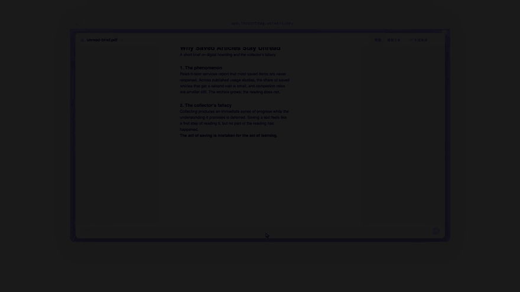
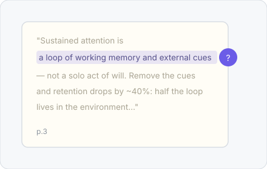
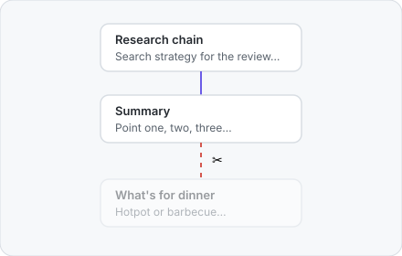
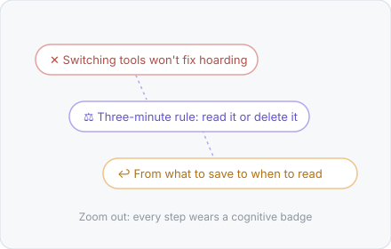
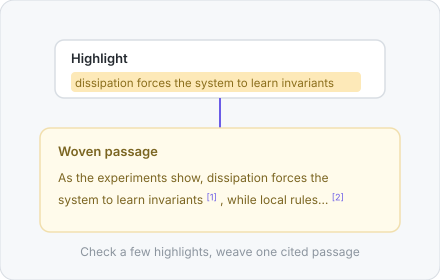
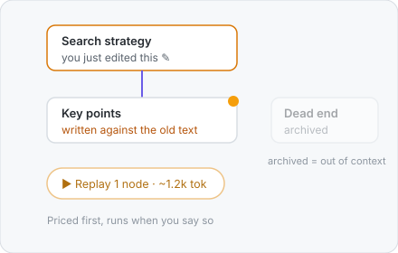

<div align="center">


# ThoughtDAG

**Your thinking deserves a map.** An infinite canvas where LLM conversations grow into an editable thought graph.


**[▶ Try it live](https://app.thoughtdag.workers.dev)** — no install, no signup; the example canvas needs no key

[中文](./README_ZH.md) · [Quick start](#quick-start) · [More capabilities](#more-capabilities) · [Models](#supported-models) · [Cost & privacy](#cost--privacy)



</div>

## The one rule

> **Wires are the context.** What the model sees is exactly what wires into the node. Editing the graph edits the model's memory.

## In action

One principle behind every gesture: **the human stays in the loop, the model stays on the wires**. No autonomous agent redraws your graph.

<table>
<tr>
<td width="45%"></td>
<td width="55%">

### 📖 Read a paper into a map

Read the original pages; select a passage and ask. The answer streams in beside the document, and the question lands on the canvas wired to the material, page number included; asked passages keep a mark, and the node's p.N chip jumps straight back to that page. **By the time you finish the paper, the map is already drawn.**

</td>
</tr>
</table>

<table>
<tr>
<td width="55%">

### 🧠 Delete one edge, get a different answer

Merging branches is drawing a wire; pruning memory is deleting one; archived nodes exit every future context. The claim is testable: keep the prompt identical, delete the noise edge, and the same question returns a clean answer. **Reproduce it yourself in chapter ③ of the example canvas.**

</td>
<td width="45%"></td>
</tr>
</table>

<table>
<tr>
<td width="45%"></td>
<td width="55%">

### 🗺️ Zoom out — thinking becomes a map

Three semantic-zoom tiers: full cards, takeaway plaques, an icon skeleton. Every step wears a cognitive badge — ✕ ruled out · ⚖ decided · ↩ pivoted · ? open. Seals keep a fixed screen size, so the far view stays dense. **The detours you took are part of the map.**

</td>
</tr>
</table>

<table>
<tr>
<td width="55%">

### ✨ The passages you marked, woven into cited prose

The model does not pick your highlights: they are the passages you selected and judged worth keeping. One overview lists every mark — by time or by node, each pinpointing its source; check any subset and weave it into one passage where every sentence traces back.

</td>
<td width="45%"></td>
</tr>
</table>

<table>
<tr>
<td width="45%"></td>
<td width="55%">

### 🧭 Every generation is yours to fire

Edit anything upstream and the answers it invalidates light up; what replays, in what order, at what token cost — priced first, run on your command. Archived nodes exit every future context. **Every wire and every generation is a human decision.**

</td>
</tr>
</table>

## Quick start

```bash
# Online: app.thoughtdag.workers.dev (example canvas needs no key)
# Local:
npm install
npm run server    # LLM proxy :3001
npm run dev       # → localhost:5173
# No .env? Connect any OpenAI-compatible endpoint inside the app
```

The first launch opens a seeded example canvas: four chapters around one everyday question (why saved articles stay unread), including a reading loop with a real embedded PDF. Environment variables, free keys and configuration details → [docs/setup.md](docs/setup.md)

## More capabilities

| Capability | What it does |
|------------|--------------|
| 📤 Read-only share | One link carries the whole graph — no account, no server storage |
| 🧭 Staleness & replay | Upstream edits mark the answers they invalidate; replay in dependency order, token estimate first |
| 🧪 Paradigms | Human-machine workflows saved as files; change the input, replay the experiment |
| 🔌 Any model | Per-node pins that follow the line; image requests reroute to vision models automatically |
| 🔒 Local-first | Automatic folder backup writes real files; point it at a synced folder for cross-device |

Full feature list (60+, grouped by area) → [docs/features.md](docs/features.md)

## Supported models

Zhipu · Qwen · OpenAI · Anthropic · Google · DeepSeek · Kimi · OpenRouter · Ollama, or any OpenAI-compatible endpoint. Requests with images reroute to vision models automatically. Environment variables and default models → [docs/setup.md](docs/setup.md)

## Cost & privacy

- **The free model tier covers every feature**; a local Ollama runs fully offline
- **On the hosted demo, model traffic runs browser-direct** — keys never touch the server
- **PDFs never leave your machine**; only extracted text travels when you ask
- **The backup format stays backward compatible**; Markdown export is the permanent escape hatch

## How to cite

If ThoughtDAG plays a role in your research, please cite it (GitHub's "Cite this repository" button uses the bundled `CITATION.cff`):

```bibtex
@software{thoughtdag,
  author = {Chen, Xia},
  title  = {ThoughtDAG: an instrument for legible human-AI collaboration},
  url    = {https://github.com/chenxiachan/thoughtdag},
  year   = {2026},
  license = {MIT}
}
```

---

<div align="center">

*The graph has no cycles. The loop is you.*

[MIT](./LICENSE) © 2026 Xia Chen · [Roadmap](docs/features.md#roadmap) · [Feedback](https://github.com/chenxiachan/thoughtdag/issues)

</div>
