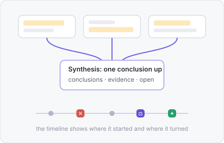

<div align="center">


# ThoughtDAG

**Your thinking deserves a map.** An infinite canvas where LLM conversations grow into an editable thought graph.


### [Website](https://chenxiachan.github.io/thoughtdag/) · [Live Demo](https://app.thoughtdag.workers.dev)

no install, no signup

[中文](./README_ZH.md) · [Quick start](#quick-start) · [More capabilities](#more-capabilities) · [Models & subscriptions](#models--subscriptions) · [Cost & privacy](#cost--privacy)


</div>

## The one rule

> **Wires are the context.** What the model sees is exactly what wires into the node. Editing the graph edits the model's memory.

## In action

One principle behind every gesture: **the human in the loop, the model on the wires**. No autonomous agent redraws your graph.

<table>
<tr>
<td width="45%"></td>
<td width="55%">

### ✂️ Delete one edge, get a different answer

The model sees only what wires in. Delete the noise edge, ask again, and the same prompt returns a clean answer. **Reproduce it in chapter ③ of the example canvas.**

</td>
</tr>
</table>

<table>
<tr>
<td width="55%">

### 📖 Read a paper into a map

Select a passage, ask right there. The answer lands on the canvas with its page number, and the p.N chip jumps back to the page. **Finish the paper, and the map is drawn.**

</td>
<td width="45%"></td>
</tr>
</table>

<table>
<tr>
<td width="45%"></td>
<td width="55%">

### 💎 Thinking condenses in your hands

Merge nodes into one higher conclusion; weave highlights into a summary. The graph folds inward instead of sprawling. **The human refines in the loop.**

</td>
</tr>
</table>

<table>
<tr>
<td width="55%">

### 🖍️ The passages you marked, woven into cited prose

Highlights are your judgment, not the model's. Check any subset and weave one passage where every sentence traces back.

</td>
<td width="45%"></td>
</tr>
</table>

<table>
<tr>
<td width="45%"></td>
<td width="55%">

### 🗺️ Zoom out: thinking becomes a map

Full cards, takeaway plaques, an icon skeleton: three semantic tiers, every step badged ✕ ⚖ ↩ ?. **The detours are part of the map.**

</td>
</tr>
</table>

## Quick start

```bash
# Online: app.thoughtdag.workers.dev (example canvas needs no key)
# Local:
npm install
npm run server    # LLM proxy :3001
npm run dev       # → localhost:5173
# No .env? Connect any OpenAI-compatible endpoint inside the app
```

The landing page offers the seeded example canvas one labeled click away: four chapters around one everyday question (why saved articles stay unread), including a reading loop with a real embedded PDF. Environment variables, free keys and configuration details → [docs/setup.md](docs/setup.md)

## More capabilities

| Capability | What it does |
|------------|--------------|
| 📤 Read-only share | One link carries the whole graph: no account, no server storage |
| 🧭 Staleness & replay | Upstream edits mark the answers they invalidate; replay in dependency order, token estimate first |
| ✂️ Clipping | Select a passage or drag a rectangle in the reader; it becomes canvas material with page provenance |
| 🔌 Any model | Per-node pins that follow the line; text-only models read images through their companion text |
| 🔒 Local-first | Automatic folder backup writes real files; point it at a synced folder for cross-device |

Full feature list (60+, grouped by area) → [docs/features.md](docs/features.md)

## Models & subscriptions

Zhipu · Qwen · OpenAI · Anthropic · Google · DeepSeek · Kimi · OpenRouter · Ollama, or any OpenAI-compatible endpoint. Text-only models read already-indexed images through their companion text; unread images go to a vision model, announced. Environment variables and default models → [docs/setup.md](docs/setup.md)

**Already paying for a subscription? It plugs in.** A ChatGPT plan connects through a one-command local bridge (with ThoughtDAG running locally). GLM Coding and Kimi Code plans issue real API keys: pick the preset, paste the key, done. Setup for all three → [docs/setup.md#subscriptions](docs/setup.md#subscriptions)

## Cost & privacy

- **The free model tier covers every feature**; a local Ollama runs fully offline
- **On the hosted demo, model traffic runs browser-direct**: keys never touch the server
- **PDFs never leave your machine**; only extracted text travels when you ask
- **The backup format stays backward compatible**; Markdown export is the permanent escape hatch

---

<div align="center">

*The graph is acyclic. You are the loop.*

[MIT](./LICENSE) © 2026 Xia Chen · [Roadmap](docs/features.md#roadmap) · [Feedback](https://github.com/chenxiachan/thoughtdag/issues) · [Cite](https://github.com/chenxiachan/thoughtdag#cite-this-repository)

</div>
