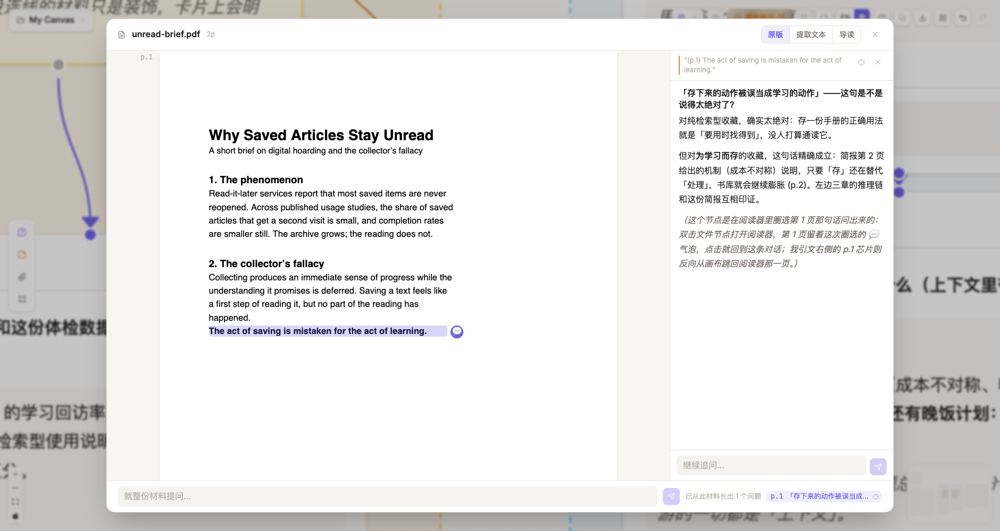

<div align="center">


# ThoughtDAG

**Your thinking deserves a map.**

An infinite canvas where LLM conversations grow into an editable thought graph.


 

[中文](./README_ZH.md) · [Quick start](#quick-start) · [Features](#features-at-a-glance) · [Models](#supported-models) · [Roadmap](#roadmap)


</div>

## Why

Chat is linear and opaque: context dilutes as the thread grows, nothing can be removed, and you never see what the model actually reads. ThoughtDAG lays the conversation out as a graph. Every question is a node, every wire is context, and editing the graph edits the model's memory. Think in branches, not threads.

## Quick start

```bash
npm install
cp .env.example .env   # one key is enough: ZHIPU_API_KEY is free (open.bigmodel.cn)
npm run server         # LLM proxy
npm run dev            # → http://localhost:5173
```

The first launch opens a seeded example canvas, so there is something to play with before you type. The fastest way in: drop a PDF on the landing page and start reading. ChatGPT and Claude `conversations.json` exports import as editable graphs, branches preserved.

## The One Rule: a wire is context

The model sees exactly what wires into a node. Adding an edge injects context, deleting one prunes it, and a live token preview prices the payload before every question.


*Same question, asked twice. Left: an off-topic node wired in, and the noise leaks into the answer. Right: that edge deleted, and the answer stays clean.*

## Read a paper into a map

Drop in a PDF and read the original pages. Select a passage and ask: the answer streams in beside the document, while the question lands on the canvas as a node wired to the material, page number included. Follow up in place, highlight what matters, keep reading. When you look up, the map of your close reading has drawn itself. Scanned documents rewrite into readable Markdown (formulas included) in one click.



## The core gesture


*Select any passage in any answer, hit Explore, and a branch grows from exactly that text. The main chain stays clean.*

## Features at a glance

| | |
|---|---|
| 🧠 Context editing | Merge branches by drawing a wire, prune memory by deleting one, archive dead ends out of every future context |
| 🔗 References | Dashed edges quote a node without dragging its conversation along; toggle quote ⇄ full with the price shown |
| 🧹 Converge | Box-select redundant nodes, merge them into one structured synthesis, archive the originals |
| 🗺️ Map view | Zoomed out, every card shows its one-line takeaway; the canvas reads like a lab notebook's table of contents |
| 🧭 Staleness & replay | Upstream edits mark the answers they invalidate; replay them in dependency order, token estimate first |
| 🩺 Topology check-up | One click flags structural diseases (duplicate context routes, broken blind pools), each with a jump and a fix |
| 🧪 Paradigms | Reusable workflows of human and machine steps; change the input and replay the whole experiment |
| 👁️ Live reviewers | A critic that follows the thread and re-critiques every new step, history versioned |
| 🔍 Agentic search | Web, arXiv and Semantic Scholar with inline citations; the model decides when to look |
| 📥 History import | ChatGPT and Claude exports become editable graphs, forks preserved |
| 🎭 Roles | Per-node system prompts with inheritance, backed by an editable role library |
| 🔒 Local-first | Your browser plus a thin proxy on your own machine; backups are plain JSON files you own |


*Converge in action: three redundant nodes become one synthesis; the originals stay on canvas but leave every context.*

<details>
<summary><b>📜 Full feature list (60+)</b></summary>

- **Material reader**: original PDF rendering with a selectable text layer (pdf.js); select → ask lands a branch node with `(p.N)` provenance; extracted-text view for scanned PDFs; per-page vision **Recognize** into Markdown/LaTeX (editable, MinerU paste point); whole-material ask input; per-material scroll memory
- **Annotation rail**: answers stream beside the document; follow-ups chain onto the thread; selecting inside a rail answer explores (branch of THAT answer) or highlights; thread chips switch conversations, a crosshair jumps to the canvas
- **Material-first landing**: drop a document on the landing page and it lands as a material node with the reader auto-opened; attachments to the root question stay behind the explicit paperclip
- **Map mode**: below ~0.8 zoom cards render as takeaway-first label plaques (pill radius, type-colored border); hysteresis prevents boundary flapping; nodes awaiting human input and locked paradigm runs keep their working form
- **Versioned takeaway summaries**: one conclusion-first line generated per answer version (display layer only, never enters context or fingerprints; short answers show whole and skip the call)
- **Topology check-up**: on-demand diagnostics with deterministic findings (residual edges, shadow references, blind-pool breaches, pool asymmetry) plus observations (long chains, open branches, collider continuations); locate + one-click fix
- **Infinite canvas**: pan, zoom, drag nodes freely (React Flow)
- **DAG context engine**: `buildContext()` walks all incoming edges, builds history in topological order
- **Purple edges** (continue): inherit the full ancestor context
- **Orange solid edges** (explore): select text → branch right with the selection as context; solid always means structural, dashed always means bypass (reference / watch)
- **Reference edges (dashed)**: drop a hand-drawn wire on any node to quote it (Q&A + upstream question trail) without dragging its whole conversation in; depth is a first-class edge property: toggle quote ⇄ full on the selected edge OR in the panel's context tree, and the connect toast prices both options (silent when the source has no chain)
- **Click-to-delete edges**: select an edge for a floating delete button; right-click menu works too; Cmd+Z undoes
- **Regenerate in place**: appends a comparable version (page through, delete, revert; downstream staleness reacts to the active version); "Regenerate as branch" in the ⋯ menu spawns a parallel sibling for A/B runs
- **Edit everything**: double-click to edit questions or responses
- **Text selection toolbar**: select response text → Branch or Highlight
- **Markdown + LaTeX**: full markdown, syntax highlighting, inline and block math
- **Version management**: navigate response versions, delete bad ones
- **Focus panel (floating overlay)**: cards-on-wash reading layout over the canvas (which never resizes), context tree grouped by materials / references / conversation, follow-up input; drag-resizable width
- **Highlight system**: three downstream modes: 📄 Full text / 🏷️ Tag important / ✂️ Highlights only
- **Auto-clean stale highlights on edit**
- **Undo/Redo**: Cmd+Z / Cmd+Shift+Z, full state snapshots
- **Column-Tree auto-layout**: main chain flows down, branches fork right; real measured heights prevent overlap
- **Tidy layout / Align selection**: re-organize the whole graph by arrow order (with confirm); stack selected nodes into a column
- **Collapse/Expand**: purely visual tidiness; the chain always flows full text (token control lives in archive / highlight filter / reference depth)
- **Takeaway per node**: a conclusion-first line generated in the background, aligned with the active answer version; it is the card's face when zoomed out and when collapsed
- **Semantic zoom with hysteresis**: map labels below 0.8, working cards above 0.9; unfolding near 1:1 means only a handful of cards ever expand at once
- **Token counting**: per-node usage display
- **Streaming responses**: SSE token-by-token rendering with blinking cursor, in node and panel
- **Stop generation**: keeps partial content
- **Retry in place**: failed generations show a Retry button; errors go to toasts, never into answers
- **Ancestor edge highlighting**: the selected node's path to root turns gold, others dim
- **Multi-select**: box-select nodes: Merge Summary / Merge & Delete / Align / Export / Delete
- **Node role system**: per-node system prompt with three modes (inherit / set for next / reset here), `appliedRole` recorded at generation time, radio picker for multi-parent conflicts
- **Role library, user-editable**: built-ins (Reviewer / Skeptic / Statistician / Code Reviewer / Tutor) plus your own roles; add, edit and remove options in a manager (editing a built-in makes your copy; restore anytime); applied roles stay frozen on their nodes
- **Reviewer preset**: critic role on a sliding red edge; re-critiques each new step automatically, history versioned; reviewers are ordinary nodes (question them, branch from them)
- **Agentic search**: AI SDK tool loop: Zhipu web search + arXiv + Semantic Scholar (free APIs), `[n]` citations + persisted references, guaranteed synthesis fallback, per-group toolbar toggles
- **MCP tool ecosystem**: Claude-Desktop-format `mcp.config.json`; stdio + HTTP/SSE transports; tools join the agentic loop with per-call progress; mock server included for testing
- **Data persistence**: IndexedDB auto-save (1s debounce), survives refresh
- **Multi-canvas projects**: create/switch/rename/delete, each saved independently
- **Archive (prune-but-keep)**: dimmed on canvas, excluded from every context walk, restorable; batch via multi-select
- **Merge Synthesis**: box-select nodes → structured synthesis (conclusions / evidence / open questions)
- **Export system**: whole-graph JSON backup (one click on the toolbar, carries paradigm provenance) and import; context-chain / multi-select Markdown export
- **Context send preview**: live "~N tok · M messages · K files" plus a materials · references · conversation layer breakdown before asking
- **Attachment system**: node-local attachments (drag/paste/upload), inherited include/exclude control, fingerprint dedup, automatic Vision switching for images; PDFs feed context as extracted text (the reader's Recognize upgrades scanned ones) and wear their first page as a cover on file nodes
- **Per-node model override**: any node can pin its own LLM (badge on the card, sibling regenerations inherit it); cheap models for exploration, flagship for the hard steps
- **Cmd+F node search**: filter by question/answer/summary, arrows + Enter to jump-pan the canvas
- **Keyboard shortcuts**: Space collapse, R regenerate, arrow keys walk the DAG, Esc steps out (legend in the tutorial)
- **Bilingual UI**: auto-detects browser language, one-click EN/中 switch
- **Built-in tutorial**: a ten-step illustrated hero page, from asking to paradigms
- **Ask nodes anywhere**: double-click empty canvas, use the palette, or drop a wire on blank space; fresh nodes focus their input immediately
- **Layered context assembly**: materials → reference blocks → the conversation, ordering independent of wiring history (same graph, same prompt)
- **Content nodes**: notes (markdown), file nodes with PDF covers, time-stamped link snapshots; paste-driven creation; image auto-reading picks the strongest configured vision model; every material opens in the reader
- **Frames**: labeled colored regions with a navigator jump list; hide-annotations view toggle
- **Staleness tracking**: per-generation upstream fingerprints; amber badges on nodes, dots in the context tree, explicit [Stale] marks in downstream payloads
- **Batch replay**: one click re-runs every stale node in dependency order; confirm dialog with a token estimate; stop anytime
- **Paradigm mode**: human/prompt steps + material slots; instantiate → cascade → unlock; edit the input + replay = re-run the experiment; bounded reviewer rounds declared in the file
- **Example canvas on first run**: a seeded graph (with a context-pruning ⚖️ side-by-side demo) instead of a blank page; reload it anytime from the landing screen
- **Import ChatGPT / Claude exports**: drop conversations.json into Import; ChatGPT's edit/regenerate branches are preserved as graph forks, each conversation becomes its own canvas
- **Environment-based config**: keys live in `.env`; available models register automatically per key

</details>

## Philosophy

Chat terminals are harnesses for doing: they optimize for handing you an answer and hide everything else. ThoughtDAG is an instrument for thinking: the unit of value is the reasoning structure itself, kept legible, editable and repeatable.

The industry aligns models inside their weights. A workbench does its part structurally: you see what the model read, every answer keeps its origin, stale conclusions announce themselves, and any run can be replayed. This is the older lineage of computing, from the memex to Engelbart: not machines that think for you, but instruments that let you think further.

*The graph has no cycles. The loop is you.*

## Cost & privacy

- **Free to run.** The Zhipu free tier (GLM-4.5-Flash text + GLM-4V-Flash vision) covers every feature; agentic web search costs ~¥0.01/query. Or point it at any provider you already pay for, or a local Ollama model, fully offline.
- **Your data stays with you.** Canvases live in your browser's IndexedDB; the only server is a thin proxy on your own machine. Nothing is uploaded anywhere except the LLM API you chose. Backups are plain JSON files you own.
- Optional: PDF page rendering wants poppler (`brew install poppler`); degrades gracefully to text without it.

## MCP tools

Copy `mcp.config.example.json` to `mcp.config.json` and list any [MCP](https://modelcontextprotocol.io) servers (Claude-Desktop format; existing snippets just work). Their tools join the same agentic loop: the model decides when to call them.

```jsonc
{
  "mcpServers": {
    "zotero": { "command": "zotero-mcp", "env": { "ZOTERO_LOCAL": "true" } },  // your reference library
    "fetch":  { "command": "uvx", "args": ["mcp-server-fetch"] }               // full web-page reading
  }
}
```

A mock server ships in `scripts/mock-mcp.mjs` for verifying the loop end-to-end.

## Supported models

Built on the Vercel AI SDK. Any provider below activates when its key lands in `.env`; a toolbar picker switches models at any time, and text-only models reroute automatically when images appear. Default model IDs can be overridden per provider (e.g. `OPENAI_MODELS=gpt-5.2`).

> Image understanding needs a vision key. Pasted images are auto-read once, by the strongest vision model you have configured, into editable companion text. The free `glm-4v-flash` works; flagship models read scientific figures noticeably better.

| Provider | Default models | `.env` key | Notes |
|----------|----------------|------------|-------|
| **Zhipu GLM** | glm-4.5-flash · glm-4v-flash | `ZHIPU_API_KEY` | **Free**, CN-direct; powers web search |
| **Qwen** (DashScope) | qwen-plus · qwen-vl-plus | `DASHSCOPE_API_KEY` | CN-direct |
| **OpenAI** | gpt-5.1 · gpt-5-mini | `OPENAI_API_KEY` | override via `OPENAI_MODELS` |
| **Anthropic** | claude-sonnet-5 · claude-haiku-4-5 | `ANTHROPIC_API_KEY` | override via `ANTHROPIC_MODELS` |
| **Google** | gemini-2.5-pro · gemini-2.5-flash | `GOOGLE_API_KEY` | override via `GOOGLE_MODELS` |
| **DeepSeek** | deepseek-chat · deepseek-reasoner | `DEEPSEEK_API_KEY` | text-only (auto vision reroute) |
| **Kimi** (Moonshot) | kimi-k2-turbo-preview · kimi-latest | `MOONSHOT_API_KEY` | CN-direct; intl via `MOONSHOT_BASE_URL` |
| **OpenRouter** | openrouter/auto | `OPENROUTER_API_KEY` | gateway to 300+ models; list any `vendor/model` slugs in `OPENROUTER_MODELS` |
| **Ollama** | (yours) | `OLLAMA_MODELS=qwen3:8b,…` | fully local & offline |

## Tech Stack & Architecture

| Layer | Technology |
|-------|------------|
| UI | React 19 + TypeScript + Vite 7 |
| Canvas | @xyflow/react (React Flow) |
| State | Zustand (persist → IndexedDB via idb-keyval) |
| Styling | Tailwind CSS v4 |
| LLM | Vercel AI SDK: 9 provider families, auto-registered from `.env` keys (see [Supported models](#supported-models)) |
| Proxy | Express + Vercel AI SDK (server.mjs, default port 3001) |

<details>
<summary>Request flow</summary>

```
Browser (localhost:5173)
  └─ React + React Flow canvas
      └─ Zustand store (nodes, edges, history) ⇄ IndexedDB (auto-save)
          ├─ buildContext(nodeId) → walk DAG → ContextMessage[] + images
          └─ src/lib/api.ts
              ├─ llmCallStream(messages) → POST /api/stream (SSE + tool events)
              ├─ llmCall(messages)       → POST /api/claude (non-streaming, summaries)
              └─ extractPdf(base64)      → POST /api/pdf-extract
                        └─ Express + AI SDK (server.mjs) → Zhipu / Qwen / any provider
                             └─ web_search tool (model-invoked, citations flow back)
```

</details>

## Roadmap

**Near term**
- [ ] Event-log export (canvas operations → CSV/JSON, the measurement layer for human-AI interaction studies)
- [ ] Save any canvas as a paradigm (reverse instantiation)
- [ ] Attachment blob separation (scaling image-heavy canvases)

**Long term**
- [ ] Run comparison view (same paradigm, N runs side by side)
- [ ] Artifact nodes (file deliverables on canvas, Monaco editor + version history)
- [ ] Async collaboration: share a paradigm, collect runs

## How to cite

If ThoughtDAG plays a role in your research, please cite it (GitHub's "Cite this repository" button uses the bundled `CITATION.cff`):

```bibtex
@software{thoughtdag,
  author = {Chen, Xia},
  title  = {ThoughtDAG: an instrument for legible human-AI collaboration},
  url    = {https://github.com/chenxiachan/thoughtdag},
  year   = {2026},
  license = {MIT}
}
```

## Feedback

ThoughtDAG is an early, actively developed project. This is exactly when feedback matters most:

- ⭐ **Star the repo** if the idea resonates; it genuinely helps
- 🐛 Hit a bug or a rough edge? [Open an issue](https://github.com/chenxiachan/thoughtdag/issues)
- 💡 Ideas about thinking-in-graphs? [Start a discussion](https://github.com/chenxiachan/thoughtdag/discussions)

## License

[MIT](./LICENSE) © 2026 Xia Chen
