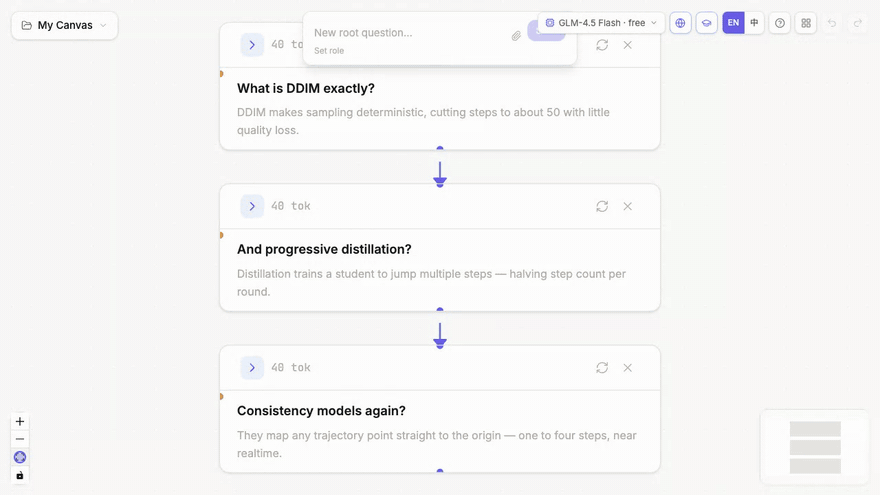

<div align="center">


# ThoughtDAG

### Think in branches, not threads

**An infinite canvas that turns LLM conversations into an editable thought graph.**

**One rule: a wire IS context — you see and decide exactly what the model reads.**


 

[中文](./README_ZH.md) · [Quick Start](#quick-start) · [Features](#features) · [Roadmap](#roadmap)


</div>

---

## See it in action


*The core gesture: select any passage in an answer → **Explore** → an orange branch grows out of exactly that text, streams its answer, and never pollutes the main chain.*

## Get running in 2 minutes

```bash
npm install
cp .env.example .env   # one key is enough: ZHIPU_API_KEY is free (open.bigmodel.cn)
npm run server         # LLM proxy
npm run dev            # → http://localhost:5173
```

Your first launch lands on a **seeded example canvas** — including the ⚖️ context-pruning demo below — so you can feel the tool before typing anything. Have ChatGPT or Claude history? **Import your `conversations.json`** and your own conversations become editable graphs (branches preserved).

## Why ThoughtDAG?

Every mainstream LLM interface is **linear, append-only, and opaque**: context dilutes as chats grow and nothing can be removed; exploring in parallel means losing the connections; and you never control what the model actually sees.

A conversation isn't a list. It's a **graph**.

And there is a deeper split. Chat terminals are **harnesses for doing** — they optimize for handing you an answer, and hide everything else: what entered the context, how it was compacted, which agent did what. ThoughtDAG is an **instrument for thinking**: the unit of value is not the answer but the reasoning structure — what flowed in, who influenced whom, what changed since, and whether the whole run can be repeated. The more powerful and opaque agents become, the more you need a workbench that keeps human–AI collaboration **legible**.

## The One Rule: a wire IS context

**Node** = one Q&A turn. **Edge** = where context flows. The model sees exactly what wires in — **adding an edge injects context, deleting one prunes it**, and a live "~N tok · M messages" preview shows the payload before every question.

**Seeing is believing** — same question, twice. Node A inherits an off-topic cooking chat and it leaks straight into the answer; node B's edge to the noise is deleted:


*Left: an off-topic node feeding into question A. Right: A's answer absorbs the noise (bold), while B — same question, noise edge deleted — stays clean.*

## Features

### 🧠 Context you can see and shape
Drag an edge to merge branches, delete one to prune memory, collapse a node to pass its summary instead of full text. Two kinds of wires: **solid = the conversation** (full history flows; layout and paradigms follow it), **dashed = a reference** that quotes one node plus its upstream trail — select it for a token price chip and a quote ⇄ full toggle. Context assembles in layers (materials → references → conversation), so the same graph always produces the same prompt.

### 📥 Your history, unlocked
Import ChatGPT / Claude `conversations.json` — each conversation becomes an editable canvas, ChatGPT's edit/regenerate forks preserved as visible branches.

### 🌿 Branch anywhere
Select any passage → an exploration branch grows from exactly that text; regenerate appends comparable versions in place (the parallel-branch variant is one menu click away); wire branches back together to merge.

### 🧹 Converge — don't accumulate
Redundant exploration is inevitable; keeping it in context is not. Box-select the sprawl → **Merge Summary** produces a structured synthesis (conclusions / evidence / open questions) → **Archive** the originals: still on canvas, dimmed, and excluded from every future context.



### 📌 Anything on the canvas
Paste anything: text becomes a note (Word tables → Markdown), a URL becomes a time-stamped web snapshot, an image is **auto-read into context** (tables, charts, scientific figures — the extracted text stays inspectable and editable). Notes, files and colored frames live on the canvas — and nothing enters context without a wire.

### 🧭 Staleness you can see, replay with a price tag
Every answer records a fingerprint of what it depended on. Change anything upstream and the affected answers wear an amber **"Upstream changed"** badge — staleness travels along references too. Click a badge to re-run in place (old versions kept for comparison), or **replay everything stale in dependency order** after a confirm dialog that prices the run in tokens. Export a **run manifest** (models, fingerprints, timestamps, staleness) for your methods section.

### 🧪 Paradigms — run reasoning as experiments
Design a workflow once — human steps, auto-running prompt steps, material slots — then instantiate it: the cascade runs every machine step and pauses wherever a person belongs. Edit the input afterwards and replay: the chain re-runs in order, each step appending a comparable version. Share as `.paradigm.json`; a rule-out / rule-in example ships built in.

### 👁️ Reviewers that keep up
One click attaches a critic whose red edge slides forward as your thread grows — each new step gets re-critiqued (history versioned). A reviewer is an ordinary node: question it, branch from it, wire its opinion anywhere.

### 🔍 Agentic search — web & scholarly
The model decides when to search: web for facts, **arXiv + Semantic Scholar for papers**. Inline `[n]` citations, references persisted with the node, toolbar toggles per tool group.

### ✂️ Editing built for deep reading
Everything is editable, answers keep multiple versions, LaTeX and syntax highlighting render inline, semantic zoom swaps cards for large-type thumbnails when zoomed out, and one-click tidy layout re-organizes the whole graph by arrow order.

### 🗂️ Research-grade workflow
Multi-canvas projects (one topic, one graph), IndexedDB auto-save, JSON backup/import, **ChatGPT/Claude history import** (branches preserved), one-click Markdown export of any context chain, an attachment system (image Vision / dual-channel PDF / precise inheritance control), a bilingual EN/中 interface, and a built-in ten-step tutorial.

<details>
<summary><b>📜 Full feature list (60+)</b></summary>

- **Infinite canvas** — pan, zoom, drag nodes freely (React Flow)
- **DAG context engine** — `buildContext()` walks all incoming edges, builds history in topological order
- **Purple edges** (continue) — inherit the full ancestor context
- **Orange edges** (explore) — select text → branch right with the selection as context
- **Reference edges (dashed)** — drop a hand-drawn wire on any node to quote it (Q&A + upstream question trail) without dragging its whole conversation in; the selected edge shows a token price chip and flips quote ⇄ full
- **Click-to-delete edges** — select an edge for a floating delete button; right-click menu works too; Cmd+Z undoes
- **Regenerate in place** — appends a comparable version (page through, delete, revert — downstream staleness reacts to the active version); "Regenerate as branch" in the ⋯ menu spawns a parallel sibling for A/B runs
- **Edit everything** — double-click to edit questions or responses
- **Text selection toolbar** — select response text → Branch or Highlight
- **Markdown + LaTeX** — full markdown, syntax highlighting, inline and block math
- **Version management** — navigate response versions, delete bad ones
- **Focus panel (floating overlay)** — cards-on-wash reading layout over the canvas (which never resizes), context tree grouped by materials / references / conversation, follow-up input; drag-resizable width
- **Highlight system** — three downstream modes: 📄 Full text / 🏷️ Tag important / ✂️ Highlights only
- **Auto-clean stale highlights on edit**
- **Undo/Redo** — Cmd+Z / Cmd+Shift+Z, full state snapshots
- **Column-Tree auto-layout** — main chain flows down, branches fork right; real measured heights prevent overlap
- **Tidy layout / Align selection** — re-organize the whole graph by arrow order (with confirm); stack selected nodes into a column
- **Collapse/Expand** — collapsed nodes pass summaries instead of full text (context compression); downstream shifts automatically
- **Auto-summary per node** — generated in the background, shown when collapsed
- **Semantic zoom** — cards become large-type thumbnails when zoomed out
- **Token counting** — per-node usage display
- **Streaming responses** — SSE token-by-token rendering with blinking cursor, in node and panel
- **Stop generation** — keeps partial content
- **Retry in place** — failed generations show a Retry button; errors go to toasts, never into answers
- **Ancestor edge highlighting** — the selected node's path to root turns gold, others dim
- **Multi-select** — box-select nodes: Merge Summary / Merge & Delete / Align / Export / Delete
- **Node role system** — per-node system prompt with three modes (inherit / set for next / reset here), `appliedRole` recorded at generation time, radio picker for multi-parent conflicts
- **Role template library** — Reviewer / Devil's Advocate / Statistician / Code Reviewer / Tutor
- **Reviewer preset** — critic role on a sliding red edge; re-critiques each new step automatically, history versioned; reviewers are ordinary nodes (question them, branch from them)
- **Agentic search** — AI SDK tool loop: Zhipu web search + arXiv + Semantic Scholar (free APIs), `[n]` citations + persisted references, guaranteed synthesis fallback, per-group toolbar toggles
- **MCP tool ecosystem** — Claude-Desktop-format `mcp.config.json`; stdio + HTTP/SSE transports; tools join the agentic loop with per-call progress; mock server included for testing
- **Data persistence** — IndexedDB auto-save (1s debounce), survives refresh
- **Multi-canvas projects** — create/switch/rename/delete, each saved independently
- **Archive (prune-but-keep)** — dimmed on canvas, excluded from every context walk, restorable; batch via multi-select
- **Merge Synthesis** — box-select nodes → structured synthesis (conclusions / evidence / open questions)
- **Export system** — whole-graph JSON backup and import; context-chain / multi-select Markdown export
- **Context send preview** — live "~N tok · M messages · K files" plus a materials · references · conversation layer breakdown before asking
- **Attachment system** — node-local attachments (drag/paste/upload), inherited include/exclude control, fingerprint dedup, automatic Vision switching for images, dual-channel PDF (text + rendered pages)
- **Per-node model override** — any node can pin its own LLM (badge on the card, sibling regenerations inherit it); cheap models for exploration, flagship for the hard steps
- **Cmd+F node search** — filter by question/answer/summary, arrows + Enter to jump-pan the canvas
- **Keyboard shortcuts** — Space collapse, R regenerate, arrow keys walk the DAG, Esc steps out (legend in the tutorial)
- **Bilingual UI** — auto-detects browser language, one-click EN/中 switch
- **Built-in tutorial** — a ten-step illustrated hero page, from asking to paradigms
- **Ask nodes anywhere** — double-click empty canvas, use the palette, or drop a wire on blank space; fresh nodes focus their input immediately
- **Layered context assembly** — materials → reference blocks → the conversation, ordering independent of wiring history (same graph, same prompt)
- **Content nodes** — notes (markdown), file nodes, time-stamped link snapshots; paste-driven creation; image auto-reading picks the strongest configured vision model
- **Frames** — labeled colored regions with a navigator jump list; hide-annotations view toggle
- **Staleness tracking** — per-generation upstream fingerprints; amber badges on nodes, dots in the context tree, explicit [Stale] marks in downstream payloads
- **Batch replay** — one click re-runs every stale node in dependency order; confirm dialog with a token estimate; stop anytime
- **Run manifest export** — `.manifest.json` with models, roles, fingerprints, timestamps, staleness, typed edges and paradigm provenance
- **Paradigm mode** — human/prompt steps + material slots; instantiate → cascade → unlock; edit the input + replay = re-run the experiment; bounded reviewer rounds declared in the file
- **Example canvas on first run** — a seeded graph (with a context-pruning ⚖️ side-by-side demo) instead of a blank page; reload it anytime from the landing screen
- **Import ChatGPT / Claude exports** — drop conversations.json into Import; ChatGPT's edit/regenerate branches are preserved as graph forks, each conversation becomes its own canvas
- **Environment-based config** — keys live in `.env`; available models register automatically per key

</details>

## Cost & privacy

- **Free to run.** The Zhipu free tier (GLM-4.5-Flash text + GLM-4V-Flash vision) covers every feature; agentic web search costs ~¥0.01/query. Or point it at any provider you already pay for — or a local Ollama model, fully offline.
- **Your data stays with you.** Canvases live in your browser's IndexedDB; the only server is a thin proxy on your own machine. Nothing is uploaded anywhere except the LLM API you chose. Backups are plain JSON files you own.
- Optional: PDF page rendering wants poppler (`brew install poppler`) — degrades gracefully to text without it.

## MCP tools — plug in the whole ecosystem

Copy `mcp.config.example.json` to `mcp.config.json` and list any [MCP](https://modelcontextprotocol.io) servers (Claude-Desktop format — existing snippets just work). Their tools join the same agentic loop: the model decides when to call them.

```jsonc
{
  "mcpServers": {
    "zotero": { "command": "zotero-mcp", "env": { "ZOTERO_LOCAL": "true" } },  // your reference library
    "fetch":  { "command": "uvx", "args": ["mcp-server-fetch"] }               // full web-page reading
  }
}
```

A mock server ships in `scripts/mock-mcp.mjs` for verifying the loop end-to-end.

## Supported models

Built on the Vercel AI SDK: **every provider below activates automatically when its key is in `.env`** — no code changes, no config files. A toolbar picker switches models at any time; when a text-only model receives images, the proxy silently reroutes to a vision-capable one. Default model IDs can be overridden per provider (e.g. `OPENAI_MODELS=gpt-5.2`), so new releases never require an update.

> **Image understanding needs a vision model.** Pasted images are auto-extracted once (objects, text, figure structure — scientific figures get axes/panels/trends) into companion text using the **strongest vision model you have configured**. The free `glm-4v-flash` works; flagship vision models read scientific figures noticeably better.

| Provider | Default models | `.env` key | Notes |
|----------|----------------|------------|-------|
| **Zhipu GLM** | glm-4.5-flash · glm-4v-flash | `ZHIPU_API_KEY` | **Free**, CN-direct; powers web search |
| **Qwen** (DashScope) | qwen-plus · qwen-vl-plus | `DASHSCOPE_API_KEY` | CN-direct |
| **OpenAI** | gpt-5.1 · gpt-5-mini | `OPENAI_API_KEY` | override via `OPENAI_MODELS` |
| **Anthropic** | claude-sonnet-5 · claude-haiku-4-5 | `ANTHROPIC_API_KEY` | override via `ANTHROPIC_MODELS` |
| **Google** | gemini-2.5-pro · gemini-2.5-flash | `GOOGLE_API_KEY` | override via `GOOGLE_MODELS` |
| **DeepSeek** | deepseek-chat · deepseek-reasoner | `DEEPSEEK_API_KEY` | text-only (auto vision reroute) |
| **Kimi** (Moonshot) | kimi-k2-turbo-preview · kimi-latest | `MOONSHOT_API_KEY` | CN-direct; intl via `MOONSHOT_BASE_URL` |
| **OpenRouter** | openrouter/auto | `OPENROUTER_API_KEY` | gateway to 300+ models — list any `vendor/model` slugs in `OPENROUTER_MODELS` |
| **Ollama** | (yours) | `OLLAMA_MODELS=qwen3:8b,…` | fully local & offline |

## Tech Stack & Architecture

| Layer | Technology |
|-------|------------|
| UI | React 19 + TypeScript + Vite 7 |
| Canvas | @xyflow/react (React Flow) |
| State | Zustand (persist → IndexedDB via idb-keyval) |
| Styling | Tailwind CSS v4 |
| LLM | Vercel AI SDK — 9 provider families, auto-registered from `.env` keys (see [Supported models](#supported-models)) |
| Proxy | Express + Vercel AI SDK (server.mjs, default port 3001) |

```
Browser (localhost:5173)
  └─ React + React Flow canvas
      └─ Zustand store (nodes, edges, history) ⇄ IndexedDB (auto-save)
          ├─ buildContext(nodeId) → walk DAG → ContextMessage[] + images
          └─ src/lib/api.ts
              ├─ llmCallStream(messages) → POST /api/stream (SSE + tool events)
              ├─ llmCall(messages)       → POST /api/claude (non-streaming, summaries)
              └─ extractPdf(base64)      → POST /api/pdf-extract
                        └─ Express + AI SDK (server.mjs) → Zhipu / Qwen / any provider
                             └─ web_search tool (model-invoked, citations flow back)
```

## Roadmap

**Near term**
- [ ] Event-log export (canvas operations → CSV/JSON — the measurement layer for human-AI interaction studies)
- [ ] Save any canvas as a paradigm (reverse instantiation)
- [ ] Attachment blob separation (scaling image-heavy canvases)

**Long term**
- [ ] Run comparison view (same paradigm, N runs side by side)
- [ ] Artifact nodes (file deliverables on canvas, Monaco editor + version history)
- [ ] Async collaboration: share a paradigm, collect runs

## Feedback

ThoughtDAG is an early, actively developed project — which is exactly when feedback matters most:

- ⭐ **Star the repo** if the idea resonates — it genuinely helps
- 🐛 Hit a bug or a rough edge? [Open an issue](https://github.com/chenxiachan/thoughtdag/issues)
- 💡 Ideas about thinking-in-graphs? [Start a discussion](https://github.com/chenxiachan/thoughtdag/discussions)

## License

[MIT](./LICENSE) © 2026 Xia Chen
