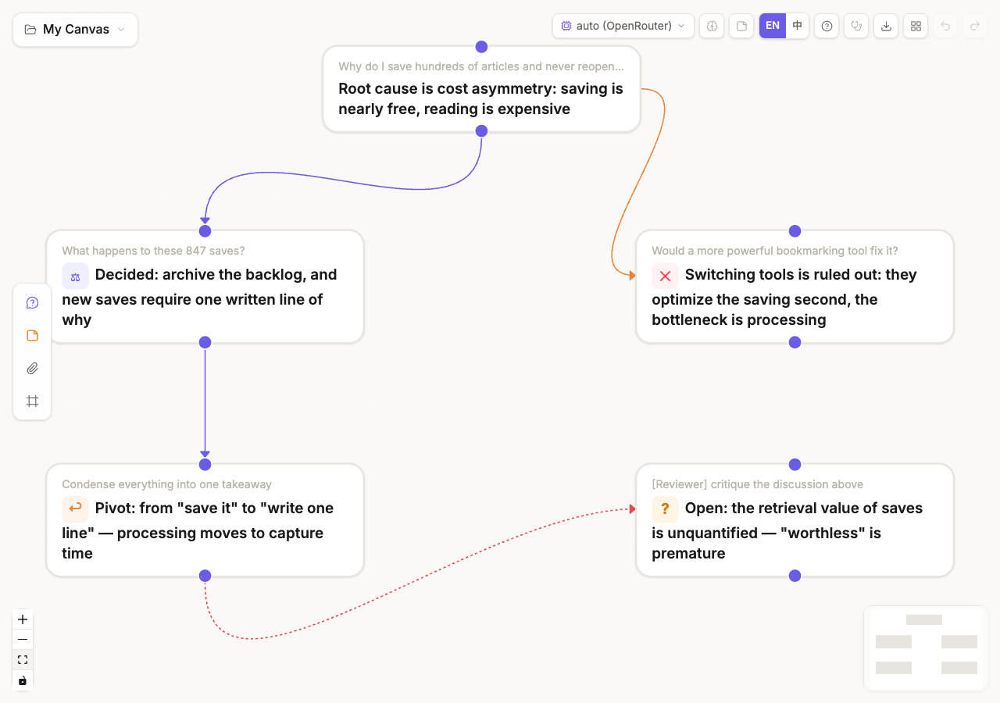
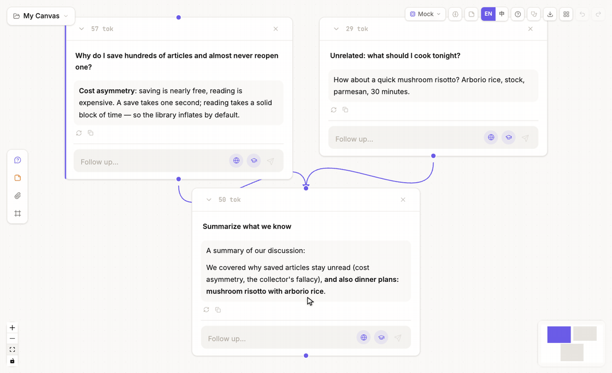

<div align="center">


# ThoughtDAG

**Your thinking deserves a map.**

An infinite canvas where LLM conversations grow into an editable thought graph.


 

[中文](./README_ZH.md) · [Quick start](#quick-start) · [Features](#features-at-a-glance) · [Models](#supported-models) · [Roadmap](#roadmap)



</div>

## Why

Chat is linear and opaque: context dilutes as the thread grows, nothing can be removed, and you never see what the model actually reads. ThoughtDAG lays the conversation out as a graph. Every question is a node, every wire is context, and editing the graph edits the model's memory. Think in branches, not threads.

## Quick start

```bash
npm install
npm run server         # LLM proxy
npm run dev            # → http://localhost:5173
```

No config needed to start: if `.env` has no key, the app asks for an OpenRouter key in the browser (it stays in localStorage and the proxy's memory, never on disk). Or copy `.env.example` to `.env` and fill in any provider key — `ZHIPU_API_KEY` is free (open.bigmodel.cn).

The first launch opens a seeded example canvas — four chapters around one everyday question (why saved articles stay unread), from the conversation grammar to a real embedded PDF with its reading loop. Zoom out: the hero image above is that canvas as a map. The fastest way in: drop a PDF on the landing page and start reading. The Zhipu key also powers web search (engine tiers switchable in the model menu); scholarly search (arXiv + Semantic Scholar) is free and needs no key at all.

## Delete one edge, get a different answer

The model sees exactly what wires into a node — that is the whole rule. Which makes the claim testable: keep the prompt identical, change one wire, and watch the answer change.



*One summary node, two parents — and dinner plans leak into the answer. Delete the noise edge, regenerate, and the same prompt returns a clean summary. Recorded from the app (content preloaded so every run is inspectable); the mechanism is live behavior — reproduce it in chapter ③ of the example canvas.*

## Read a paper into a map

Drop in a PDF and read the original pages. Select a passage and ask: the answer streams in beside the document, and the question lands on the canvas wired to the material, page number included. The asked passage keeps a mark on the page — a highlight wash and a bubble that reopens the conversation, so everything you asked stays reachable while you read. The trip works both ways: back on the canvas, the node wears a p.N chip that jumps straight back to that page in the reader.

One click writes a guided digest: a short structured post in your language, every point anchored to its page with jump buttons. The digest is itself a node — wire it downstream and later questions ride the material's best compression instead of its full text. Scanned documents rewrite into readable Markdown (formulas included) in one click.


## The core gesture

**Select text → Explore → a branch grows from exactly that passage.** The new node inherits only what you selected; the main chain stays clean.

## Features at a glance

| | |
|---|---|
| 🧠 Context editing | Merge branches by drawing a wire, prune memory by deleting one, archive dead ends out of every future context |
| 🔗 References | Dashed edges quote a node without dragging its conversation along; toggle quote ⇄ full with the price shown |
| 🧹 Converge | Box-select redundant nodes, merge them into one structured synthesis, archive the originals |
| 🗺️ Map view | Zoomed out, every card shows its one-line takeaway, badged by move: ✕ ruled out · ⚖ decided · ↩ pivoted · ? open |
| 📖 Reading loop | Asked passages keep marks on the PDF pages; canvas nodes jump back with p.N chips; one-click guided digest as a wireable node |
| 🧭 Staleness & replay | Upstream edits mark the answers they invalidate; replay them in dependency order, token estimate first |
| 🩺 Topology check-up | One click flags structural diseases (duplicate context routes, broken blind pools), each with a jump and a fix |
| 🧪 Paradigms | Reusable workflows of human and machine steps; change the input and replay the whole experiment |
| 👁️ Live reviewers | A critic that follows the thread and re-critiques every new step, history versioned |
| 🔍 Agentic search | Web, arXiv and Semantic Scholar with inline citations; the model decides when to look |
| 🔌 Any model | Nine provider families register from `.env` keys; switch per node, or run fully local with Ollama |
| 🎭 Roles | Per-node system prompts with inheritance, backed by an editable role library |
| 🔒 Local-first | Your browser plus a thin proxy on your own machine; backups are plain JSON files you own |

<details>
<summary><b>📜 Full feature list, by area</b></summary>

### Canvas & context — the One Rule family

- **DAG context engine**: `buildContext()` walks all incoming edges, builds history in topological order
- **Layered context assembly**: materials → reference blocks → the conversation, ordering independent of wiring history (same graph, same prompt)
- **Purple edges** (continue): inherit the full ancestor context
- **Orange solid edges** (explore): select text → branch right with the selection as context; solid always means structural, dashed always means bypass (reference / watch)
- **Reference edges (dashed)**: drop a hand-drawn wire on any node to quote it (Q&A + upstream question trail) without dragging its whole conversation in; depth is a first-class edge property: toggle quote ⇄ full on the selected edge OR in the panel's context tree, and the connect toast prices both options (silent when the source has no chain)
- **Context send preview**: live "~N tok · M messages · K files" plus a materials · references · conversation layer breakdown before asking
- **Click-to-delete edges**: select an edge for a floating delete button; right-click menu works too; Cmd+Z undoes
- **Archive (prune-but-keep)**: dimmed on canvas, excluded from every context walk, restorable; batch via multi-select
- **Merge Synthesis**: box-select nodes → structured synthesis (conclusions / evidence / open questions)
- **Highlight system**: three downstream modes: 📄 Full text / 🏷️ Tag important / ✂️ Highlights only; stale highlights auto-clean on edit
- **Node role system**: per-node system prompt with three modes (inherit / set for next / reset here), `appliedRole` recorded at generation time, radio picker for multi-parent conflicts
- **Role library, user-editable**: built-ins plus your own roles; add, edit and remove in a manager (editing a built-in makes your copy; restore anytime); applied roles stay frozen on their nodes
- **Token counting**: per-node usage display

### Reading & materials

- **Material reader**: original PDF rendering with a selectable text layer (pdf.js); select → ask lands a branch node with `(p.N)` provenance, and the passage keeps an anchor on the page (highlight wash + a bubble that reopens the thread); canvas nodes carry a p.N chip that jumps back into the reader; extracted-text view for scanned PDFs; a footer thread index tagging each conversation p.N or whole-material; per-material scroll memory
- **Annotation rail**: answers stream beside the document; follow-ups chain onto the thread; selecting inside a rail answer explores (branch of THAT answer) or highlights; thread chips switch conversations, a crosshair jumps to the canvas
- **Guided digest**: one click turns the material into a short structured post in the UI language, with (p.N) jump buttons back into the original pages; the digest is a canvas NODE (versioned on rewrite, model-stamped, wireable downstream as the material's compression); regenerating routes through the digest prompt against the full text
- **Recognize (scanned PDFs)**: per-page vision rewrite into Markdown/LaTeX, editable; external OCR output pastes in
- **Content nodes**: notes (markdown), file nodes with PDF covers, time-stamped link snapshots; paste-driven creation; image auto-reading picks the strongest configured vision model; every material opens in the reader
- **Attachment system**: node-local attachments (drag/paste/upload), inherited include/exclude control, fingerprint dedup, automatic Vision switching for images; PDFs feed context as extracted text and wear their first page as a cover on file nodes
- **Material-first landing**: drop a document on the landing page and it lands as a material node with the reader auto-opened; attachments to the root question stay behind the explicit paperclip

### Map & review

- **Map mode**: below ~0.8 zoom cards render as takeaway-first label plaques (pill radius, type-colored border); hysteresis prevents boundary flapping; nodes awaiting human input and locked paradigm runs keep their working form
- **Typed takeaways**: one conclusion-first line per answer version, auto-classified (✕ ruled out · ⚖ decided · ↩ pivoted · ? open; insight stays unmarked); display layer only, never enters context or fingerprints
- **Staleness tracking**: per-generation upstream fingerprints; amber badges on nodes, dots in the context tree, explicit [Stale] marks in downstream payloads
- **Batch replay**: one click re-runs every stale node in dependency order; confirm dialog with a token estimate; stop anytime
- **Version management**: regenerate in place appends a comparable version (page through, delete, revert; downstream staleness reacts to the active version); "Regenerate as branch" spawns a parallel sibling for A/B runs
- **Topology check-up**: on-demand diagnostics with deterministic findings (residual edges, shadow references, blind-pool breaches, pool asymmetry) plus observations (long chains, open branches, collider continuations); locate + one-click fix
- **Cmd+F node search**: filter by question/answer/summary, arrows + Enter to jump-pan the canvas
- **Ancestor edge highlighting**: the selected node's path to root turns gold, others dim

### Generation & automation

- **Streaming responses**: SSE token-by-token rendering with blinking cursor, in node and panel; Stop keeps partial content; failed generations show Retry (errors go to toasts, never into answers)
- **Reviewer preset**: critic role on a sliding red edge; re-critiques each new step automatically, history versioned; reviewers are ordinary nodes (question them, branch from them)
- **Paradigm mode**: human/prompt steps + material slots; instantiate → cascade → unlock; edit the input + replay = re-run the experiment; bounded reviewer rounds declared in the file
- **Ambient memory**: a background judge saves durable facts with a visible toast + undo; one global switch (default on), manager with paste-import and JSON export; machine steps and digests stay memory-free
- **Edit everything**: double-click to edit questions or responses; text selection toolbar (Branch / Highlight)

### Models & search

- **Any model**: nine provider families register from `.env` keys; a toolbar picker switches at any time; text-only models reroute automatically when images appear
- **Browser-side API key**: no `.env` needed — paste an OpenRouter key in the app (localStorage + proxy memory only, never on disk); the dialog auto-opens when no model is configured
- **Per-node model override**: any node can pin its own LLM (badge on the card, sibling regenerations inherit it); cheap models for exploration, flagship for the hard steps; every version records which model wrote it
- **Agentic search**: AI SDK tool loop: web search + arXiv + Semantic Scholar (free APIs), `[n]` citations + persisted references, guaranteed synthesis fallback, per-group toolbar toggles
- **MCP tool ecosystem**: `mcp.config.json` (stdio + HTTP/SSE transports); tools join the agentic loop with per-call progress; mock server included for testing
- **Capabilities panel**: search engine choice, scholar status, vision model preference and memory switch in one place, at the model picker's foot

### Workbench & data

- **Infinite canvas**: pan, zoom, drag nodes freely (React Flow)
- **Column-Tree auto-layout**: main chain flows down, branches fork right; real measured heights prevent overlap; Tidy layout / Align selection on demand
- **Frames**: labeled colored regions with a navigator jump list; hide-annotations view toggle
- **Focus panel (floating overlay)**: cards-on-wash reading layout over the canvas (which never resizes), context tree grouped by materials / references / conversation, follow-up input; drag-resizable width
- **Markdown + LaTeX**: full markdown, syntax highlighting, inline and block math
- **Multi-select**: box-select nodes: Merge Summary / Merge & Delete / Align / Export / Delete
- **Data persistence**: IndexedDB auto-save (1s debounce), survives refresh; multi-canvas projects (create/switch/rename/delete)
- **Export system**: whole-graph JSON backup and import; context-chain / multi-select Markdown export; memory and roles export too — easy in, easy out
- **Import ChatGPT / Claude exports**: drop conversations.json into Import; edit/regenerate branches are preserved as graph forks, each conversation becomes its own canvas
- **Undo/Redo**: Cmd+Z / Cmd+Shift+Z, full state snapshots
- **Keyboard shortcuts**: Space collapse, R regenerate, arrow keys walk the DAG, Esc steps out (legend in the tutorial)
- **Bilingual UI**: auto-detects browser language, one-click EN/中 switch
- **Built-in tutorial**: a ten-step illustrated hero page, from asking to paradigms
- **Example canvas on first run**: four framed chapters around one everyday question — conversation grammar, materials & references, the ⚖️ context-pruning pair, and a reading loop with a real embedded PDF (anchored question, digest node); every node carries a typed takeaway so zooming out lands on a working map; reload anytime from the landing screen

</details>

## Philosophy

Chat terminals are harnesses for doing: they optimize for handing you an answer and hide everything else. ThoughtDAG is an instrument for thinking: the unit of value is the reasoning structure itself, kept legible, editable and repeatable.

*The graph has no cycles. The loop is you.*

## Cost & privacy

- **Free to run.** The Zhipu free tier (GLM-4.5-Flash text + GLM-4V-Flash vision) covers every feature; agentic web search costs ~¥0.01/query. Or point it at any provider you already pay for, or a local Ollama model, fully offline.
- **Your data stays with you.** Canvases live in your browser's IndexedDB; the only server is a thin proxy on your own machine. Nothing is uploaded anywhere except the LLM API you chose. Backups are plain JSON files you own.
- Optional: PDF page rendering wants poppler (`brew install poppler`); degrades gracefully to text without it.

## Supported models

Built on the Vercel AI SDK. Any provider below activates when its key lands in `.env` — or skip `.env` entirely and paste an OpenRouter key in the app; a toolbar picker switches models at any time, and text-only models reroute automatically when images appear. Default model IDs can be overridden per provider (e.g. `OPENAI_MODELS=gpt-5.2`).

> Image understanding needs a vision key. Pasted images are auto-read once, by the strongest vision model you have configured, into editable companion text. The free `glm-4v-flash` works; flagship models read scientific figures noticeably better.

| Provider | Default models | `.env` key | Notes |
|----------|----------------|------------|-------|
| **Zhipu GLM** | glm-4.5-flash · glm-4v-flash | `ZHIPU_API_KEY` | **Free**, CN-direct; powers web search |
| **Qwen** (DashScope) | qwen-plus · qwen-vl-plus | `DASHSCOPE_API_KEY` | CN-direct |
| **OpenAI** | gpt-5.1 · gpt-5-mini | `OPENAI_API_KEY` | override via `OPENAI_MODELS` |
| **Anthropic** | claude-sonnet-5 · claude-haiku-4-5 | `ANTHROPIC_API_KEY` | override via `ANTHROPIC_MODELS` |
| **Google** | gemini-2.5-pro · gemini-2.5-flash | `GOOGLE_API_KEY` | override via `GOOGLE_MODELS` |
| **DeepSeek** | deepseek-v4-flash · deepseek-v4-pro | `DEEPSEEK_API_KEY` | text-only (auto vision reroute) |
| **Kimi** (Moonshot) | kimi-k2-turbo-preview · kimi-latest | `MOONSHOT_API_KEY` | CN-direct; intl via `MOONSHOT_BASE_URL` |
| **OpenRouter** | openrouter/auto | `OPENROUTER_API_KEY` | gateway to 300+ models; list any `vendor/model` slugs in `OPENROUTER_MODELS` |
| **Ollama** | (yours) | `OLLAMA_MODELS=qwen3:8b,…` | fully local & offline |

## Tech Stack & Architecture

| Layer | Technology |
|-------|------------|
| UI | React 19 + TypeScript + Vite 7 |
| Canvas | @xyflow/react (React Flow) |
| State | Zustand (persist → IndexedDB via idb-keyval) |
| Styling | Tailwind CSS v4 |
| LLM | Vercel AI SDK: 9 provider families, auto-registered from `.env` keys (see [Supported models](#supported-models)) |
| Proxy | Express + Vercel AI SDK (server.mjs, default port 3001) |

<details>
<summary>Request flow</summary>

```
Browser (localhost:5173)
  └─ React + React Flow canvas
      └─ Zustand store (nodes, edges, history) ⇄ IndexedDB (auto-save)
          ├─ buildContext(nodeId) → walk DAG → ContextMessage[] + images
          └─ src/lib/api.ts
              ├─ llmCallStream(messages) → POST /api/stream (SSE + tool events)
              ├─ llmCall(messages)       → POST /api/claude (non-streaming, summaries)
              └─ extractPdf(base64)      → POST /api/pdf-extract
                        └─ Express + AI SDK (server.mjs) → Zhipu / Qwen / any provider
                             └─ web_search tool (model-invoked, citations flow back)
```

</details>

## Roadmap

**Near term**
- [ ] Event-log export (canvas operations → CSV/JSON, the measurement layer for human-AI interaction studies)
- [ ] Save any canvas as a paradigm (reverse instantiation)
- [ ] Attachment blob separation (scaling image-heavy canvases)

**Long term**
- [ ] Run comparison view (same paradigm, N runs side by side)
- [ ] Artifact nodes (file deliverables on canvas, Monaco editor + version history)
- [ ] Async collaboration: share a paradigm, collect runs

## How to cite

If ThoughtDAG plays a role in your research, please cite it (GitHub's "Cite this repository" button uses the bundled `CITATION.cff`):

```bibtex
@software{thoughtdag,
  author = {Chen, Xia},
  title  = {ThoughtDAG: an instrument for legible human-AI collaboration},
  url    = {https://github.com/chenxiachan/thoughtdag},
  year   = {2026},
  license = {MIT}
}
```

## Feedback

ThoughtDAG is an early, actively developed project. This is exactly when feedback matters most:

- ⭐ **Star the repo** if the idea resonates; it genuinely helps
- 🐛 Hit a bug or a rough edge? [Open an issue](https://github.com/chenxiachan/thoughtdag/issues)
- 💡 Ideas about thinking-in-graphs? [Start a discussion](https://github.com/chenxiachan/thoughtdag/discussions)

## License

[MIT](./LICENSE) © 2026 Xia Chen
