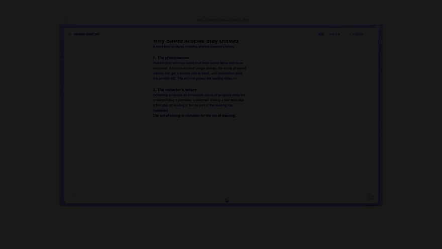
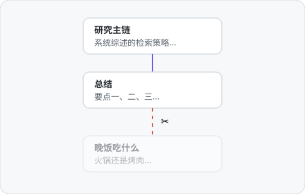
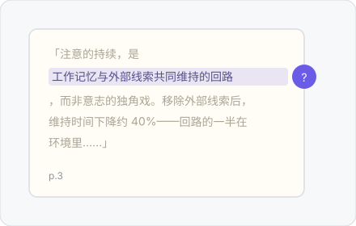
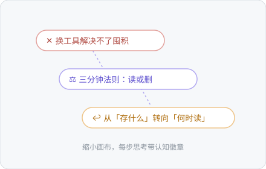

<div align="center">


# ThoughtDAG

**思考值得一张地图。** 在无限画布上，AI 对话长成一张可编辑的思维图。


### [下载桌面版 ↓](https://chenxiachan.github.io/thoughtdag/?lang=zh#download) · [官网](https://chenxiachan.github.io/thoughtdag/?lang=zh)

[English](./README.md) · [快速开始](#快速开始) · [有何不同](#thoughtdag-和其他图形化-ai-工具有何不同) · [研究](#-研究为什么上下文需要可编辑) · [模型与隐私](#模型成本与隐私)



</div>

**[▶ 33 秒旁白讲解](https://github.com/user-attachments/assets/f0362497-0e80-4caa-8214-cdbac92ab77c)**

## 唯一法则

> **连线即上下文。** 模型看到的，精确等于连进节点的内容。编辑图，就是在编辑模型的记忆。

很多工具都把对话放上画布。在 ThoughtDAG 里，连线不是装饰，也不是执行路径。它决定模型下一次看到什么。

## 它长什么样

每个手势背后是同一条原则：**人在回路上，模型在连线上**。没有自主代理替你改图。

<table>
<tr>
<td width="45%"></td>
<td width="55%">

### ✂️ 删一条边，换一个答案

模型只看到连进来的内容。删掉噪音边，同一个问题返回干净的回答。**在示例画布第 ③ 区亲手复现。**

</td>
</tr>
</table>

<table>
<tr>
<td width="55%">

### 📖 把文献读成思维地图

圈选一段直接提问，答案带着页码落进画布，p.N 芯片一键跳回原文。**读完论文，地图已经画好。**

</td>
<td width="45%"></td>
</tr>
</table>

<table>
<tr>
<td width="45%"></td>
<td width="55%">

### 💎 先凝练，再看见整张地图

节点合并成更高的结论，高光串成带引用的文字；继续缩小，完整卡片变成收获句门牌与图标骨架。**图不断收拢，而不是不断膨胀。**

</td>
</tr>
</table>

## ThoughtDAG 和其他图形化 AI 工具有何不同

很多产品都有节点和连线，但这张图在不同产品中做的事并不一样。

| 产品类别 | 与 ThoughtDAG 的区别 |
|---|---|
| 线性对话 | 上下文沿一条时间线累积；ThoughtDAG 可选择和合并可见路径。 |
| 思维导图与数字白板 | 连线主要帮人整理概念；ThoughtDAG 的连线还会改变模型输入。 |
| 分支对话画布 | 通常沿一条父链继承；ThoughtDAG 还能合并或剪枝多条路径。 |
| 工作流与 Agent 画布 | 连线用于运行任务和传递数据；ThoughtDAG 的连线用于控制对话上下文。 |
| RAG 与自动记忆 | 系统自动检索上下文；ThoughtDAG 让选择过程可见、可编辑。 |

ThoughtDAG 是一张由人编辑的上下文图：连入节点的路径与显式引用构成下一次请求，被排除的内容则继续留在画布上。

## 快速开始

### 桌面版

下载、打开、开始思考。[下载页](https://chenxiachan.github.io/thoughtdag/?lang=zh#download)会自动识别系统并给出对应安装包；全部构建可在 [Releases](https://github.com/chenxiachan/thoughtdag/releases/latest) 找到。macOS 版已签名与公证；Windows 版暂未签名，可能出现 SmartScreen 提示。

### 从源码运行

```bash
npm install
npm run server    # LLM 代理 :3001
npm run dev       # → localhost:5173
# 无 .env 时，在应用内连接任意兼容 OpenAI 协议的接口即可
```

环境变量、本地模型与连接方式 → [docs/setup_ZH.md](docs/setup_ZH.md)

### 在线体验

想先花十秒看看再决定装不装？[在线 Demo](https://app.thoughtdag.workers.dev) 在浏览器里直接跑，示例画布免 key。注意它是功能子集：免 key 联网搜索、部分直连工具和订阅桥只在桌面版/本地可用。

## 🧪 研究：为什么上下文需要可编辑

### 上下文干预基准 · 首轮实验

错误信息进入一段 LLM 对话后，究竟要移除多少受影响的路径，回答才能恢复？

> 七个模型端点、126 个配对案例：只删除错误源头修复 **116/126**。移除受污染子图修复 **126/126**。

这个实验不解释模型内部为何这样回答，也不做通用模型排名。它检验的是一个更窄、可观察的问题：改变可见上下文，会不会改变下一次回答？

📖 **[阅读首轮案例](https://chenxiachan.github.io/thoughtdag/stories/context-repair/?lang=zh)** · 📊 **[实验方法与结果（英文技术报告）](https://chenxiachan.github.io/thoughtdag/research/context-repair-pilot-v2/)** · 💬 **[建议下一轮测试模型](https://github.com/chenxiachan/thoughtdag/issues/new)**

## 更多能力

| 能力 | 说明 |
|------|------|
| 📤 只读分享 | 一条链接携带整张图，无账号、不经服务器存储 |
| 🧭 陈旧重放 | 上游一改，受影响回答亮标记；按依赖序批量重放，先报 token 价 |
| ✂️ 摘取 | 阅读器里圈选文字、框选图表，摘成带页码出处的画布素材 |
| 🔌 模型自由 | 节点级钉选、沿线继承；纯文本模型经伴随文本读图 |
| 🔒 本地优先 | 自动文件夹备份写成真实文件，指向同步盘即跨设备 |

完整功能清单（60+ 条，按领域分组）→ [docs/features_ZH.md](docs/features_ZH.md)

### 和 coding agent 并肩工作

自动文件夹备份会把画布持续写成项目里的 `.thoughtdag.json`；Markdown 导出则把任意上下文链或选区变成普通 `.md`。coding agent 无需插件、API 或额外服务即可读取。

## 模型、成本与隐私

连接本地 Ollama 或任意兼容 OpenAI 协议的端点。内置预设、订阅接入与环境变量说明统一放在[配置文档](docs/setup_ZH.md)。

- **免费档模型覆盖全部功能**；本地 Ollama 完全离线
- **桌面版一切都在本机**：画布、key、文档；在线 Demo 的模型流量浏览器直连，key 不经服务器
- **PDF 不离机**，只有提取文本随提问发出
- **备份格式向后兼容**；Markdown 导出是永久逃生门

## 支持者

感谢首位支持者 **@andreilaiter**，也感谢每一位帮助这个独立开源项目继续成长的人。

<a href="https://buymeacoffee.com/chatchan92"></a>

---

<div align="center">

*图无环，环是人。*

[MIT](./LICENSE) © 2026 Xia Chen · [Roadmap](docs/features_ZH.md#roadmap) · [反馈](https://github.com/chenxiachan/thoughtdag/issues) · [引用](https://github.com/chenxiachan/thoughtdag#cite-this-repository)

</div>
