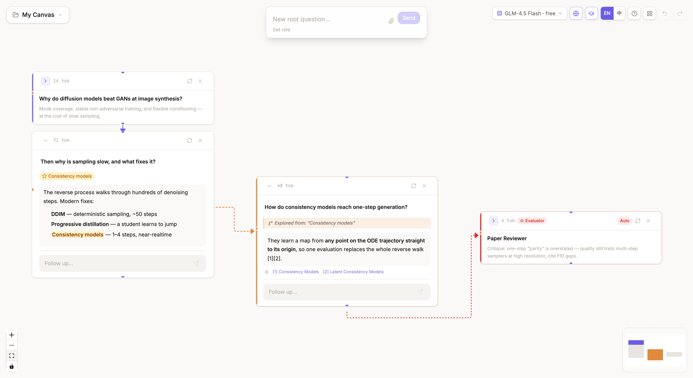
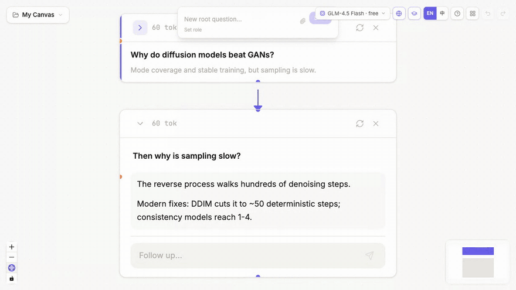
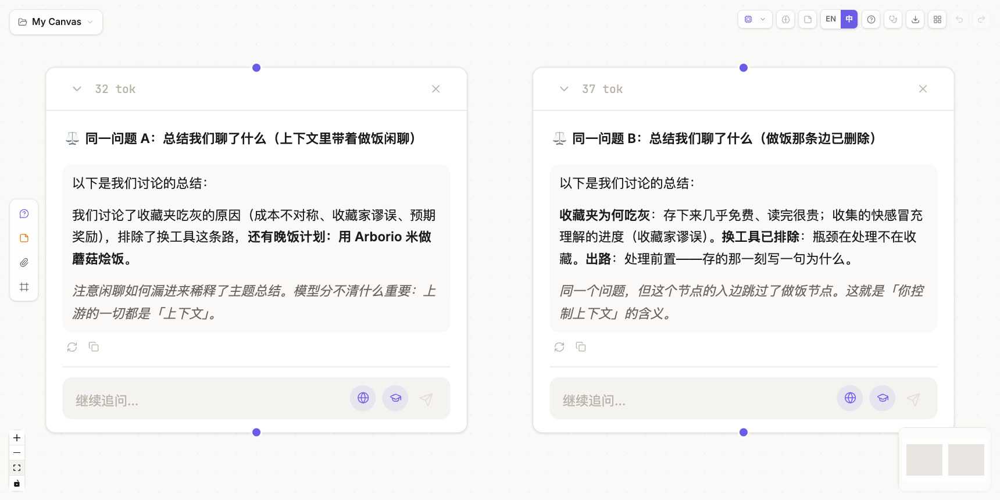

<div align="center">


# ThoughtDAG

### 让思考长成图，而不是一条线

**在无限画布上，把 AI 对话变成可编辑的思维图谱 —— 模型看到什么，由你决定。**


 

[English](./README.md) · [快速开始](#快速开始) · [核心特性](#核心特性) · [Roadmap](#roadmap)



</div>

---

## 看它怎么用



*核心手势：选中回答里的任意一段文字 → **Explore** → 一条橙色分支从这段文字里长出来、流式生成回答，并且永远不污染主链。*

## 两分钟跑起来

```bash
npm install
cp .env.example .env   # 一把 key 就够：ZHIPU_API_KEY 免费（open.bigmodel.cn）
npm run server         # LLM 代理
npm run dev            # → http://localhost:5173
```

首次打开会载入**预置示例画布**——包括下方的 ⚖️ 上下文裁剪演示——不用输入任何东西就能感受这个工具。有 ChatGPT 或 Claude 的聊天记录？**导入 `conversations.json`**，你自己的对话立刻变成可编辑的图（分支保留）。

## 为什么需要 ThoughtDAG？

所有主流 LLM 界面都是**线性的、只能追加的、不透明的**：

- 对话越长，上下文被无关内容稀释得越厉害 —— 而你删不掉任何一句
- 想同时探索三个方向？开三个窗口，然后眼睁睁看着它们失去关联
- 「圈住这段话继续深挖」这个最自然的动作，只能靠复制粘贴模拟
- 最关键的：**你对 context window 里有什么，没有任何控制权**

ThoughtDAG 换了一个数据结构来回答这个问题：对话不是列表，是**图**。

## 一条规则，掌控上下文

- **节点** = 一轮问答 · **边** = 上下文的流向
- 发送给模型的上下文由一条规则决定：**沿所有入边递归向上遍历**
- 于是：**加一条边 = 注入上下文，删一条边 = 裁剪上下文**

```
[什么是ML?] ──紫──▶ [什么是DL?] ──紫──▶ [什么是Transformer?]
                        │
                    橙（选中文字分支）
                        ▼
              [具体解释一下 CNN]
```

- 「Transformer」节点看到节点 1 + 2；删掉 1→2、直连 1→3，它就只看到节点 1
- 分支节点带着选中的文字去探索，却不污染主链
- 提问前实时预览「将发送 ~N tok · M messages · K files」—— 上下文从黑箱变成仪表盘

**眼见为实** —— 示例画布自带这个实验：同一个总结问题问了两次。A 节点继承了一段无关的做饭闲聊，它直接漏进了回答；B 节点通向噪音的边被删掉，回答干干净净：



*左：一个无关节点连进问题 A。右：A 的回答吸进了噪音（加粗处），而 B —— 同一个问题、删掉噪音边 —— 保持干净。*

## 核心特性

### 🧠 上下文，可见且可塑
每条边都是一次上下文决策：拖线合并分支、点选删除裁剪记忆、折叠节点自动改传摘要（上下文压缩）。发送预览让每次提问前都知道模型将看到什么。

### 📥 解锁你的对话资产
导入 ChatGPT 或 Claude 的 `conversations.json`——每个对话变成一张可编辑画布，ChatGPT 的编辑/重新生成分叉保留为可见的图分支。积累多年、被锁在线性聊天里的对话，变成可裁剪、可延伸、可推理的图。

### 🌿 随处分支，自由收敛
选中回答里的任意文字 → 向右生长出一条探索分支；跨分支拖线合并结论；Regenerate 生成兄弟版本对比择优；高亮关键段落做「蒸馏重生成」，去冗余保重点。

### 🔁 活节点与受控循环 —— 一个原语，无数工具
任意节点都可以开启**自动重跑**：上游一有变化就重新生成自己。与角色组合，这一个开关就能长出审稿人、活摘要、随动翻译、常驻研究问题——不需要为每个场景单独造功能。**审稿人预设**一键完成组装：批评者人设 + 一条随思路延伸自动前移的红边，每一步新内容都会被重新评审（历史成版本）。而且审稿人就是普通节点——你可以反问它的批评、从批评里分支、把它连到任何地方。把批评者**连回**写作者并调高轮数预算（×3、×5……），就得到一个**受控的自我改进循环**：起草 → 批评 → 修订，一次点击自动迭代、预算用尽确定性停止。全局暂停开关随时叫停一切自动化。

### 🔍 Agentic 检索 —— 联网 + 学术
模型自主判断何时检索、用哪个工具：事实与时事走网页搜索，**论文走 arXiv + Semantic Scholar**（摘要、作者、引用数）。回答带 `[n]` 行内引用，References 随节点持久化 —— 每个结论都有出处可点。工具栏可分组开关。

### ✂️ 为深读设计的编辑
问答全部可编辑、回答多版本管理、LaTeX 公式、代码高亮、语义缩放（缩小画布自动切大字缩略卡）、一键排版按箭头顺序整理全图。

### 🗂️ 科研级工作流
多画布项目管理（一个课题一张图）、IndexedDB 自动保存、JSON 备份 / 导入、**ChatGPT/Claude 历史导入**（分支保留）、上下文链一键导出 Markdown、附件系统（图片 Vision / PDF 双通道 / 继承精确控制）、中英双语界面、内置五步教程。

<details>
<summary><b>📜 完整功能清单（50+ 项）</b></summary>

- **无限画布** — 平移、缩放、自由拖拽节点（React Flow）
- **DAG 上下文引擎** — `buildContext()` 遍历所有入边，拓扑序构建对话历史
- **紫色边**（继续追问）— 继承完整祖先上下文
- **橙色边**（分支探索）— 选中文字 → 向右分支，探索性提问
- **跨分支连线** — 拖拽连接任意节点，合并上下文
- **连线点选删除** — 点击连线选中，浮出删除按钮；右键菜单同样可删；Cmd+Z 撤销
- **重新生成** — 创建兄弟节点（树形分支，不是原地替换）
- **全部可编辑** — 双击编辑问题或回答
- **文字选择工具栏** — 选中回答中的文字 → 分支 / 高亮
- **Markdown + LaTeX 渲染** — 完整 markdown、代码高亮、行内与块级公式
- **版本管理** — 在回答版本间导航，删除差的版本
- **Focus 侧栏面板** — 完整问答编辑、版本导航、高亮管理、context chain 可视化、追问输入；宽度可拖拽
- **高亮系统** — 三种下游传递模式：📄 全文 / 🏷️ 标记重点 / ✂️ 仅传高亮
- **精炼重生成（Distill）** — 高亮关键段落后一键创建精炼兄弟节点
- **编辑自动清理失效高亮**
- **撤销/重做** — Cmd+Z / Cmd+Shift+Z，完整状态快照
- **Column-Tree 自动布局** — 主链向下、分支向右分列，真实测量高度防重叠
- **一键排版 / 圈选对齐** — 按箭头顺序整理全图（确认框防误触）；多选 Align 堆叠成列
- **折叠/展开** — 折叠节点传摘要不传全文（上下文压缩），下游自动平移
- **节点自动摘要** — 后台 LLM 生成，折叠态显示
- **语义缩放** — 缩小画布节点切大字缩略卡
- **Token 计数** — 每节点显示用量
- **流式响应** — SSE 逐字渲染 + 闪烁光标，节点与面板同步
- **停止生成** — 保留已生成内容
- **失败原地重试** — Retry 按钮原地重试，错误走 toast 不污染回答
- **选中边高亮** — 祖先路径金色加粗，其余淡化
- **多选操作** — 框选节点：Merge Summary / Merge & Delete / Align / Export / Delete
- **节点角色系统** — 节点级 System Prompt 三模式（继承/向下设置/本节点重置），`appliedRole` 记录生成时角色，多父冲突 Radio 选择
- **角色模板库** — 审稿人 / 魔鬼代言人 / 统计顾问 / Code Reviewer / 导师
- **审稿人预设** — 批评角色骑在滑动红边上，每步新内容自动重新评审、历史成版本；审稿人是普通节点（可反问、可分支）
- **Agentic 检索** — AI SDK 工具循环：智谱网页搜索 + arXiv + Semantic Scholar（免费 API），`[n]` 引用 + References 持久化，强制总结兜底，工具分组开关
- **MCP 工具生态** — Claude Desktop 同格式 `mcp.config.json`；支持 stdio 与 HTTP/SSE；工具进入 agentic 循环并带调用进度；自带 mock server 供验证
- **数据持久化** — IndexedDB 自动保存（1s 防抖），刷新不丢
- **多画布项目管理** — 新建/切换/重命名/删除，每张独立保存
- **导出体系** — 整图 JSON 备份导入；上下文链/多选导出 Markdown
- **Context 发送预览** — 「~N tok · M messages · K files」实时预览
- **附件系统** — 节点局部附件（拖拽/粘贴/上传）、继承 include/exclude 精确控制、指纹去重、图片 Vision 自动切换、PDF 文本+页图双通道
- **节点级模型覆盖** — 任意节点可固定自己的 LLM（卡片显示徽章，Regenerate 兄弟版本继承）；探索用便宜模型、关键推理用旗舰
- **Cmd+F 节点搜索** — 按问题/回答/摘要过滤，方向键 + Enter 定位画布
- **键盘快捷键** — Space 折叠、R 重生成、方向键沿 DAG 导航、Esc 逐级退出（教程内有速查表）
- **中英双语 UI** — 自动检测浏览器语言，一键切换
- **内置教程** — 五步图解快速上手
- **画布新建 Root** — 双击空白处提问，多棵树共存
- **首次打开自带示例画布** — 预置图（含 ⚖️ 上下文裁剪 A/B 对比演示）而非空白页；landing 可随时重新载入
- **导入 ChatGPT / Claude 记录** — conversations.json 拖进导入即可；ChatGPT 的编辑/重生成分支保留为图分叉，每个对话一张画布
- **环境变量配置** — key 走 `.env`，按 key 自动注册可用模型

</details>

## 成本与隐私

- **免费可用。** 智谱免费档（GLM-4.5-Flash 文本 + GLM-4V-Flash 视觉）覆盖全部功能；联网搜索约 ¥0.01/次。也可以接任何你已付费的模型，或本地 Ollama 完全离线。
- **数据在你手里。** 画布存在浏览器 IndexedDB；唯一的服务端是你自己机器上的轻代理。除了你选择的 LLM API，任何数据不上传任何地方。备份是你完全拥有的 JSON 文件。
- 可选：PDF 页图渲染需要 poppler（`brew install poppler`），缺失时自动降级纯文本。

## MCP 工具 —— 接入整个生态

把 `mcp.config.example.json` 复制为 `mcp.config.json`，按 [MCP](https://modelcontextprotocol.io) 标准格式（与 Claude Desktop 完全一致，现成配置片段直接可用）列出你的 MCP server。它们的工具与联网/学术检索进入同一个 agentic 循环：**模型自主决定何时调用**，工具栏插头图标可整组关闭，调用时节点显示 🔧 进度。

```jsonc
{
  "mcpServers": {
    "zotero": { "command": "zotero-mcp", "env": { "ZOTERO_LOCAL": "true" } },  // 你的 Zotero 文献库
    "fetch":  { "command": "uvx", "args": ["mcp-server-fetch"] }               // 网页全文阅读
  }
}
```

stdio 型 server 用 `command`/`args`/`env`；远程 server 用 `url`（可选 `type`、`headers`）。仓库自带测试 server（`scripts/mock-mcp.mjs`）——接上后问一句「某某的幸运数字是多少」即可验证全链路。

## 支持的模型

基于 Vercel AI SDK：**下表任何一家，把 key 填进 `.env` 即自动激活**——不改代码、不写配置。工具栏模型选择器随时切换；纯文本模型收到图片时自动改走视觉模型。各家默认模型 id 可用环境变量覆盖（如 `OPENAI_MODELS=gpt-5.2`），新模型发布无需升级代码。

| 提供商 | 默认模型 | `.env` key | 说明 |
|--------|----------|------------|------|
| **智谱 GLM** | glm-4.5-flash · glm-4v-flash | `ZHIPU_API_KEY` | **免费**、国内直连；联网搜索由它驱动 |
| **通义千问** (DashScope) | qwen-plus · qwen-vl-plus | `DASHSCOPE_API_KEY` | 国内直连 |
| **OpenAI** | gpt-5.1 · gpt-5-mini | `OPENAI_API_KEY` | 可用 `OPENAI_MODELS` 覆盖 |
| **Anthropic** | claude-sonnet-5 · claude-haiku-4-5 | `ANTHROPIC_API_KEY` | 可用 `ANTHROPIC_MODELS` 覆盖 |
| **Google** | gemini-2.5-pro · gemini-2.5-flash | `GOOGLE_API_KEY` | 可用 `GOOGLE_MODELS` 覆盖 |
| **DeepSeek** | deepseek-chat · deepseek-reasoner | `DEEPSEEK_API_KEY` | 纯文本（有图自动改道视觉模型）|
| **Kimi**（月之暗面）| kimi-k2-turbo-preview · kimi-latest | `MOONSHOT_API_KEY` | 国内直连；国际版设 `MOONSHOT_BASE_URL` |
| **OpenRouter** | openrouter/auto | `OPENROUTER_API_KEY` | 一把 key 通 300+ 模型，`OPENROUTER_MODELS` 填任意 `vendor/model` |
| **Ollama** | （你本地的）| `OLLAMA_MODELS=qwen3:8b,…` | 完全本地离线 |

## 技术栈与架构

| 层级 | 技术 |
|------|------|
| 界面 | React 19 + TypeScript + Vite 7 |
| 画布 | @xyflow/react (React Flow) |
| 状态 | Zustand（persist → IndexedDB via idb-keyval）|
| 样式 | Tailwind CSS v4 |
| 大模型 | Vercel AI SDK —— 9 家 provider，按 .env key 自动注册（见[支持的模型](#支持的模型)）|
| 代理 | Express + Vercel AI SDK（server.mjs，默认端口 3001）|

```
浏览器 (localhost:5173)
  └─ React + React Flow 画布
      └─ Zustand store (nodes, edges, history) ⇄ IndexedDB（自动保存）
          ├─ buildContext(nodeId) → 遍历 DAG → ContextMessage[] + images
          └─ src/lib/api.ts
              ├─ llmCallStream(messages) → POST /api/stream（SSE 流式 + 工具事件）
              ├─ llmCall(messages)       → POST /api/claude（非流式，用于摘要）
              └─ extractPdf(base64)      → POST /api/pdf-extract
                        └─ Express + AI SDK (server.mjs) → 智谱 / 通义千问 / 任意 provider
                             └─ web_search 工具（模型自主调用，引用回流）
```

## Roadmap

**近期**
- [ ] 边交叉最小化、Hover ＋ 空白子节点、框选 Group/Ungroup

**远期**
- [ ] 多 Evaluator 协作（审稿人 + 统计顾问 + 语言编辑同挂一条主线）
- [ ] Artifact 节点（画布上的文件产出物，Monaco 编辑器 + 版本历史）
- [ ] 导入 ChatGPT/Claude 历史对话自动转 DAG
- [ ] 协作模式、模板系统、本地 LLM（Ollama）、DOCX 解析

## 反馈

ThoughtDAG 是一个活跃开发中的早期项目——正是反馈最有价值的时候：

- ⭐ 觉得这个思路有意思？**点个 Star**，这真的很有帮助
- 🐛 遇到 bug 或不顺手的地方？[提个 issue](https://github.com/chenxiachan/thoughtdag/issues)
- 💡 关于「用图思考」的想法？[来 Discussions 聊聊](https://github.com/chenxiachan/thoughtdag/discussions)

## 许可

[MIT](./LICENSE) © 2026 Xia Chen
