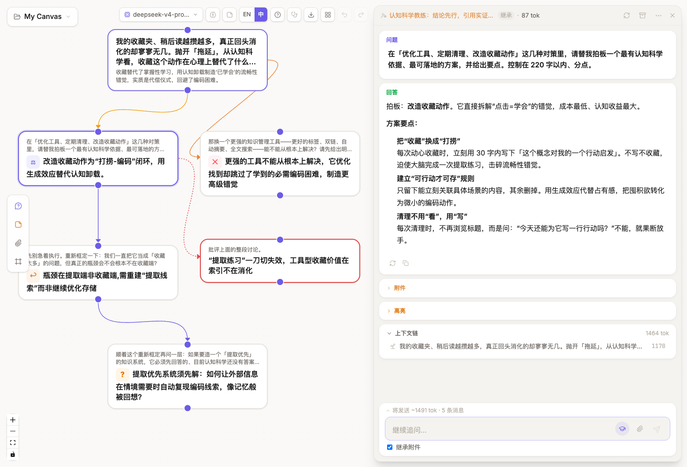
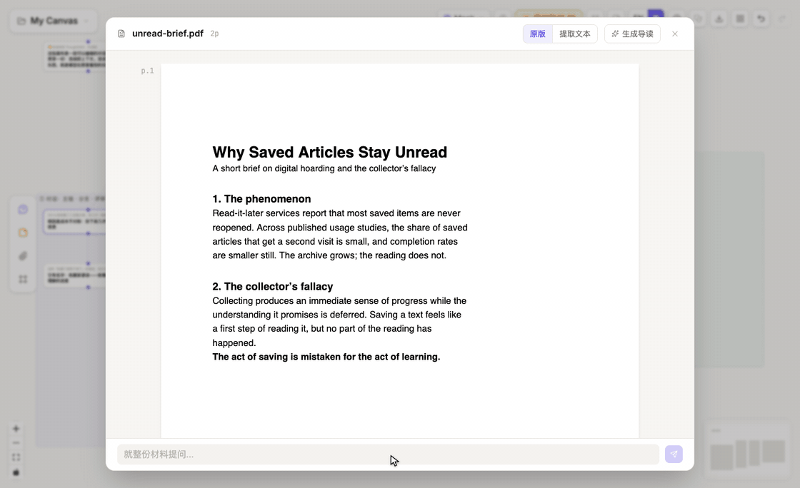
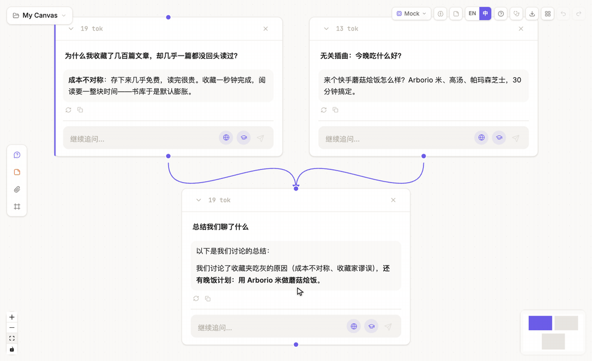

<div align="center">


# ThoughtDAG

**思考值得一张地图。**

在无限画布上，AI 对话长成一张可编辑的思维图。


 

**[▶ 在线试用](https://app.thoughtdag.workers.dev)**。无需安装、无需注册。示例画布（上图的来源）不需要 key；连接模型只需任意兼容 OpenAI 协议的 API key，在应用内完成。

[English](./README.md) · [在线 Demo](https://app.thoughtdag.workers.dev) · [快速开始](#快速开始) · [功能总览](#功能总览) · [支持的模型](#支持的模型) · [Roadmap](#roadmap)



</div>

## 为什么

**长对话在稀释上下文，而你看不见模型读了什么。**
在这里，模型看到的精确等于连进节点的内容。删一条边，换一个答案。

**好答案埋在第 47 轮，再找到它像一场考古。**
缩小画布：收获句门牌和认知徽章，把画布变成你思考过程的地图。

**你的思考锁在别人的服务器里。**
画布在你的浏览器里；备份是你磁盘上的真实文件，随时带走。

问题是节点，连线是上下文，编辑图，就是在编辑模型的记忆。让思考长成图，不再挤成一条线。


## 快速开始

最快的路径是[在线 Demo](https://app.thoughtdag.workers.dev)：打开、粘贴一个 key（不粘贴也行，可以先逛示例画布）就能用。模型流量从浏览器直连网关，key 不会经过 Demo 的服务器。想自己跑：

```bash
npm install
npm run server         # LLM 代理
npm run dev            # → http://localhost:5173
```

不用配置也能开始：`.env` 里没有 key 时，应用会请你连接一个模型接口。选一家服务商填 key、接入本地运行的模型（Ollama 等），或者填任何兼容 OpenAI 协议的自定义端点；模型列表从接口现场拉取，key 只存 localStorage 和代理内存，不落盘。也可以把 `.env.example` 复制成 `.env` 填任意服务商的 key，`ZHIPU_API_KEY` 免费（open.bigmodel.cn）。

首次打开是预置的示例画布：围绕一个日常问题（收藏夹为什么总在吃灰）展开四章，从对话语法到一份内嵌真 PDF 的阅读闭环。缩小画布看看，上面的 hero 图就是这张画布的地图形态。最快的入口：把一篇 PDF 拖到首页，从阅读开始。智谱 key 同时驱动联网搜索（引擎档位在模型菜单里可切换）；学术检索（arXiv + Semantic Scholar）免费、不需要任何 key。

## 把文献读成思维地图

拖入 PDF，读的是原版页面。圈选一段、直接提问：答案在文档旁边流式出现，问题带着页码落在画布上、连着材料。问过的段落会在页面上留下印记：一道高亮和一个重开对话的气泡，读完整篇之前，问过的一切都在原地等你。这条路是双向的：回到画布，节点上的 p.N 芯片一键跳回阅读器的那一页。

一键生成导读：一篇你的语言写成的短篇结构化导读，每个要点都锚着页码跳转按钮。导读本身就是一个节点。把它连向下游，后续问题就以材料的最佳压缩为上下文，不再拖着整份原文。扫描件一键重排为可读的 Markdown，公式也认。



**核心手势，处处可用：**选中文字，点探索，分支就从这段文字里长出来。在阅读器里、在任何回答里、在任何卡片上都一样。新节点只继承你选中的内容，主链保持干净。

## 删一条边，换一个答案

模型只看到连进节点的内容，整个产品就这一条法则。这条法则是可检验的：提示词一字不动，只改一条线，看回答怎么变。



*一个总结节点、两个上游，晚饭计划漏进了回答。删掉噪音那条边，重新生成，同一句提示词返回干净的总结。录屏来自真实应用（内容预载，方便任何人检查上下文）；机制是产品真实行为，在示例画布第 ③ 区可以亲手复现。*

## 功能总览

| | |
|---|---|
| 🧠 上下文编辑 | 拖线合并分支、删线裁剪记忆、归档的节点退出一切未来上下文 |
| 📖 阅读闭环 | 问过的段落在 PDF 页面留印记，画布节点用 p.N 芯片跳回原文；一键导读，导读即节点、可连下游 |
| ✨ 高光 | 圈选标记你的判断；总览一处看全（按时间或按节点，每条可定位出处）；勾选任意几条串联成一段带引用的文字 |
| 🗺️ 地图视图 | 三层语义缩放：完整卡片 → 收获句门牌（✕ 排除 · ⚖ 决策 · ↩ 转向 · ? 待解）→ 图标骨架，印章保持固定屏幕尺寸，缩得再远地图也不稀疏 |
| 📤 只读分享 | 一条链接把画布变成任何人可浏览的只读页面；链接本身携带整张图，无需账号，不经任何服务器存储 |
| 🧭 陈旧与重放 | 上游一改，被影响的回答立刻亮标记；按依赖顺序批量重放，先报 token 价 |
| 🧪 范式 | 可复用的人机工作流；改个输入、一键重放，整个实验重跑一遍 |
| 🔌 模型自由 | 九家 provider 或任何兼容 OpenAI 协议的接口；节点级切换，钉选沿线继承，Ollama 完全本地离线 |
| 🔒 本地优先 | 数据在你的浏览器里；自动文件夹备份把画布写成磁盘上的真实文件（指向同步盘即零服务器跨设备）；备份是你完全拥有的 JSON |

折叠清单里还有：带价格的引用边（摘要⇄全量互转）、带意图的收敛、随动评审、拓扑体检、Agentic 检索、角色库、@ 节点引用。

<details>
<summary><b>📜 完整功能清单（按领域分组）</b></summary>

### 画布与上下文：唯一法则一族

- **DAG 上下文引擎**: `buildContext()` 遍历所有入边，拓扑序构建对话历史
- **分层上下文组装**: 材料 → 引用块 → 对话，顺序与连线先后无关（同一张图、同一份 prompt）
- **紫色边**（继续追问）：继承完整祖先上下文
- **橙色实线**（分支探索）：选中文字 → 向右分支，探索性提问；实线永远=结构，虚线永远=旁路（引用 / 评审）
- **引用边（虚线）**: 手拖连线落在任意节点=引用它（问答+上游来路），不拖整条对话；深度是边的一等属性：选中边或在面板上下文树里都能切 引用⇄全量，连线 toast 同时报出两档价格（源头无上游链时不打扰）
- **「将发送」预览**: 提问前实时显示 ~N tok · M 条消息 · K 个文件，并按 材料 · 引用 · 对话 三层拆解
- **连线点选删除**: 点击连线选中，浮出删除按钮；右键菜单同样可删；Cmd+Z 撤销
- **归档（裁剪但保留）**: 画布上变暗、退出一切上下文遍历、可恢复；多选批量归档
- **合并综合**: 框选节点 → 结构化综合（结论 / 证据 / 未解问题）
- **高亮系统**: 三种下游传递模式：📄 全文 / 🏷️ 标记重点 / ✂️ 仅传高亮；列表、表格里的标记照常显示；编辑后自动清理失效高亮；全部高光总览（按时间/按节点）每条可定位出处节点、可导出 Markdown、勾选任意子集串联成带引用的一段文字
- **节点角色系统**: 节点级 system prompt 三种模式（继承 / 为下游设定 / 此处重置），生成时记录 `appliedRole`，多父冲突有单选器
- **角色库可自行编辑**: 内置角色+自定义角色；管理器中增删改（改内置=生成你的副本，可随时还原）；已应用的角色冻结在节点上
- **Token 计数**: 每节点用量显示

### 阅读与材料

- **材料阅读器**: 原版 PDF 渲染+可选中文字层（pdf.js）；圈选→提问=支线节点带 `(p.N)` 出处，段落在页面留下锚点（高亮洗染+重开对话的气泡）；画布节点带 p.N 芯片反向跳回阅读器；扫描件回退提取文本视图；底部对话索引给每条线程标注 p.N 或整篇；每份材料记住滚动位置
- **批注栏**: 答案在文档旁流式出现；追问接成链；在答案里圈选可探索（挂在该回答下）或加高亮；chips 切换线程，十字跳画布
- **回答也有阅读闭环**: 每个回答都能以阅读尺寸打开；圈选即可高亮或就这段内容开分支，下方直接追问，视图自动切到新节点原地流式，一整条追问链读下来不用离开文本
- **导读**: 一键把材料整理成 UI 语言的短篇结构化导读，(p.N) 按钮跳回原文页；导读本身是画布节点（重写即版本、标注生成模型、可连下游作为材料的压缩表示）；重新生成走导读专用 prompt 对全文执行
- **识别（扫描件）**: 逐页视觉重排为 Markdown/LaTeX，可编辑；外部 OCR 工具的输出可直接贴入
- **内容节点**: 便签（markdown）、带 PDF 封面的文件节点、带时间戳的链接快照；粘贴即建；图像自动识读用最强的已配置视觉模型；所有材料都在阅读器中打开
- **附件系统**: 节点级附件（拖拽/粘贴/上传）、继承的包含/排除控制、指纹去重、图片自动切换视觉模型；PDF 以提取文本进入上下文，文件节点穿首页封面
- **材料优先首页**: 文档拖到首页=材料节点+阅读器自动打开；给根问题带附件走显式回形针

### 地图与回顾

- **地图模式**: 三层滞回缩放：完整卡片 → 收获句门牌 → 图标印章（一节点一章）；印章与连线反向补偿到固定屏幕尺寸（地图图钉式），越缩地图越紧而不是越稀；等人输入的节点保持工作形态
- **类型化收获句**: 每个回答版本一行结论先行的总结，自动分类（✕ 排除 · ⚖ 决策 · ↩ 转向 · ? 待解；普通洞见不打标）；纯显示层，永不进上下文与指纹
- **陈旧追踪**: 每次生成记录上游指纹；节点亮琥珀徽章、上下文树打点、下游载荷带 [Stale] 标记
- **批量重放**: 一键按依赖顺序重跑全部陈旧节点；确认框带 token 估算；随时停止
- **版本管理**: 原地重新生成=追加可对比版本（翻页/删除/切回，下游陈旧随当前版本联动）；「另开分支重答」生成平行兄弟做 A/B
- **拓扑体检**: 按需诊断，确定性发现（残差实线/影子引用/盲评破盲/候选不对称）+ 观察项（巨链/开放支线/坍缩点）；定位跳转+一键修复
- **Cmd+F 节点搜索**: 按问题/回答/收获句过滤，方向键+Enter 跳转平移画布
- **祖先边高亮**: 选中节点到根的路径变金色，其余变暗

### 生成与自动化

- **流式回答**: SSE 逐 token 渲染+闪烁光标，节点和面板同步；停止保留已生成内容；失败显示重试（错误进 toast，不进回答）
- **随动评审**: 红色滑动边上的批评者角色；每一步新内容自动重新评审，历史成版本；评审是普通节点（可追问、可分支）
- **范式模式**: human/prompt 步骤+材料槽位；实例化 → 级联 → 解锁；改输入+重放=重跑整个实验；评审轮数在文件里声明、有界
- **环境记忆**: 后台判官给长期事实分类（偏好/身份/项目），准入规则写在代码里；写入有可见 toast+撤销；项目类条目 45 天未更新自动退出上下文；一个全局开关（默认开）、管理器带类别徽章、支持粘贴导入和 JSON 导出；机器步骤和导读不注入记忆
- **全部可编辑**: 双击编辑问题或回答；文字选择工具栏（分支 / 高亮）

### 模型与检索

- **模型自由**: 九家 provider 填 key 即注册；工具栏切换随时生效；带图请求自动改道视觉模型
- **模型接口管理器**: 不碰 `.env` 也能用：服务商预设只固化接口地址，模型列表从接口的 `/models` 现场拉取（永不过期）；本地 Ollama 免 key 自动探测；自定义端点兜住一切兼容 OpenAI 协议的服务；key 只存 localStorage+代理内存，不落盘；没有任何模型时管理器自动弹出
- **节点级模型覆写**: 任意节点可钉住自己的 LLM（卡片带徽章，兄弟重答继承）；探索用便宜模型、关键步骤上旗舰；每个版本记录由哪个模型生成
- **Agentic 检索**: AI SDK 工具循环：网页搜索 + arXiv + Semantic Scholar（免费 API），`[n]` 行内引用+持久化参考文献，保底综合回答，工具栏分组开关
- **MCP 工具生态**: `mcp.config.json`（stdio + HTTP/SSE 两种传输）；工具加入 agentic 循环、逐调用进度；附带测试用 mock server
- **能力面板**: 搜索引擎档位、学术检索状态、视觉模型偏好、记忆开关集中一处，在模型选择器脚部

### 工作台与数据

- **无限画布**: 平移、缩放、自由拖拽节点（React Flow）
- **列树自动布局**: 主链向下、分支向右；用实测高度防重叠；随时可整理布局/对齐所选
- **分区框**: 带标签的彩色区域+导航跳转列表；可隐藏批注视图
- **Focus 浮层面板**: 悬浮于画布之上（画布永不让位）的白卡阅读布局、按 材料/引用/对话 分组的上下文树、追问输入；宽度可拖拽
- **Markdown + LaTeX 渲染**: 完整 markdown、代码高亮、行内与块级公式
- **多选操作**: 框选节点：合并综合 / 合并删除 / 对齐 / 导出 / 删除
- **只读分享链接**: 一条链接携带整张图（压缩进 URL，不经服务器存储）；访客可浏览缩放阅读，不能编辑；⋯ 菜单里分享
- **@ 节点引用**: 输入框里敲 @ 按名字引用任意节点；不在上游的自动连一条真实的虚线引用边（可见、报价、可转实线），已在上游的成为精确指称
- **自动文件夹备份**: 授权一次文件夹，每次修改防抖写成磁盘上的真实 `.thoughtdag.json`；指向同步盘即可零服务器跨设备；工具栏控制中心显示最近写入时间，可一键备份全部画布
- **事件日志**: 语义操作的 append-only 记录（提问、生成、高光、归档、撤销），带时间戳、只记元数据；随备份走，可导出 CSV 进 R/Python 分析
- **节点右键菜单**: 打开面板 / 阅读视图 / 重新生成（原地或新节点）/ 复制 / 复制副本 / 归档 / 删除；选中文字时右键保留浏览器原生菜单
- **数据持久化**: IndexedDB 自动保存（1 秒防抖）、刷新不丢；多画布项目（新建/切换/重命名/删除）
- **导出系统**: 整图 JSON 备份与导入；上下文链/多选 Markdown 导出；记忆和角色同样可导出，easy in, easy out
- **导入 ChatGPT / Claude 会话**: conversations.json 拖进导入；编辑/重新生成分支保留为图的分叉，每个对话成为独立画布
- **撤销/重做**: Cmd+Z / Cmd+Shift+Z，完整状态快照
- **键盘快捷键**: Space 折叠、R 重新生成、方向键走图、Esc 逐层退出（教程里有图例）
- **中英双语**: 自动检测浏览器语言，一键切换
- **内置教程**: 十步图解，从提问到范式
- **首次打开自带示例画布**: 围绕一个日常问题的四章预置图：对话语法、材料与引用、⚖️ 上下文裁剪对比、内嵌真 PDF 的阅读闭环（锚点问题+导读节点）；每个节点带类型化收获句，缩小即得一张能用的地图；landing 可随时重新载入

</details>

## 设计哲学

聊天终端是执行的 harness：为「把答案递给你」而优化，其余一切都被隐藏。ThoughtDAG 是认知的 instrument：价值单位是推理结构本身，保持可读、可编辑、可复现。

思维导图是画出来的，这张地图是长出来的。聊天则根本不留地图。

*图无环，环是人。*

## 成本与隐私

- **免费可用。** 智谱免费档（GLM-4.5-Flash 文本 + GLM-4V-Flash 视觉）覆盖全部功能；联网搜索约 ¥0.01/次。也可以接任何你已付费的模型，或本地 Ollama 完全离线。
- **数据在你手里。** 画布存在你的浏览器里；唯一的服务端是你自己机器上的轻代理。除了你选择的 LLM API，数据不会发往任何别的地方。在线 Demo 上，模型流量从浏览器直连网关，key 和对话完全不经过 Demo 的服务器。
- **PDF 不离开你的电脑。** 拖入的文档永远不会以文件形式上传，只有提取出的文本在你提问时发给你选择的模型。未发表的手稿可以放心读。
- **换浏览器不等于丢工作。** 自动文件夹备份把画布写成你指定文件夹里的真实 `.thoughtdag.json` 文件（需要 Chromium 系浏览器，如 Chrome、Edge、Arc；Safari 和 Firefox 用一键手动导出）。备份格式保持向后兼容，Markdown 导出是永远与格式无关的逃生门。
- 可选：PDF 页图渲染需要 poppler（`brew install poppler`），缺失时自动降级纯文本。

## 支持的模型

基于 Vercel AI SDK。下表任何一家，把 key 填进 `.env` 即自动激活；也可以完全跳过 `.env`，在应用里连接任何兼容 OpenAI 协议的接口（含本地 Ollama）。工具栏随时换模型，纯文本模型遇到图片自动改道视觉模型。各家默认模型 id 可用环境变量覆盖（如 `OPENAI_MODELS=gpt-5.2`）。

> 图片理解需要一把视觉模型的 key。粘贴的图片会被你配置的最强视觉模型自动识读一次，结果是可编辑的伴随文本。免费的 `glm-4v-flash` 可用；旗舰视觉模型读科研图明显更好。

| 提供商 | 默认模型 | `.env` key | 说明 |
|--------|----------|------------|------|
| **智谱 GLM** | glm-4.5-flash · glm-4v-flash | `ZHIPU_API_KEY` | **免费**、国内直连；联网搜索由它驱动 |
| **通义千问** (DashScope) | qwen-plus · qwen-vl-plus | `DASHSCOPE_API_KEY` | 国内直连 |
| **OpenAI** | gpt-5.1 · gpt-5-mini | `OPENAI_API_KEY` | 可用 `OPENAI_MODELS` 覆盖 |
| **Anthropic** | claude-sonnet-5 · claude-haiku-4-5 | `ANTHROPIC_API_KEY` | 可用 `ANTHROPIC_MODELS` 覆盖 |
| **Google** | gemini-2.5-pro · gemini-2.5-flash | `GOOGLE_API_KEY` | 可用 `GOOGLE_MODELS` 覆盖 |
| **DeepSeek** | deepseek-v4-flash · deepseek-v4-pro | `DEEPSEEK_API_KEY` | 纯文本（有图自动改道视觉模型）|
| **Kimi**（月之暗面）| kimi-k2-turbo-preview · kimi-latest | `MOONSHOT_API_KEY` | 国内直连；国际版设 `MOONSHOT_BASE_URL` |
| **OpenRouter** | openrouter/auto | `OPENROUTER_API_KEY` | 一把 key 通 300+ 模型，`OPENROUTER_MODELS` 填任意 `vendor/model` |
| **Ollama** | （你本地的）| `OLLAMA_MODELS=qwen3:8b,…` | 完全本地离线 |

## 技术栈与架构

| 层级 | 技术 |
|------|------|
| 界面 | React 19 + TypeScript + Vite 7 |
| 画布 | @xyflow/react (React Flow) |
| 状态 | Zustand（persist → IndexedDB via idb-keyval）|
| 样式 | Tailwind CSS v4 |
| 大模型 | Vercel AI SDK：9 家 provider，按 .env key 自动注册（见[支持的模型](#支持的模型)）|
| 代理 | Express + Vercel AI SDK（server.mjs，默认端口 3001）|

<details>
<summary>请求流</summary>

```
浏览器 (localhost:5173)
  └─ React + React Flow 画布
      └─ Zustand store (nodes, edges, history) ⇄ IndexedDB（自动保存）
          ├─ buildContext(nodeId) → 遍历 DAG → ContextMessage[] + images
          └─ src/lib/api.ts
              ├─ llmCallStream(messages) → POST /api/stream（SSE 流式 + 工具事件）
              ├─ llmCall(messages)       → POST /api/claude（非流式，用于摘要）
              └─ extractPdf(base64)      → POST /api/pdf-extract
                        └─ Express + AI SDK (server.mjs) → 智谱 / 通义千问 / 任意 provider
                             └─ web_search 工具（模型自主调用，引用回流）
```

</details>

## Roadmap

**近期**
- [ ] 任意画布另存为范式（反向实例化）
- [ ] 附件 blob 分离（图片密集画布的规模化）

**长期**
- [ ] 运行对比视图（同一范式 N 次运行并排）
- [ ] Artifact 节点（画布上的文件产出，Monaco 编辑器 + 版本历史）
- [ ] 异步协作：分享范式、回收运行

## 如何引用

如果 ThoughtDAG 在你的研究中发挥了作用，请引用它（GitHub 的 "Cite this repository" 按钮会读取仓库内的 `CITATION.cff`）：

```bibtex
@software{thoughtdag,
  author = {Chen, Xia},
  title  = {ThoughtDAG: an instrument for legible human-AI collaboration},
  url    = {https://github.com/chenxiachan/thoughtdag},
  year   = {2026},
  license = {MIT}
}
```

## 反馈

ThoughtDAG 是一个活跃开发中的早期项目，正是反馈最有价值的时候：

- ⭐ 觉得这个思路有意思？**点个 Star**，这真的很有帮助
- 🐛 遇到 bug 或不顺手的地方？[提个 issue](https://github.com/chenxiachan/thoughtdag/issues)
- 💡 关于「用图思考」的想法？[来 Discussions 聊聊](https://github.com/chenxiachan/thoughtdag/discussions)

## 许可

[MIT](./LICENSE) © 2026 Xia Chen
