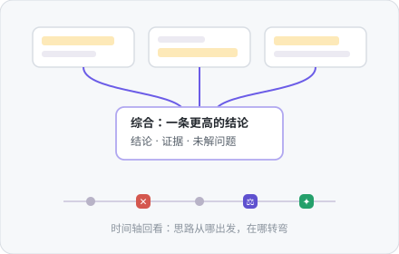
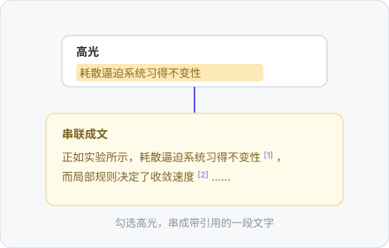

<div align="center">


# ThoughtDAG

**思考值得一张地图。** 在无限画布上，AI 对话长成一张可编辑的思维图。


### [官网](https://chenxiachan.github.io/thoughtdag/?lang=zh) · [在线 Demo](https://app.thoughtdag.workers.dev)

无需安装注册

[English](./README.md) · [快速开始](#快速开始) · [更多能力](#更多能力) · [模型与订阅](#模型与订阅) · [成本与隐私](#成本与隐私)


</div>

## 唯一法则

> **连线即上下文。** 模型看到的，精确等于连进节点的内容。编辑图，就是在编辑模型的记忆。

## 它长什么样

每个手势背后是同一条原则：**人在回路上，模型在连线上**。没有自主代理替你改图。

<table>
<tr>
<td width="45%"></td>
<td width="55%">

### ✂️ 删一条边，换一个答案

模型只看到连进来的内容。删掉噪音边，同一个问题返回干净的回答。**在示例画布第 ③ 区亲手复现。**

</td>
</tr>
</table>

<table>
<tr>
<td width="55%">

### 📖 把文献读成思维地图

圈选一段直接提问，答案带着页码落进画布，p.N 芯片一键跳回原文。**读完论文，地图已经画好。**

</td>
<td width="45%"></td>
</tr>
</table>

<table>
<tr>
<td width="45%"></td>
<td width="55%">

### 💎 思考在你手里不断凝练

节点合并成更高的结论，高光串成总结。图不断收拢，而不是不断膨胀。**人在回路中提炼。**

</td>
</tr>
</table>

<table>
<tr>
<td width="55%">

### 🖍️ 你标的重点，串成带引用的文字

高光是你的判断，不是模型的。勾选几条，串成每句可溯源的一段话。

</td>
<td width="45%"></td>
</tr>
</table>

<table>
<tr>
<td width="45%"></td>
<td width="55%">

### 🗺️ 缩小画布，思考自成地图

完整卡片、收获句门牌、图标骨架三层缩放，每步带认知徽章 ✕ ⚖ ↩ ?。**走过的弯路也是地图的一部分。**

</td>
</tr>
</table>

## 快速开始

```bash
# 在线：app.thoughtdag.workers.dev（示例画布免 key）
# 本地：
npm install
npm run server    # LLM 代理 :3001
npm run dev       # → localhost:5173
# 无 .env 时，在应用内连接任意兼容 OpenAI 协议的接口即可
```

首页一键载入预置的示例画布：围绕「收藏夹为什么总在吃灰」展开四章，含一份内嵌真 PDF 的阅读闭环。环境变量、免费 key 与配置细节 → [docs/setup_ZH.md](docs/setup_ZH.md)

## 更多能力

| 能力 | 说明 |
|------|------|
| 📤 只读分享 | 一条链接携带整张图，无账号、不经服务器存储 |
| 🧭 陈旧重放 | 上游一改，受影响回答亮标记；按依赖序批量重放，先报 token 价 |
| ✂️ 摘取 | 阅读器里圈选文字、框选图表，摘成带页码出处的画布素材 |
| 🔌 模型自由 | 节点级钉选、沿线继承；带图请求自动改道视觉模型 |
| 🔒 本地优先 | 自动文件夹备份写成真实文件，指向同步盘即跨设备 |

完整功能清单（60+ 条，按领域分组）→ [docs/features_ZH.md](docs/features_ZH.md)

## 模型与订阅

智谱 · 通义 · OpenAI · Anthropic · Google · DeepSeek · Kimi · OpenRouter · Ollama，或任何兼容 OpenAI 协议的端点。带图请求自动改道视觉模型。环境变量与默认模型 → [docs/setup_ZH.md](docs/setup_ZH.md)

**已经在付订阅费？直接接进来。** ChatGPT 订阅经一条命令的本地桥接入（配合本地运行的 ThoughtDAG）；GLM Coding 与 Kimi Code 订阅本身就发 API key，选预设、填 key 即可。三家的接法 → [docs/setup_ZH.md#订阅接入](docs/setup_ZH.md#订阅接入)

## 成本与隐私

- **免费档模型覆盖全部功能**；本地 Ollama 完全离线
- **在线 Demo 的模型流量浏览器直连**，key 不经服务器
- **PDF 不离机**，只有提取文本随提问发出
- **备份格式向后兼容**；Markdown 导出是永久逃生门

---

<div align="center">

*图无环，环是人。*

[MIT](./LICENSE) © 2026 Xia Chen · [Roadmap](docs/features_ZH.md#roadmap) · [反馈](https://github.com/chenxiachan/thoughtdag/issues) · [引用](https://github.com/chenxiachan/thoughtdag#cite-this-repository)

</div>
