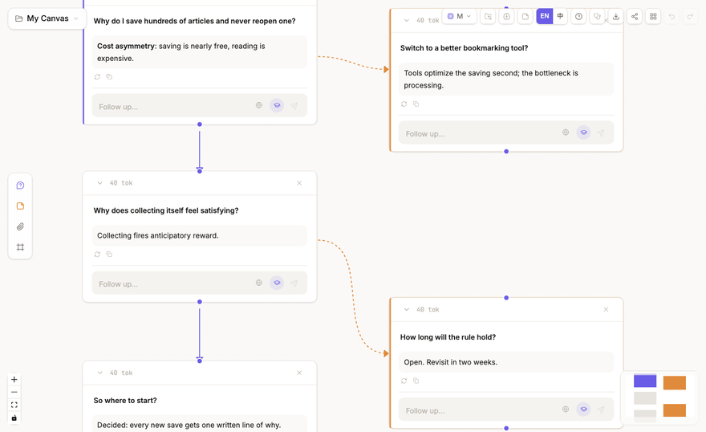
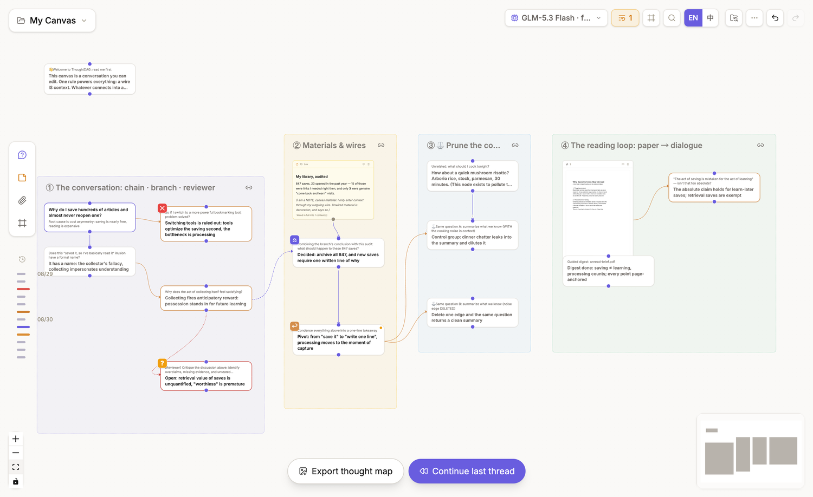
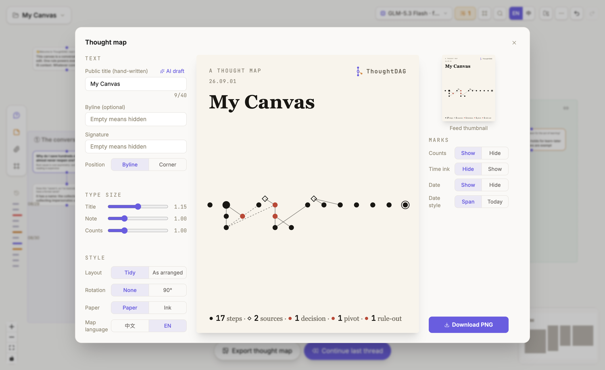
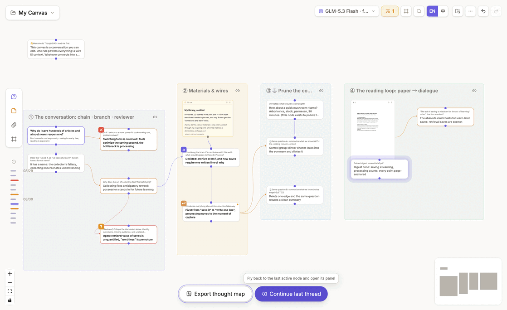
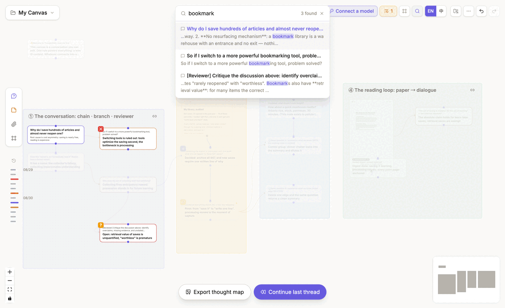
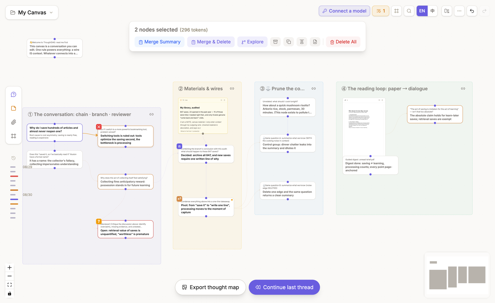

# Canvas, navigation, and frames

## Move around the canvas

- **Hold the middle or right mouse button and drag** to pan.
- **Use the wheel or two-finger scroll** to zoom.
- **Left-drag on empty space** to box-select nodes.
- **Drag a node** to change its position.

The minimap and zoom controls provide another way to move through a large graph.

## Change reading distance

As you zoom out, a node changes from a full card to a compact takeaway plaque and then to an icon-level marker. Its canvas position and connections stay the same. Semantic zoom changes presentation only; it does not change model context.

At the map and glyph tiers, two actions appear at the bottom of the canvas: **Export thought map** and **Continue last thread**.

## Generate a thought map from the canvas

Choose **Export thought map** to recompose the current nodes, wires, materials, and key marks as a shareable image. It is not a screenshot of the current viewport.

You can:

- write a public title, note, and signature, or ask the current model to draft the words;
- switch between **Tidy** and **As arranged**;
- adjust rotation, paper, map language, type size, counts, time ink, and date;
- check the feed thumbnail before downloading the PNG.

Exporting creates a separate image. It does not move canvas nodes or change model context.

## Continue the last thread

Hover **Continue last thread** to reveal the most recently active conversation node on the map. Click it to fly back, restore a readable zoom, and open that node's panel.

After arriving, continue the conversation directly or choose **Summarize to a note**. The recap lands as an unwired note: it is editable and deletable, but does not enter model context automatically.

Use search and keyboard navigation below when you know the target. Use **Continue last thread** when you are returning after a break and want to resume where the work last changed.

## Find a node

- Choose **Search** at the top right, or press `Cmd+F` / `Ctrl+F`, to find questions, answers, notes, highlights, links, or material names.
- As you type, non-matching nodes fade. Use `↑` / `↓` to choose a result and press `Enter` to fly there, open its panel, and reveal the matching passage.
- Select a node to reveal its structural path toward the root.
- Use the arrow keys to move along structural wires and press `Esc` to step out. See [Keyboard shortcuts](/reference/shortcuts) for the complete list.
- When frames exist, the **Frame navigator** appears at the top right and jumps between named regions.

The recording cycles through **Search nodes → Frame navigator → Tidy layout in More actions**.

## Arrange the graph

**Tidy layout** lives in the top-right [More actions menu](/guides/interface-overview#more-actions-menu). After confirmation, it follows wire direction, keeps a conversation chain vertically aligned, and moves branches to the side. **Align selection** cleans up a local group without rebuilding the entire graph. Both operations change positions only.

## Use frames

Frames label and visually group a region. Use them when several branches still belong to the same project but need readable sections: click or drag the **Frame** button at the bottom of the left material palette, place the frame, then edit its title and color.

The chain button at a frame's top right controls movement. When **linked**, dragging the frame carries the nodes inside; when **unlinked**, only the frame moves. Once frames exist, use the **Frame navigator** shown above to jump between them. Hiding annotations simplifies the view without deleting content.

## Multi-selection toolbar

Left-drag on empty canvas space to select two or more nodes. A toolbar appears at the top of the canvas with the node count, estimated tokens, and highlight count.

Frequent actions have text labels. Archive, duplicate, align, and export use icons whose names appear on hover. The table below explains what each action changes.

| Action | Result |
|---|---|
| **Merge Summary** | Keep the originals and create a synthesis node |
| **Merge & Delete** | Create the synthesis, then remove the selected originals |
| **Weave highlights** | When highlights exist, weave the selected excerpts into cited prose |
| **Explore** | Ask a new question using the selection as material |
| **Archive** | Keep the nodes but exclude them from context traversal |
| **Duplicate** | Copy the selection and its internal wires, excluding wires that cross its boundary |
| **Align** | Arrange the local selection by arrow relationships |
| **Export .md** | Export the selected nodes as Markdown |
| **Delete All** | Delete the selection after confirmation |

Click empty canvas space or press `Esc` to leave multi-selection.

Here, **Explore** opens a [conversation branch](/guides/conversations#explore-from-selected-text), **Merge Summary** and **Weave highlights** create new [content representations](/guides/organize), **Archive** changes [context traversal](/guides/context-control#change-what-enters-the-request), and **Export .md** belongs to [data and sharing](/guides/data-sharing#import-and-export).

## Canvases and recovery

Use the canvas menu to create, rename, switch, or delete canvases. Each canvas keeps its own graph, materials, layout, and history. Use separate canvases for work that should not share a context graph; use branches or frames for directions that still belong together.

Use `Cmd+Z` / `Ctrl+Z` and redo for recent changes. For longer-term recovery, enable [automatic folder backup](/guides/data-sharing#automatic-folder-backup).
