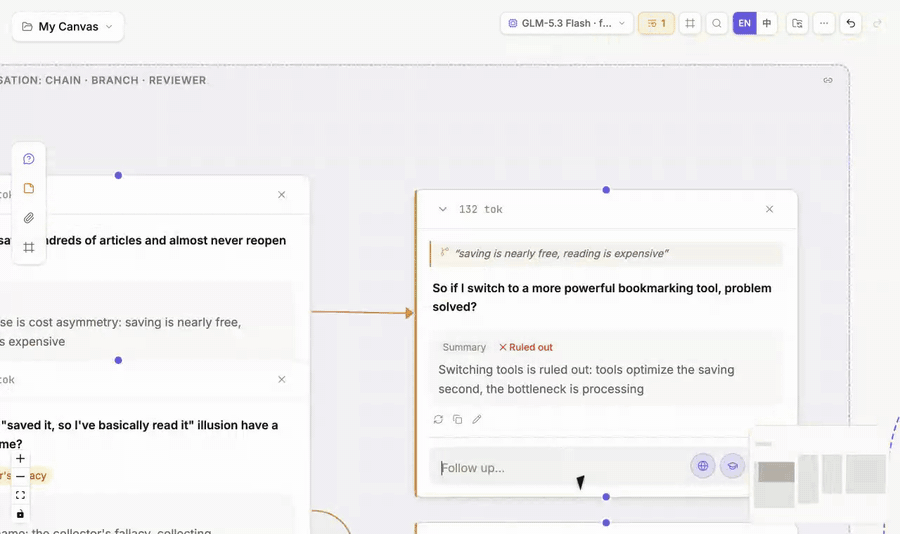

# Conversation nodes and panel

## Start and continue

Enter a question in an ask box. The question and streamed answer become one conversation node. Ask from that node to continue the same path.

The recording shows the three beats in order: **select text → choose Explore → submit the branch question**. This page explains interactions inside a node; see [Interface overview](/guides/interface-overview) for where each area sits.

## Understand a conversation node

The node card supports quick scanning rather than every control:

- the top shows the question, role, and state;
- the body shows the active answer version;
- footer actions cover frequent operations such as continuing, regenerating, copying, and editing;
- each answer version records its model and generation time;
- an amber mark means upstream content changed after this answer was generated;
- semantic zoom folds the full card into a takeaway and then an icon marker.

**Double-click the node** for the complete panel. Use **right-click** for lower-frequency node actions.

## Floating-panel areas

The panel floats above the right side of the canvas without moving nodes. Drag its left edge to resize it; double-click the edge to restore the default width.

| Area | Purpose |
|---|---|
| Header status and actions | Inspect role, token, and material state, then use node-level shortcuts |
| Question | Read or edit the question; waiting nodes also receive their question here |
| Answer and versions | Read the full answer, switch versions, inspect the generating model, and explore or highlight selected text |
| Attachments | Add [materials](/guides/materials) and control whether inherited attachments enter this context |
| Highlights | Pass full text, tag important passages, or pass highlights only; see [Highlight and weave](/guides/organize#highlight-and-weave) |
| Merge order | Reorder upstream blocks when several routes enter the node; see [Control context](/guides/context-control) |
| Context tree | Inspect the actual materials, references, conversation turns, and estimated tokens; see [Inspect the next request](/guides/context-control#inspect-the-next-request) |
| Follow-up | Continue this path; click the **Will send summary line** above the input to preview the next request |

## Explore from selected text

Select a useful phrase in an answer and choose **Explore**. ThoughtDAG creates an orange branch anchored to that selection. The original path stays intact while the new question opens another direction.

Use **Explore** to test another interpretation, investigate a detail without lengthening the main path, or compare prompts and models.

## Edit a node

- **Double-click the question** to edit it.
- Use the **pencil button** at the end of an answer to edit that answer.
- **Double-click the node** to open its floating panel.

Editing upstream content can make dependent answers stale. ThoughtDAG marks them rather than silently presenting them as current.

## Regenerate and compare

**Regenerate in place** adds an answer version to the same node. Use a new sibling node when the alternatives should remain visible side by side. See [Versions, staleness, and replay](/guides/versions-replay).

## Node right-click menu

The right-click menu holds lower-frequency actions. [Interface overview: Nodes](/guides/interface-overview#_3-nodes) explains each item once, so this page only adds two state rules: available actions vary by node type and state, and right-click preserves the browser's native menu when text is selected. CLI actions hand work to [Session Atlas](/guides/session-atlas); they do not automatically add an external session to the current context.
