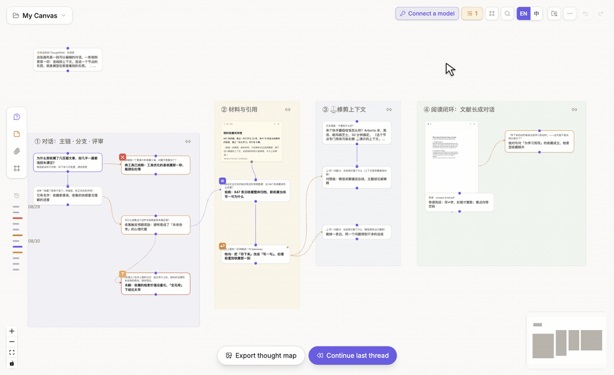

# Data, backup, and sharing

## Start with automatic folder backup

ThoughtDAG keeps canvases in local application storage by default. To keep a **visible file that you can copy and import again**, enable automatic folder backup when you first use the desktop app.

### Turn it on

1. Click the **folder backup** button in the upper-right canvas toolbar to open **Local auto-backup**.
2. Choose a folder that you intend to keep.
3. When permission is granted, an existing active canvas is written immediately.
4. Each later node or wire change restarts a roughly one-minute wait. Once editing stops, ThoughtDAG updates a `.thoughtdag.json` file named after the canvas.

Pointing it at a synced folder lets the file follow that folder's existing sync mechanism. ThoughtDAG does not require an account or upload the backup to its own server.

### What it saves

Each canvas gets a complete backup containing nodes, wires, attachment content, events, and the session identifiers needed to restore Session Atlas listening. The filename follows the canvas name, with unsupported filename characters replaced.

| Situation | What automatic backup does |
|---|---|
| Backup is enabled while the active canvas contains work | Writes the active canvas immediately |
| Nodes or wires are edited continuously | Waits until about one minute after the last change, avoiding repeated writes |
| Another canvas becomes active and is edited | Writes that canvas to its own file |
| A Session Atlas mirror | Saves it under the selected folder's `cli/` subfolder and adds a session-id fragment to avoid filename collisions |

Automatic backup writes the **active canvas**. It does not rescan and rewrite every canvas once a minute. To verify immediately, reopen the backup control center and click **Back up this canvas now**. The same dialog shows the folder, last-write time, change-folder action, and stop control.

Whenever the desktop app opens, ThoughtDAG restores the previously recorded backup folder and attempts to resume watching canvas changes. Backup continues immediately while folder permission remains valid. If the operating system asks for confirmation again, use **Re-authorize & keep backing up** to resume.

### Restore from a backup

Open the canvas menu, choose **Import backup**, and select a `.thoughtdag.json` file. This restores the complete canvas rather than a read-only text export. If the backup came from Session Atlas and the matching source is still available on this machine, session listening can resume. Otherwise, the canvas remains usable as an archive.

The desktop app provides the complete experience; the browser entry appears only where folder access is supported.

## Manual import and export

- **Export backup** for a complete graph file and later restoration.
- Export a context chain or selected nodes as Markdown.
- Export highlights, memory, roles, or event metadata when needed.
- Import a compatible ThoughtDAG backup or supported conversation export.

Imported edits and regenerated alternatives can become visible graph branches rather than being flattened into one transcript.

## Share a read-only graph

**Share** compresses a graph into a URL. A recipient can pan, zoom, and read, but cannot edit. Review the payload before sending it. Large graphs or sensitive material are better shared as an exported file.

## Recover recent changes

Use `Cmd+Z` / `Ctrl+Z` and redo for recent operations. Automatic folder backup provides recoverable files; make another manual backup before major restructuring or version upgrades.

**Local-first** does not mean data can never leave the device. Transfer occurs through an explicit action: a remote model or tool request, export, backup folder, or share link.
