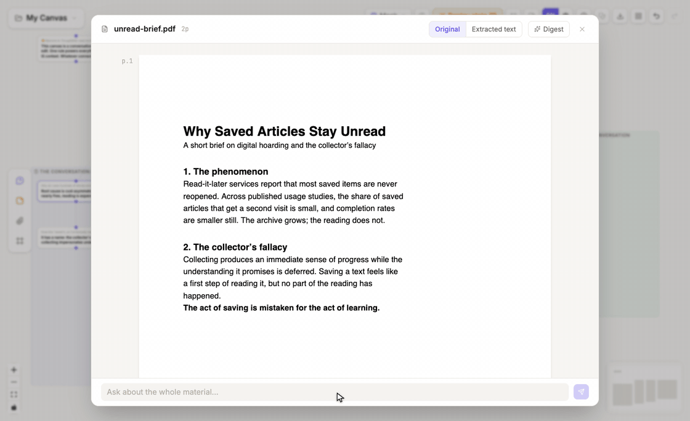

# Material nodes and reader

## Add a source

Drag, paste, or use the attachment control to add a supported file, image, text, note, or link snapshot. See [Supported inputs](/reference/supported-inputs) for current format boundaries.

A material node shows its source name, type, and connection state. Unwired material remains on the canvas only; it becomes model context when a wire or attachment relationship brings it into a question.

## Understand the reader

**Double-click a file, image, or link node** to open the reader. Controls that do not apply to the current material are hidden, but the layout follows the same areas:

| Area | Purpose |
|---|---|
| View bar | Switch between **Original**, **Text**, and **Digest** when available; enter clipping, recognition, editing, or digest regeneration |
| Reading surface | Display PDF pages, an image, HTML pages, or extracted text while remembering reading position |
| Selection toolbar | **Ask**, **highlight source text**, or **save the selection as a note/image node** |
| Reading rail | Show the question chain grown from the source, continue it, and jump to its canvas node |
| Question index | Switch between whole-document and page-anchored questions and revisit existing branches |

PDF and image views also expose relevant zoom, region-clipping, and recognition controls. When a scanned PDF has no selectable text, switch to extracted text or use recognition; recognition and image understanding that call a model use your [model configuration](/guides/models-tools#connect-and-select-a-model).

## Read and ask from a PDF

1. **Double-click the PDF node** to open the reader.
2. Select text, or drag a rectangle around a visual region.
3. Ask a question about the selection.
4. Read the answer in the reading rail.
5. Use the page marker on the canvas node to return to the source page.

## Extract reusable evidence

An extracted passage or image region becomes its own canvas node while retaining source provenance. It can be connected to later questions without repeatedly attaching the whole document.

## Other material flows

- Generate a short guide to a long document, with page jumps where available.
- Paste a URL to keep a time-stamped link snapshot.
- Add a Markdown note for your own wording or decisions.
- Add an image; a configured vision model can create companion text for text-only downstream models.
- Export unsupported presentation formats to PDF or HTML before importing.

The file remains the source; extracted nodes are selected evidence. Keeping those roles separate makes later context easier to inspect.
