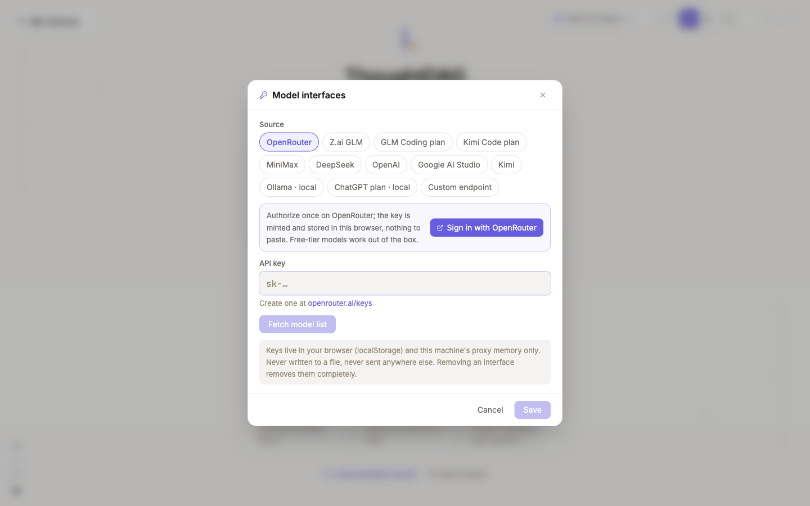
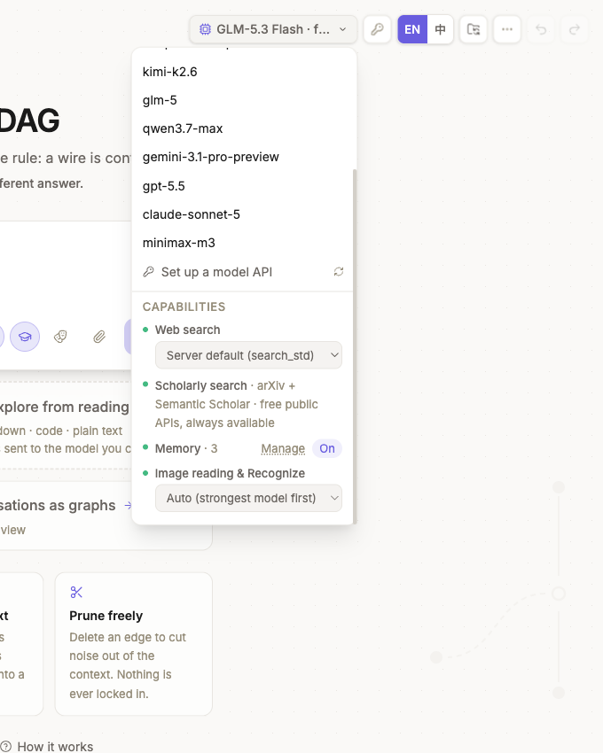
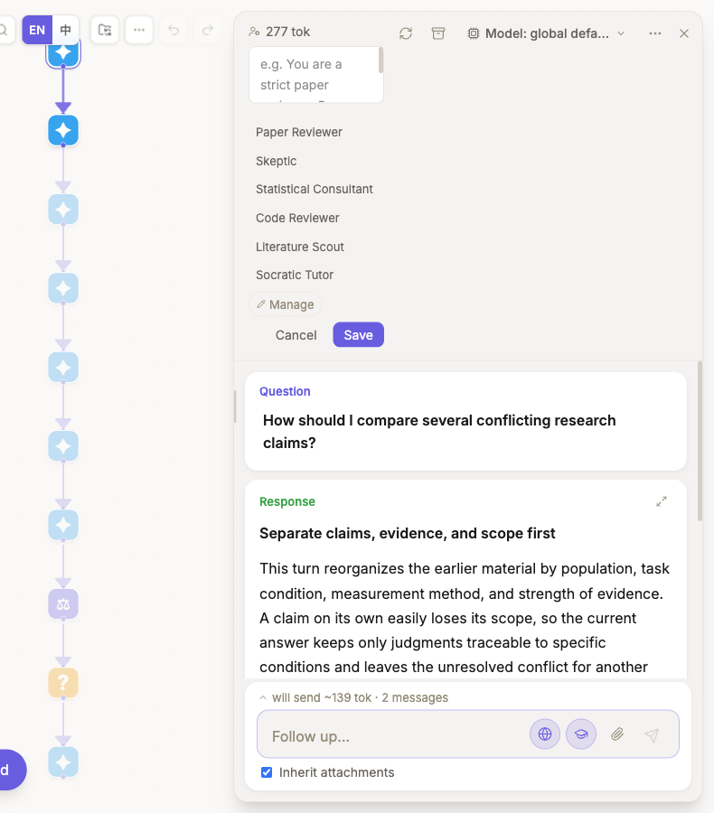
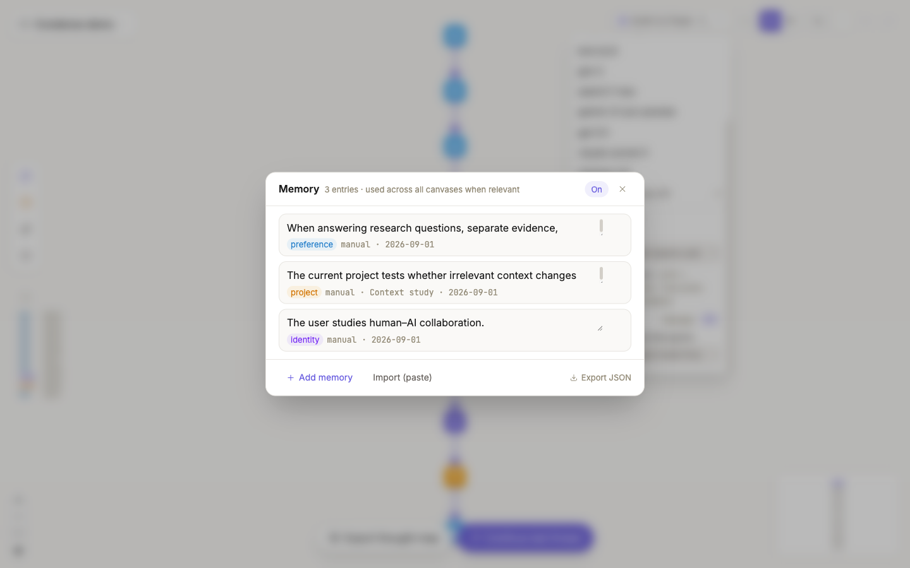

# Models, tools, and memory

## Connect and select a model

Open **Connect a model** and choose a provider, plan route, local runtime, or custom endpoint. Authorize or provide a key, fetch the model list, then enable the models you want to use in ThoughtDAG. Normal use does not require editing `.env`; see [Connect a model](/setup) for the conditions of each route.

The toolbar model is the **default for new nodes**. Its menu switches the default, reopens model interfaces, and reports whether web search, scholarly search, memory, and vision are available in the current installation. Pin a different model in the node panel only when that branch needs another cost, reasoning, or vision profile.

Each answer version records the model that produced it. Local models can run without sending model requests to a remote provider; remote costs and retention follow the endpoint you connect.

## Enable search and tools

Every ask box has **web search** and **scholarly search** switches. They determine which retrieval capabilities the generation may use; the model still decides whether to call them for the question. Search progress and supported references remain with the answer. Enable only the tools needed for the current task.

Developers who need additional tools can configure local or remote MCP servers in `mcp.config.json`. Supported transports include stdio and URL-based connections. Tool availability changes **what the model may call**; it does not change which graph paths enter the request. See [Connection mechanism for developers](/setup#connection-mechanism-for-developers).

## Apply a node role

A node can **inherit**, **set**, or **reset** a role for downstream generation. Applied roles are stored with answer versions. If several parents supply conflicting roles, ThoughtDAG asks you to choose explicitly. Built-in and custom roles are managed in the role library.

These controls affect separate layers. The model picker at the top overrides only this node. A role is a system prompt inherited downstream. The **globe** and **graduation-cap** buttons in the ask box control web and scholarly retrieval. None of them silently changes the graph's context wires.

## Manage ambient memory

Ambient memory admits selected long-lived facts in three categories: preferences, user-stated identity, and project information. Every write produces a visible notification with **Undo**. Project memories stop entering active context after 45 days without an update, but remain in the memory manager.

Use the global memory switch, category controls, import/export, or deletion when persistent background context is not appropriate. Machine steps and generated guides are not admitted as ambient memory.

When memory is enabled and entries exist, the node panel's [context tree](/guides/context-control#inspect-the-next-request) shows **Memory (ambient layer)** so you can confirm that it participates in ordinary generation. Graph wires and ambient memory remain separate layers.

## Keep the layers distinct

- The **model** determines which endpoint generates the answer.
- **Tools** determine which external actions it may call.
- A **role** changes the instruction applied to generation.
- **Ambient memory** can add admitted background facts.
- Graph wires still determine the visible conversation and material paths entering the node.

See [Connect a model](/setup) for the in-app flow, plan routes, and local models. See [Privacy and storage](/reference/privacy-storage) for the data boundary.
