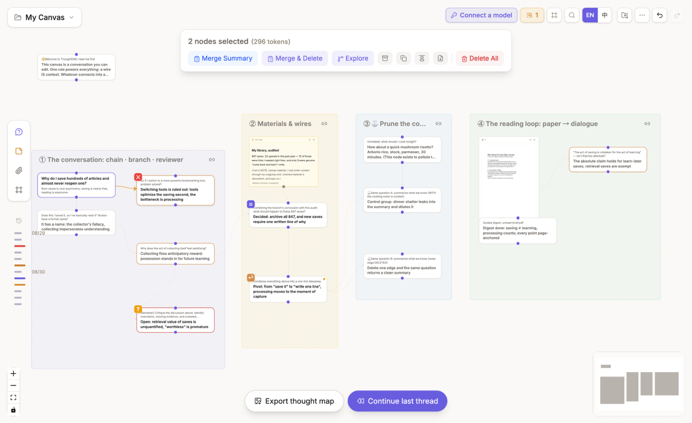
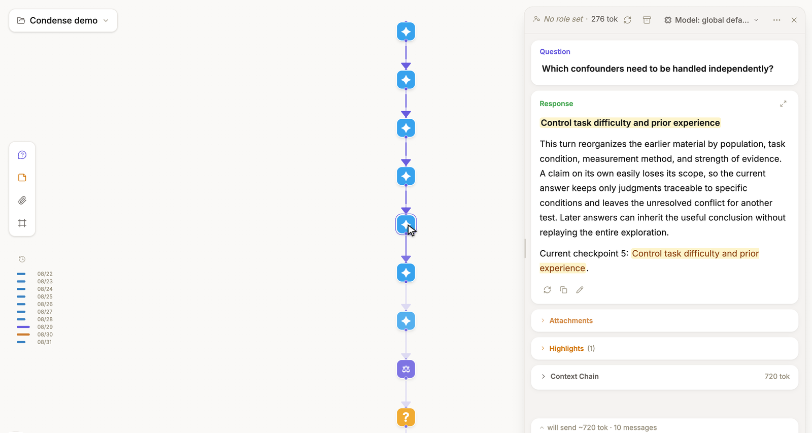
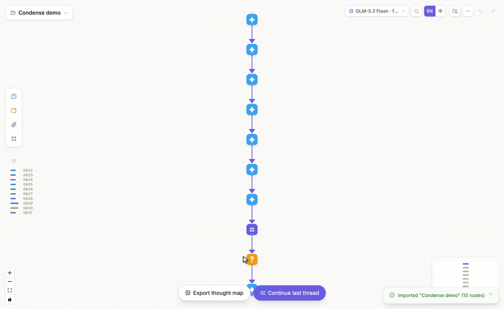

# Merge, highlight, and condense

## Merge several nodes

[Box-select the nodes](/guides/canvas-projects#multi-selection-toolbar), then choose **Merge summary** to keep the originals and create a synthesis. Choose **Merge & delete** only when you also intend to remove the selected originals from the canvas.

## Highlight and weave

Highlight useful passages in the [node panel](/guides/conversations#floating-panel-areas). A node can contribute its full text, labeled highlights, or highlights only. When selected nodes contain highlights, choose **Weave highlights** to create cited prose from those excerpts.

## Condense a path

Open **Condense** to scan consecutive, non-branching conversation segments. Choose the segments to distill. ThoughtDAG creates a **condensed copy** to the right while leaving the original path unchanged.

The recording shows: **open Condense → inspect candidate runs and estimated savings → build the copy → inspect the distill node → compare the original and condensed graphs**. Candidate runs are found by a local structural scan; only writing the distillate calls the selected model.

The condensed copy replaces selected stretches with distilled nodes, keeps protected decisions and pivots, and estimates the resulting token size. The provenance chip on a distill node returns to its source run. After checking the copy, you can [archive](/guides/context-control#change-what-enters-the-request) the original path if it is no longer needed.

Merge, weave, and condense create new representations. Moving or aligning nodes only changes layout.
