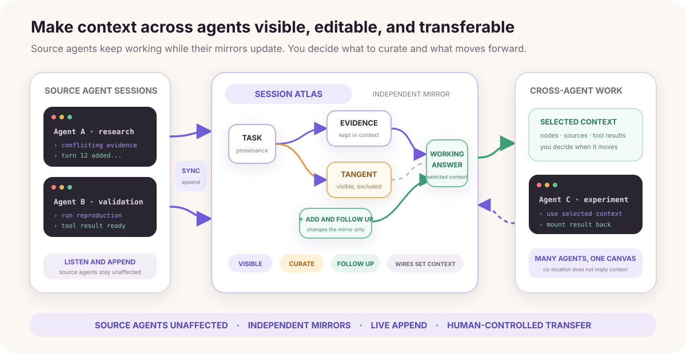
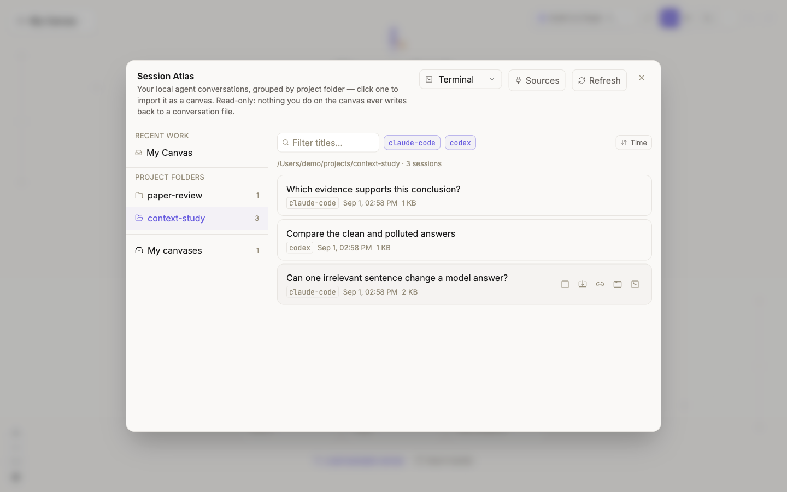
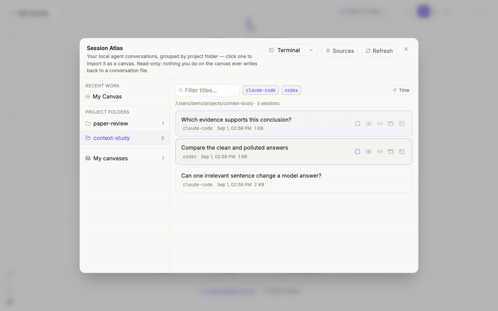
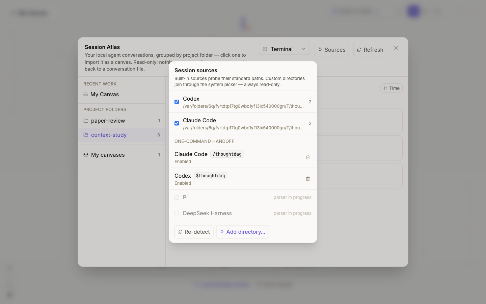
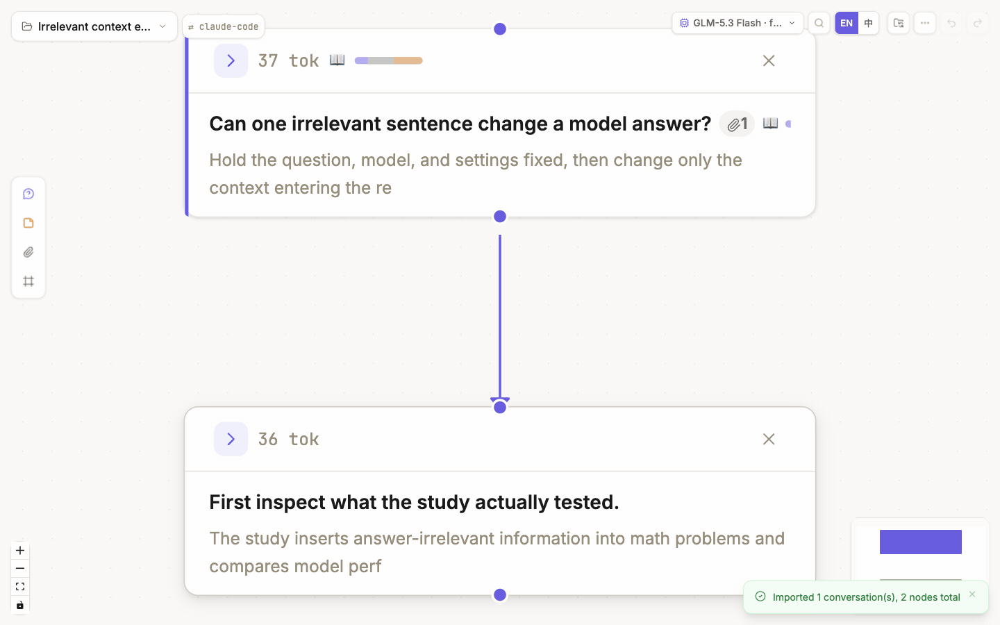
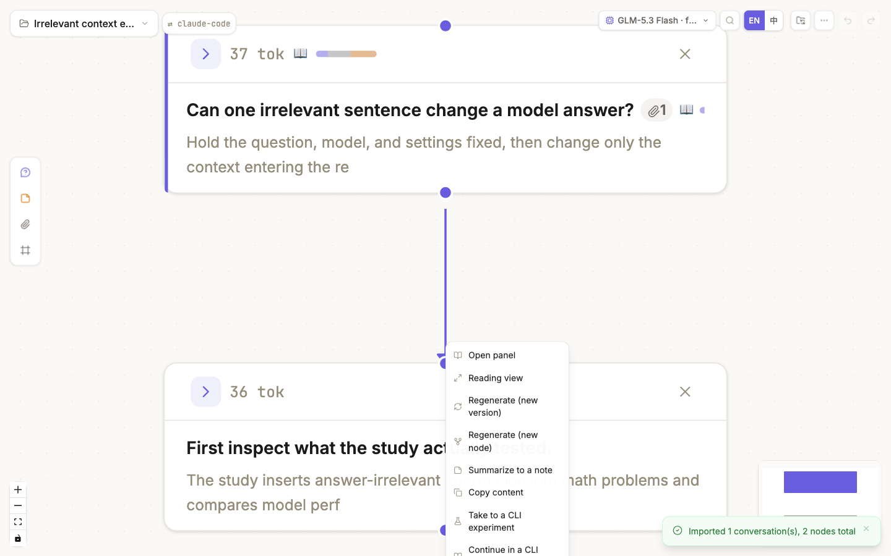
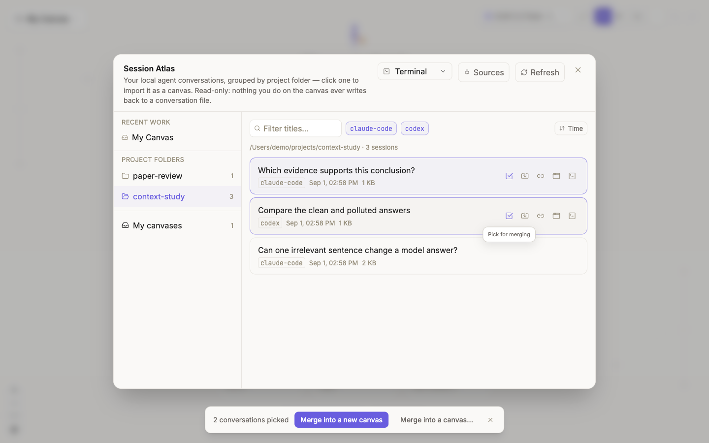

# Session Atlas

Session Atlas is ThoughtDAG's **visual context workspace** for local agent work. It brings processes that were scattered across CLI and agent sessions into one inspectable, editable, and composable canvas:

To query a file, phrase, URL, or paper directly from an agent, see [Why layer: CLI and read-only MCP](./why-layer).



- see each turn, tool call, result, and source instead of waiting for automatic compaction to leave only a summary;
- preserve the full source while curating context at the level of nodes, wires, and attachments;
- keep the source agent running and listen for new turns, while adding materials, notes, and follow-up branches in the mirror;
- take curated context from one node to another agent, then mount the resulting work back onto the graph;
- place work from several agents on one canvas and decide whether they connect and what context they share.

Atlas does not replace an agent's own compact command. It adds a finer-grained, traceable layer above it. You can think of Atlas as a **visual coordination and context-transfer layer** above CLI sessions, but not yet as an Agent OS that autonomously schedules processes, permissions, and resources.

Atlas is available in the **desktop app and the [DeepSeek Harness plugin](./deepseek-harness)**, supporting local Codex, Claude Code, and DeepSeek Harness sessions. System file pickers, desktop-app links, and terminal launching below describe the desktop app; see the plugin manual for opening and continuing sessions inside Harness.

## The source agent keeps working; the mirror is yours to curate

Atlas does not rewrite the source agent's session. It creates an independent ThoughtDAG mirror that you can curate while it continues to follow the source.

- You can prune or rewrite mirror nodes, add materials and notes, create branches, and ask follow-up questions in ThoughtDAG.
- Those actions change only the ThoughtDAG canvas and the context compiled from it. They never rewrite the source agent's history.
- The source agent can keep running. As long as this canvas remains subscribed to that session, Atlas incrementally appends new turns to the matching chain tail.
- Regular-model questions and answers belong to the canvas and are not automatically written into the source session. In the Harness plugin, **DeepSeek Harness · Agent** executes and records a new turn; a follow-up at the corresponding mirror's tail can continue that session. This does not rewrite existing history. See the [execution reference](./deepseek-harness#execution-reference).

The mirror is therefore not a frozen snapshot: you can curate its context while the source agent keeps working as before.

## Open Atlas and find a session

From the welcome screen, choose **Agent conversations**. From a canvas, open **Session Atlas** in the top-left canvas menu.



| Area | Purpose |
|---|---|
| **Recent work** | Return to recent canvases, including imported session mirrors |
| **Project folders** | Group sessions by recorded working directory; different runners for one project meet here |
| **Search and runner filters** | Filter by title or temporarily hide a runner |
| **Changed only / subthreads / sort** | Focus on changes, show subthreads, and sort by time, name, size, or CLI |
| **Session card** | Show title, runner, time, and size; hover for import, mount, app, and terminal actions |
| **Sources** | Manage scan locations and one-command handoff |

Atlas lists only files whose runner format it can identify. It does not guess from filenames.

**Sub-threads** are threads an agent spawned rather than conversations you held: Codex child threads and Claude Code subagent files. They are hidden by default; the toggle reveals them, and each opens as its own mirror.

## Open a session as a graph mirror

Click a session card or its **Import** icon. Each user-and-agent turn becomes one conversation node. Tool calls and results are paired as text attachments on that node rather than becoming fake conversation turns.



The import preserves:

- runner and session id;
- source turn identifiers for each node;
- paired tool calls, results, and truncation markers;
- the session's working directory, so relative paths in answers resolve on this machine.

Each collapsed node shows the files that turn touched (✏️ wrote or edited, 📖 read) and the answer's closing paragraph rather than its opening line; the full tool trail stays in the node's attachments. A subagent's report arriving as a task notification folds into the turn that launched it instead of appearing as a question. Links in answers never leave the app on their own: web URLs open in the system browser, a local folder or file opens in Finder, an image or PDF in its viewer, and images the agent produced render inline.

That provenance supports traceability and incremental updates. **Visible after import does not mean included in the next model request.** Wires, references, and attachment controls still determine compiled context; see [Control context](./context-control).

## Session-card actions

Hover over the right side of a card to reveal these actions:

| Action | Result |
|---|---|
| **Import** | Create a mirror; if one exists, open it and attempt to append unseen turns |
| **Pick for merging** | Add this session to the multi-selection bar |
| **Re-mirror** | Rebuild from the source session and discard edits on this mirror; confirmation is required |
| **Mount onto a canvas** | Attach the session to a canvas main-line tail and register it as an appendable chapter |
| **Open in app** | Activate the matching app; when direct positioning is unavailable, copy the session id for search |
| **Open in terminal** | Run a whitelisted resume command in the selected terminal |

Opening in an app or terminal returns to the source session. It does not write ThoughtDAG edits back to the agent.

## Configure Sources and one-command handoff

Open **Session Atlas → Sources**:



1. Built-in sources probe each runner's standard location.
2. Use **Add directory** to authorize another location through the system picker.
3. Temporarily disable a source with its checkbox.
4. Enable or update the command under **One-command handoff**.

After enabling it:

- use `/thoughtdag` in Claude Code;
- use `$thoughtdag` in Codex.

The former is a command installed in the local Claude Code command directory; the latter is a skill installed in the local Codex skills directory. The **Sources** page compares local file contents and reports whether each integration is absent, enabled, or needs an update.

The local mechanism resolves the current runner session id, opens `thoughtdag://open?session=<id>`, and lets Atlas locate the source through the same import-or-append path. The command's own “open ThoughtDAG” turn is removed from the mirror to avoid self-referential noise.

The command does not upload a session or give a web page arbitrary filesystem access. Scanning and deep links run through the desktop shell's fenced bridge; see [Privacy and storage](../reference/privacy-storage).

## Understand listening and incremental append

A mirror is not rebuilt from scratch after every change. The desktop shell observes supported JSONL locations, debounces file changes, and reports which source file changed. Atlas then uses the per-session ledger to determine how many turns have already been imported.

```text
source session gains a turn
        ↓
desktop shell reports the changed source file
        ↓
Atlas parses the session and skips turns before the ledger boundary
        ↓
only the new turns attach to that session's canvas tail
```



Incremental append follows these rules:

- already recorded turns are not duplicated;
- existing nodes are not moved;
- source text does not overwrite a mirror node the user has edited;
- changes made while the app was closed are checked during startup or canvas arrival;
- a session registered to another canvas does not silently append to the current one;
- deleting every mirror node for a session removes its subscription, so deleted work does not grow back.

### When listening stops

- Deleting a wire, editing node text, or deleting only some mirror nodes does **not** unsubscribe the session.
- Once every mirror node belonging to a session is deleted from the canvas, Atlas removes that session's ledger entry and stops listening to it.
- If it was the last subscribed session, the canvas becomes a regular ThoughtDAG canvas again.
- Undo can restore deleted nodes, but it does not restore the subscription automatically. Reopen the session in Atlas to subscribe again.
- If a source file is temporarily unavailable, Atlas cannot append new turns, but that is not the same as an intentional unsubscribe.

If a changed session has not appended, return to Atlas, click **Refresh**, and open its card. If it still cannot append, verify that its source is enabled and its format remains recognizable, then see [Troubleshooting](../reference/troubleshooting).

## Go from a node to a CLI and mount the result back

Session cards solve “**bring an existing agent session in**.” The node right-click actions solve the opposite direction: “**start new CLI work from this graph context**.”



| Entry | Use it for | Structure after return |
|---|---|---|
| **Take to a CLI experiment** | Test a hypothesis or alternative without changing the main line | The new session mounts as a branch at the departure node |
| **Continue in a CLI session** | Continue the main task after curating its context | The new session extends the main-chain tail |

Both entries compile the selected node's upstream context to Markdown and copy it to the clipboard with a return anchor. Paste it into a fresh CLI session and continue working. Atlas recognizes the anchor and mounts the returned session onto the original canvas.

This is not autonomous agent orchestration. Creating the session, pasting context, and continuing the work remain explicit user actions. See [Conversation nodes and panel](./conversations#node-right-click-menu) for the rest of the node menu.

## Place several sessions on one canvas

Pick two or more cards to reveal the multi-selection bar:



- **Merge into a new canvas** creates a canvas and places each chain side by side.
- **Merge into a canvas** uses an existing canvas as the container.
- Every session keeps independent provenance and an incremental ledger.
- **No wires are added automatically** between session chains.

That last rule matters: a wire can affect context in ThoughtDAG. Co-location is not evidence of a context relationship; you decide whether and how the sessions connect.

## Source, mirror, and model context

| Layer | Editable? | What it affects |
|---|---|---|
| Source session | Not rewritten by Atlas | Remains owned by the source runner |
| ThoughtDAG mirror | Yes | Node text, graph structure, references, and organization |
| Next model request | Inspectable and controllable | Contains only what the current path actually compiles |

Atlas does not claim that the source agent natively used the edited ThoughtDAG graph as memory, and it does not write canvas edits into source history. Adapter coverage may need to change when runner formats change.
