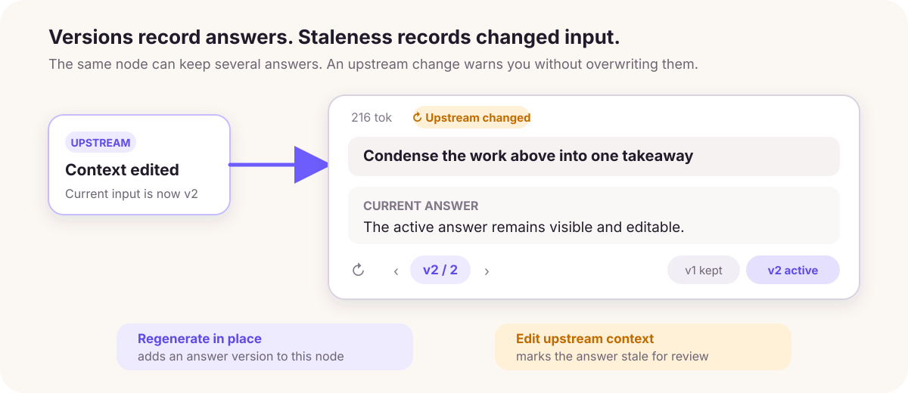

# Versions, staleness, and replay

## Compare answer versions

**Regenerate in place** adds another answer version to the same node. Switch between versions, remove an unwanted version, or restore an earlier one. Use a [sibling node](/guides/conversations#regenerate-and-compare) when the comparison should remain visible on the canvas.

## Understand stale answers

Generated nodes record a fingerprint of their upstream context. Editing an ancestor, changing a relevant wire, or switching the active upstream version can mark dependent nodes **Stale**.

**Stale** means “generated from an older input,” not “incorrect.” Inspect the context difference before deciding what to update.

The **Upstream changed** mark only reports that the input changed. Inspect the difference in the [context tree and next-request preview](/guides/context-control#inspect-the-next-request) before choosing whether to replay.

## Replay dependent work

1. Review the stale nodes and estimated token cost.
2. Start **Replay**.
3. ThoughtDAG regenerates affected nodes in dependency order.
4. Stop when the remaining updates are no longer useful.

Dependency order prevents a downstream answer from regenerating before the upstream answer it needs has finished.

**Replay** updates existing downstream nodes along the current structure. If you would rather test the same question with another context or model, create a new sibling from the same parent so both answers remain side by side. Use replay to refresh existing work, and a new node to compare answers or models.

## Use a sliding reviewer

A reviewer is an ordinary conversation node with a critic role and a red dashed sliding-review wire. It can re-evaluate newly added work while retaining previous review versions. You can question or branch from it like any other node.
