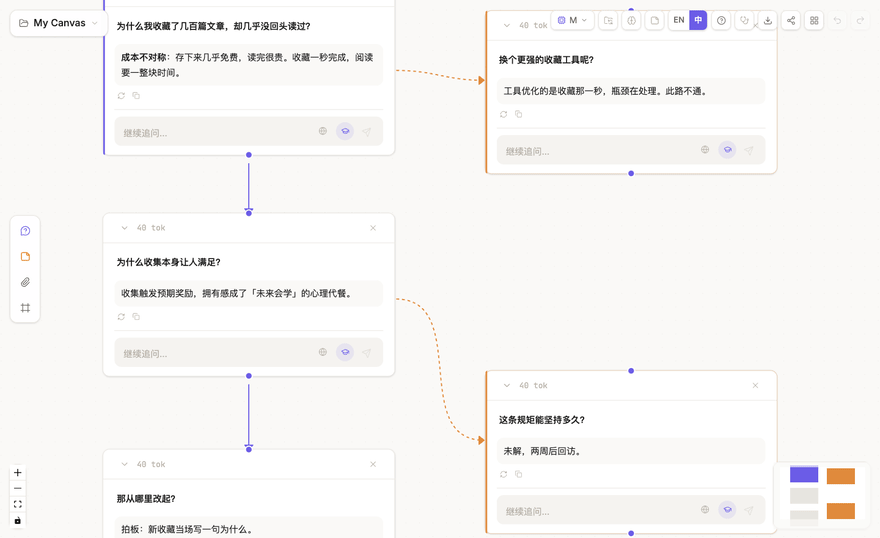
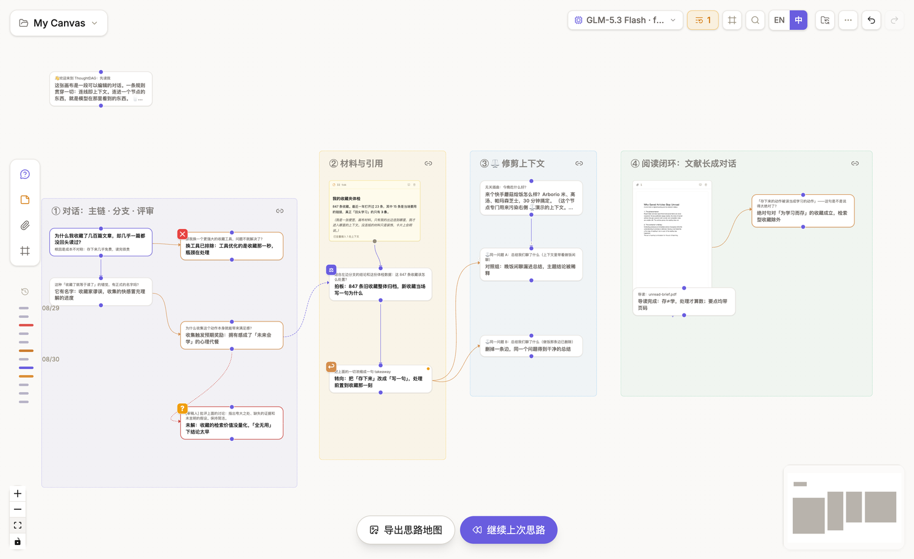
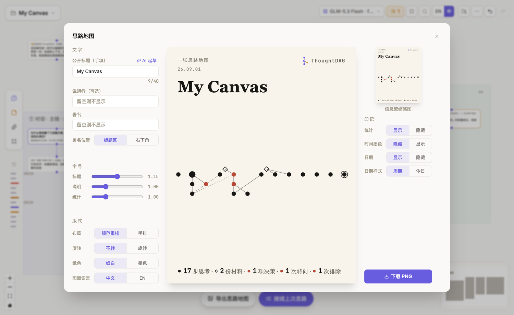
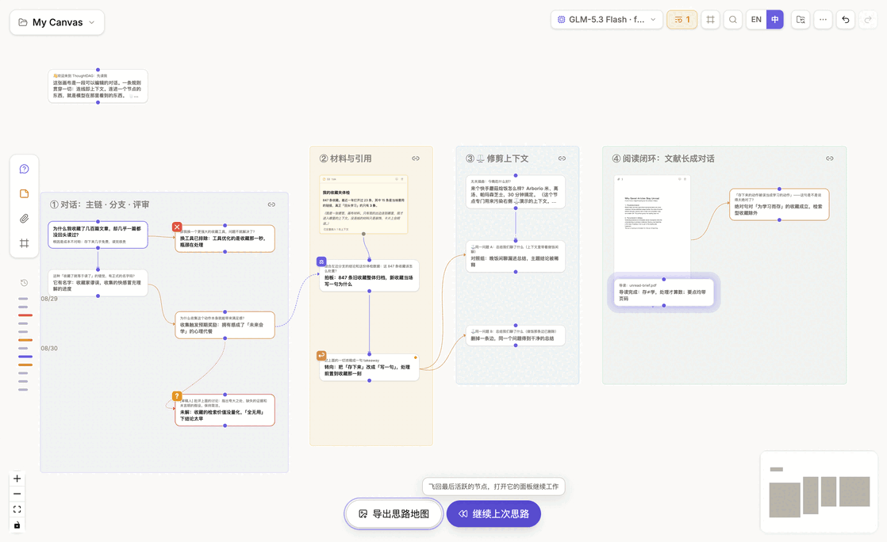
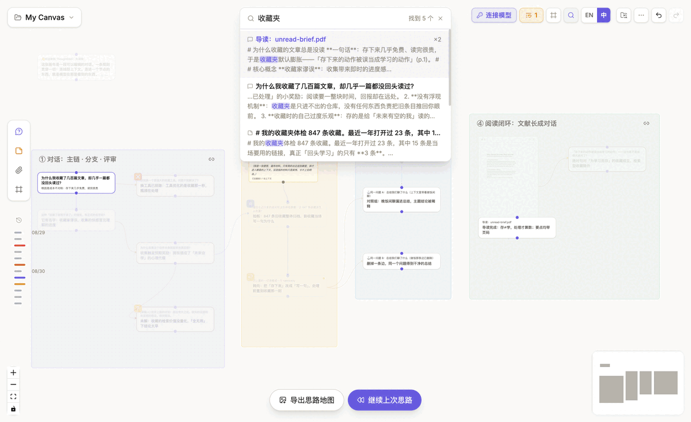
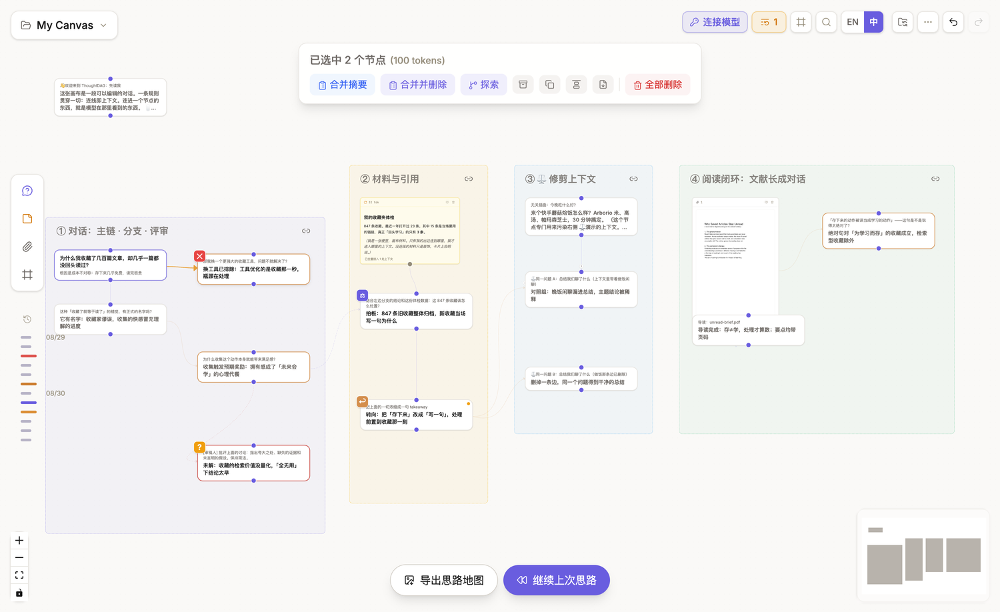

# 画布、导航与分区

## 浏览画布

- **按住鼠标中键或右键拖动**：平移画布；
- **滚轮或双指滚动**：缩放；
- **左键拖动空白处**：框选多个节点；
- **拖动节点**：调整位置。

右下角小地图和画布底部的缩放控件，也可以用来浏览大型图。

## 改变阅读距离

缩小画布时，节点会从完整卡片变为简洁的收获句门牌，再变为图标级标记。节点位置与连线保持不变。语义缩放只改变展示，不会改变模型上下文。

进入地图层或图标层后，画布底部会出现两个入口：**导出思路地图**与**继续上次思路**。

## 从画布生成思路地图

点击**导出思路地图**，ThoughtDAG 会把当前节点、连线、材料与关键标记重新排成一张可分享的图片，而不是截取当前屏幕。

你可以：

- 手填公开标题、说明与署名，或让当前模型起草文字；
- 在**规范重排**与**手排**之间切换；
- 调整旋转、纸色、图面语言、字号、统计、时间墨色与日期；
- 检查信息流缩略图，再下载 PNG。

导出只建立分享图片，不会移动画布节点，也不会改变上下文。

## 继续上次思路

鼠标停在**继续上次思路**上，地图会提示最近活跃的对话节点。点击后，画布会飞回该节点、恢复到可阅读缩放，并打开它的侧栏。

到达后可以直接追问，也可以选择**概括成便签**。生成的概括会作为未连线便签落在画布上：可以编辑或删除，但不会自动进入模型上下文。

如果你明确知道要找哪个节点，使用下面的搜索与键盘导航；如果只是隔了一段时间回来继续，使用**继续上次思路**。

## 找到节点

- 点击右上角的**搜索**按钮，或按 `Cmd+F` / `Ctrl+F`，查找问题、回答、便签、高亮、链接或材料名；
- 输入关键词后，不匹配的节点会淡出。使用 `↑` / `↓` 选择结果，按 `Enter` 飞到节点并打开侧栏中的命中位置；
- 点击一个节点后，它通向根节点的结构路径会高亮；
- 使用方向键沿结构连线移动，按 `Esc` 逐层退出。完整按键参见[键盘快捷键](/zh/reference/shortcuts)；
- 已有分区框时，右上角会出现**分区导航**按钮，用于在命名区域之间跳转。

上图依次展示：**搜索节点 → 分区导航 → 更多操作中的一键排版**。

## 整理布局

**一键排版**位于右上角的[“更多操作”菜单](/zh/guides/interface-overview#更多操作-菜单)。确认后，它会遵循连线方向，让同一对话链纵向对齐、分支向侧面展开。多选工具栏中的**对齐**只整理局部，不重排整张图。两者都只改变位置，不改变上下文。

## 使用分区框

分区框用于命名和视觉分组。当多条分支仍属于同一项目，但需要清晰分区时使用：点击或拖动左侧材料栏最下方的**分区框**按钮，把框放到画布上，再编辑标题和颜色。

分区框右上角的链条按钮控制拖动关系：**已链接**时，拖动分区框会带动框内节点；**未链接**时，只移动框本身。已有分区后，可以通过上图右上角的**分区导航**直接跳转。隐藏标注只会简化视图，不会删除内容。

## 多选工具栏

用左键在空白处框选两个以上节点后，画布顶部会出现选择工具栏，并显示节点数、估算 token 和高亮数量。

常用操作直接显示文字；归档、复制、对齐与导出使用图标，鼠标停留时会显示名称。下表说明每个操作对内容和结构产生的结果。

| 操作 | 结果 |
|---|---|
| **合并摘要** | 保留原节点，建立综合节点 |
| **合并并删除** | 建立综合节点，再删除所选原节点 |
| **串联高光** | 当选区含高亮时，把所选高亮串成带来源的内容 |
| **探索** | 以整个选区作为材料，提出一个新问题 |
| **归档** | 保留节点，但让它们退出上下文遍历 |
| **复制** | 复制选区及选区内部连线，不携带跨出选区的连线 |
| **对齐** | 按箭头关系整理局部位置 |
| **导出 .md** | 把所选节点导出为 Markdown |
| **删除全部** | 删除选区；执行前会确认 |

点击画布空白处或按 `Esc` 可以退出多选。

其中，**探索**会建立新的[对话分支](/zh/guides/conversations#从所选文字探索)，**合并摘要**与**串联高光**会建立新的[内容表示](/zh/guides/organize)，**归档**会改变[上下文遍历](/zh/guides/context-control#改变进入请求的内容)，**导出 .md**则属于[数据与分享](/zh/guides/data-sharing#导入与导出)。

## 画布与恢复

通过画布菜单新建、重命名、切换或删除画布。每张画布分别保存图、材料、布局和历史。互不共享上下文的工作使用不同画布；仍属于同一项目的方向使用分支或分区框。

使用 `Cmd+Z` / `Ctrl+Z` 和重做恢复近期操作。需要跨会话恢复时，启用[自动文件夹备份](/zh/guides/data-sharing#自动文件夹备份)。
