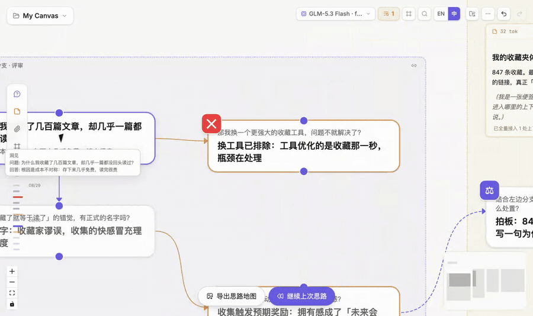

# 对话节点与侧栏

## 开始并继续对话

在输入框中提出问题。问题与流式生成的回答会组成一个对话节点。从该节点继续提问，就会沿同一路径向下展开。

上图依次展示：**选中文字 → 点击探索 → 提交分支问题**。这里只讲节点内的交互；界面各区域的位置参见[认识界面](/zh/guides/interface-overview)。

## 认识对话节点

节点卡片用于快速浏览，而不是承载全部控制：

- 顶部是问题、角色和状态；
- 中间显示当前回答版本；
- 底部操作用于继续、重新生成、复制、编辑回答等高频动作；
- 回答版本记录生成模型和生成时间；
- 琥珀色标记表示该回答早于上游变化，需要检查或重新生成；
- 缩小画布时，完整卡片会折叠为收获句，再折叠为图标标记。

**双击节点**进入完整侧栏；需要低频操作时，使用**右键节点**。

## 浮动侧栏的功能区

侧栏覆盖在画布右侧，不会挤压或移动节点。左边缘可以拖动调宽，双击边缘恢复默认宽度。

| 功能区 | 作用 |
|---|---|
| 顶部状态与操作 | 查看角色、token、材料状态，并执行节点级快捷操作 |
| 问题 | 阅读或编辑当前问题；等待输入的节点也在这里填写问题 |
| 回答与版本 | 阅读完整回答、切换版本、查看生成模型，从所选文字继续探索或高亮 |
| 附件 | 加入[材料](/zh/guides/materials)，控制继承附件是否进入当前上下文 |
| 高亮 | 选择全文、标注重点或仅传高亮，并从高亮内容继续提问；详见[高亮并串联](/zh/guides/organize#高亮并串联) |
| 汇入顺序 | 多个上游块汇入时，调整它们进入请求的先后；详见[控制上下文](/zh/guides/context-control) |
| 上下文树 | 按材料、引用和对话检查当前节点真正收到的内容与估算 token；详见[检查下一次请求](/zh/guides/context-control#检查下一次请求) |
| 底部追问 | 继续当前路径；点击输入框上方的**将发送摘要行**预览下一次请求 |

## 从所选文字探索

在回答中选中一句有价值的文字，点击**探索**。ThoughtDAG 会建立一条与所选文字对应的橙色分支。原路径不变，新问题从另一个方向展开。

需要检验另一种解释、深入某个细节，或比较提示词和模型时，使用**探索**。

## 编辑节点

- **双击问题**编辑问题；
- 点击回答末尾的**铅笔按钮**编辑回答；
- **双击节点**打开浮动侧栏。

修改上游内容后，依赖它的回答可能被标记为陈旧，而不是继续被当作当前结果。

## 重新生成与比较

**原地重新生成**会在同一节点增加一个回答版本。若要让不同答案在图上并排保留，则建立新的兄弟节点。详见[版本、陈旧与重放](/zh/guides/versions-replay)。

## 节点右键菜单

右键菜单集中放置低频操作；每一项的用途已经在[认识界面：节点](/zh/guides/interface-overview#_3-节点)中逐项说明。这里需要记住两点：菜单会随节点类型和状态变化；选中文字后右键时，会保留浏览器原生文字菜单。CLI 相关操作会把工作交给[Agent 对话地图](/zh/guides/session-atlas)管理，而不会把外部会话自动加入当前上下文。
