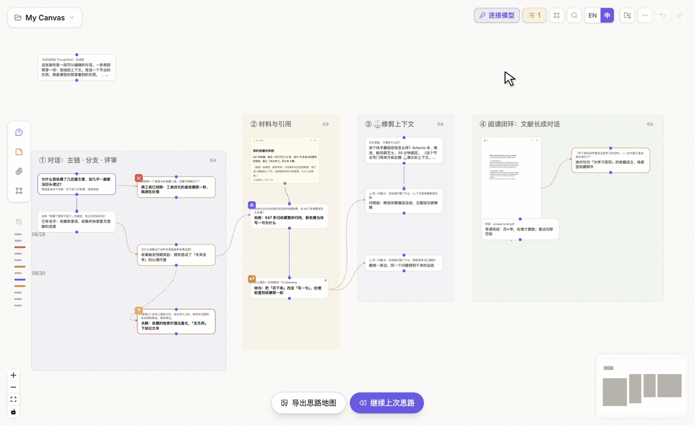

# 数据、备份与分享

## 先开启自动文件夹备份

ThoughtDAG 默认把画布保存在本机应用数据中。为了获得一份**看得见、可以复制、也可以重新导入的真实文件**，建议在桌面版首次使用时就开启自动文件夹备份。

### 开启方法

1. 点击画布右上角的**文件夹备份**按钮，打开**本地自动备份**；
2. 选择一个你能够长期保留的文件夹；
3. 授权成功后，当前画布已有内容时会立即写入一次；
4. 此后节点或连线每次发生变化，都会重新开始约一分钟的等待；停止改动后，当前画布会更新为一个以画布名称命名的 `.thoughtdag.json` 文件。

选择网盘同步目录时，文件会沿用该目录本身的同步方式；ThoughtDAG 不需要为此建立账号或上传到自己的服务器。

### 它具体会保存什么

每张画布对应一个完整备份文件，包含节点、连线、附件内容、事件记录，以及恢复 Agent 对话地图监听所需的会话标识。文件名来自画布名称；非法文件名字符会被替换。

| 情况 | 自动备份的行为 |
|---|---|
| 开启备份时，当前画布已有内容 | 立即写入当前画布 |
| 连续编辑节点或连线 | 等最后一次改动约一分钟后写入，避免频繁保存 |
| 切换到另一张画布并修改 | 为那张画布写入自己的文件 |
| Agent 对话地图的会话镜像 | 在所选文件夹的 `cli/` 子目录保存，并在文件名中加入 session id 片段以避免重名 |

自动备份写入的是**当前活动画布**，不是每分钟扫描并重写所有画布。需要立即确认时，重新打开备份控制中心，点击**立即备份当前画布**；这里也可以查看文件夹、上次写入时间、更换目录或停止备份。

每次打开桌面 App，ThoughtDAG 都会恢复上次记录的备份文件夹并尝试继续监听画布变化。若操作系统仍保留文件夹权限，自动备份会直接继续；若系统要求重新确认，点击**重新授权，继续备份**即可恢复。

### 从备份恢复

打开画布菜单，选择**导入备份**，再选择 `.thoughtdag.json` 文件。恢复的是完整画布，不只是可阅读的导出文本。若备份来自 Agent 对话地图，且本机仍能找到对应来源，会话监听也可以继续；找不到来源时，画布仍可作为普通档案使用。

桌面版提供最完整的体验；浏览器版本只有在环境允许访问文件夹时才会显示这一入口。

## 手动导入与导出

- 使用**导出备份**随时保存一份完整图，并在之后恢复；
- 把一条上下文链或所选节点导出为 Markdown；
- 按需导出高亮、记忆、角色或事件元数据；
- 导入兼容的 ThoughtDAG 备份或受支持的对话导出。

导入内容中的编辑与重新生成版本，可以成为可见分支，而不是被压平成一段聊天记录。

## 分享只读图

**分享**会把图压缩进 URL。接收者可以平移、缩放和阅读，但不能编辑。发送前应检查载荷；大型图或敏感材料更适合通过导出文件分享。

## 恢复近期修改

使用 `Cmd+Z` / `Ctrl+Z` 和重做恢复近期操作。自动文件夹备份用于恢复文件；大规模整理或升级版本前，可以再手动导出一份备份。

**本地优先**不等于数据永远不会离开设备。远程模型或工具请求、导出、备份文件夹与分享链接，都会在你明确操作时传输数据。
