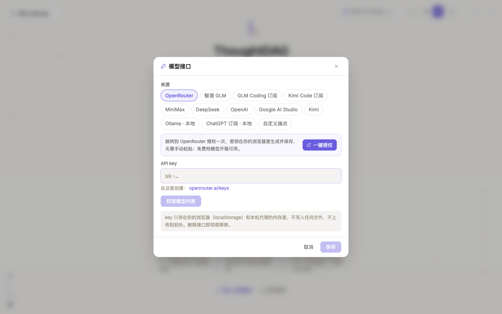
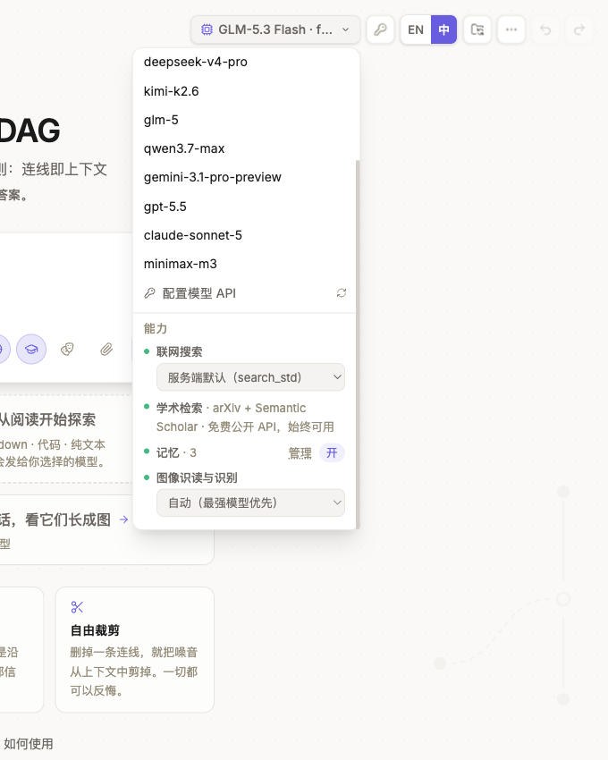
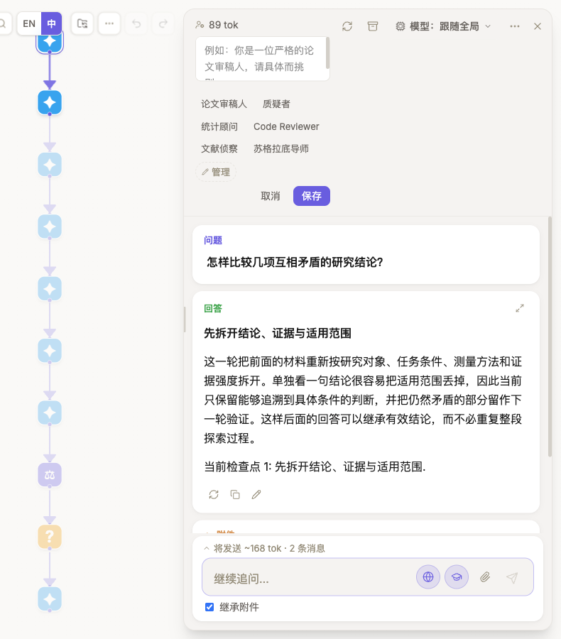
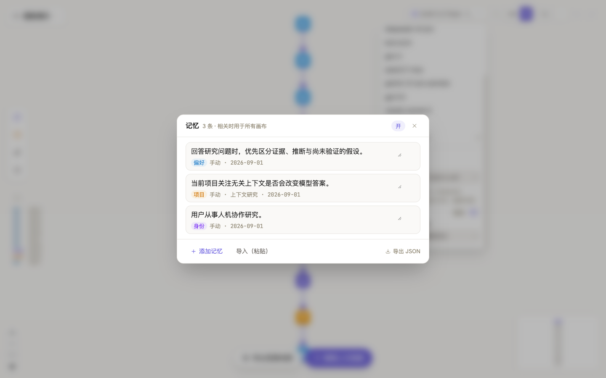

# 模型、工具与记忆

## 连接并选择模型

打开**连接模型**，在应用内选择服务商、订阅入口、本地模型或自定义 endpoint，再授权或填入 key。获取模型列表后，勾选要在 ThoughtDAG 中使用的模型并保存。一般用户不需要修改 `.env`；各入口的适用条件见[连接模型](/zh/setup)。

工具栏中的模型是**新节点的默认模型**。打开下拉菜单可以切换默认模型、重新进入模型接口，也可以查看当前安装具备的联网搜索、学术检索、记忆与图像识读能力。只有某条分支需要不同的成本、推理或视觉能力时，再在节点侧栏为该节点单独选择模型。

每个回答版本都会记录生成它的模型。本地模型可以不向远程服务发送模型请求；远程费用和数据保留规则由所连接的 endpoint 决定。

## 启用搜索与工具

每个提问框旁都有**联网搜索**与**学术检索**开关。它们决定本次生成可以使用哪些检索能力；模型仍会根据问题判断是否实际调用。检索进度与可用引用会随回答保存。只启用当前任务需要的工具。

需要额外工具的开发者，可以在 `mcp.config.json` 中配置本地或远程 MCP server。支持 stdio 与基于 URL 的连接。工具决定模型**可以调用什么能力**，不会改变哪些图路径进入请求；配置细节见[连接机制（开发者）](/zh/setup#连接机制开发者)。

## 设置节点角色

节点可以为下游生成**继承**、**设置**或**重置**角色。实际应用的角色会随回答版本记录。多个父节点提供冲突角色时，ThoughtDAG 会要求明确选择。内置与自定义角色统一在角色库管理。

这几个入口作用不同：顶部模型选择器只覆盖当前节点；角色是向下游继承的 system prompt；提问框中的**地球**与**学位帽**按钮分别控制联网搜索和学术检索。它们都不会替你改变图中的上下文连线。

## 管理环境记忆

环境记忆只接纳三类长期事实：偏好、由用户明确陈述的身份信息，以及项目信息。每次写入都会显示通知，并提供**撤销**。项目记忆连续 45 天没有更新后，会停止进入活动上下文，但不会从记忆管理器中删除。

不适合持续携带背景信息时，可以使用全局开关、分类管理、导入导出或删除。机器步骤与自动生成的导读不会进入环境记忆。

节点侧栏的[上下文树](/zh/guides/context-control#检查下一次请求)会在记忆开启且存在条目时显示**记忆（常驻层）**，方便确认它是否参与普通生成。画布连线与环境记忆仍是两个独立层次。

## 区分这些层次

- **模型**决定由哪个 endpoint 生成回答；
- **工具**决定模型可以调用哪些外部能力；
- **角色**改变生成时使用的指令；
- **环境记忆**可以加入已接纳的背景事实；
- 图中的连线仍然决定进入节点的对话和材料路径。

应用内连接流程、订阅入口与本地模型参见[连接模型](/zh/setup)，数据边界参见[隐私与存储](/zh/reference/privacy-storage)。
