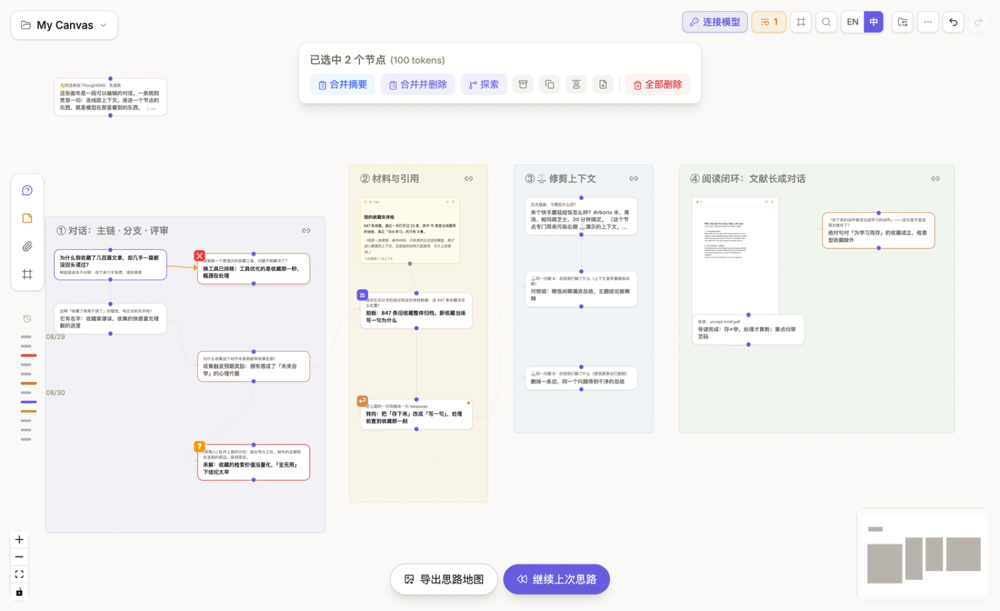
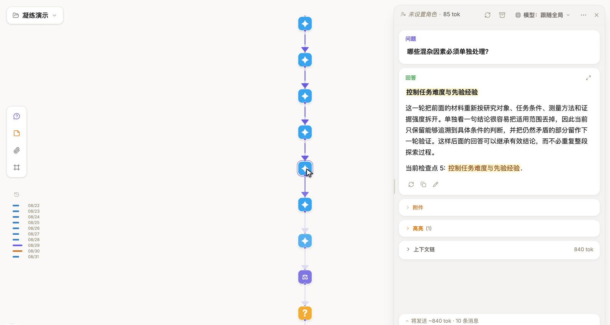
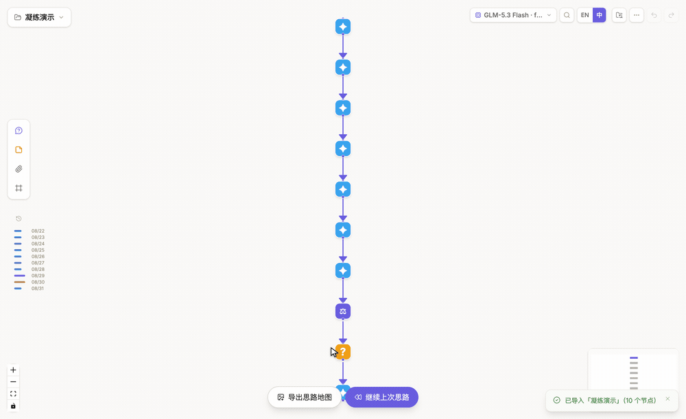

# 合并、高亮与凝练

## 合并多个节点

按[多选工具栏](/zh/guides/canvas-projects#多选工具栏)的方式框选多个节点后，点击**合并摘要**：保留原节点，并建立综合节点。只有同时希望从画布移除原节点时，才使用**合并并删除**。

## 高亮并串联

在[节点侧栏](/zh/guides/conversations#浮动侧栏的功能区)中标记有用段落。节点可以传递全文、带标签的高亮，或仅传递高亮。所选节点包含高亮时，点击**串联高光**，把这些段落整理成带引用的文字。

## 凝练一条路径

打开**凝练**，系统会扫描连续、没有分叉的对话片段。选择要提炼的片段后，ThoughtDAG 会在右侧建立一份**凝练副本**，原路径保持不变。

上图依次展示：**打开凝练 → 检查候选片段与预计节省 → 生成凝练副本 → 查看蒸馏节点 → 对比原图与副本**。候选片段由本地结构扫描发现；只有生成蒸馏内容时才调用所选模型。

凝练副本会用提炼节点替换所选片段，保留受保护的决策点和转折点，并估算新的 token 大小。点击蒸馏节点上的来源标记可以返回原片段。检查副本后，如果原路径不再需要，可以再将其[归档](/zh/guides/context-control#改变进入请求的内容)。

合并、串联与凝练会建立新的内容表示；移动或对齐节点只会改变布局。
