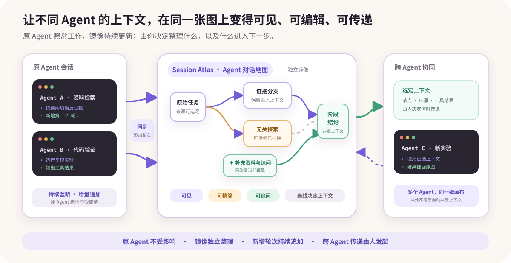
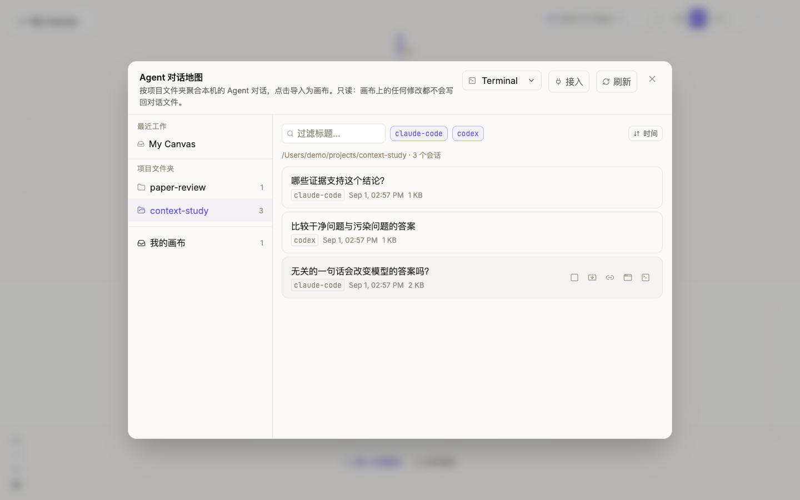
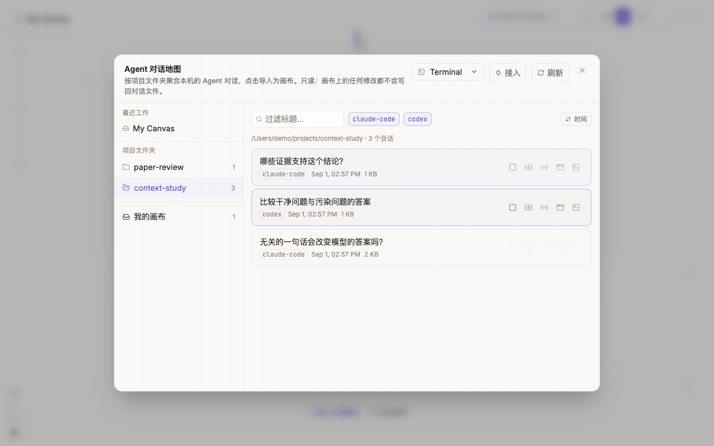
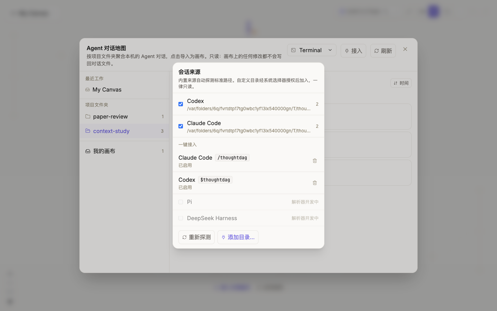
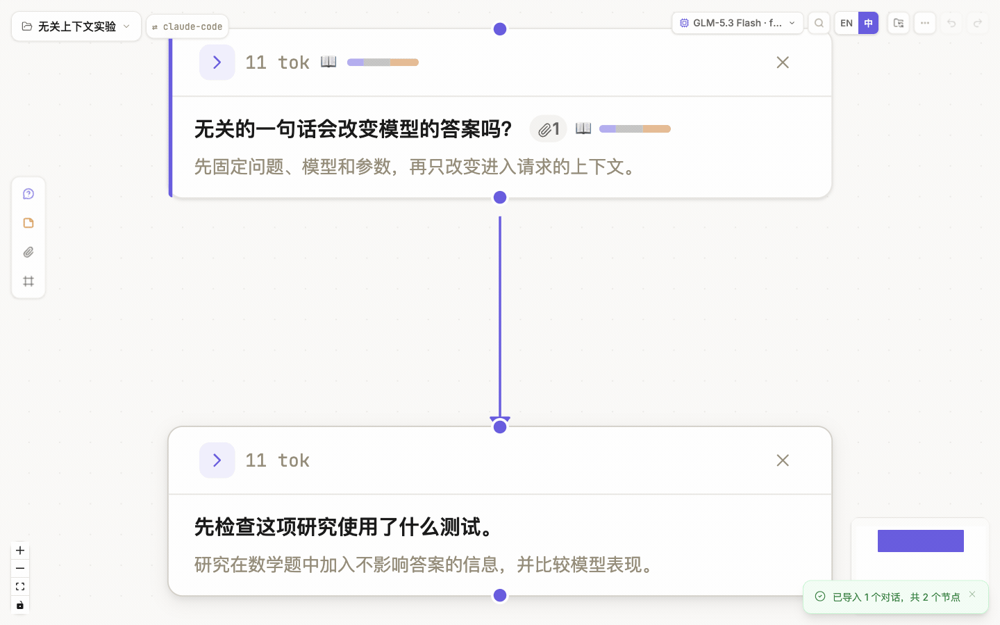
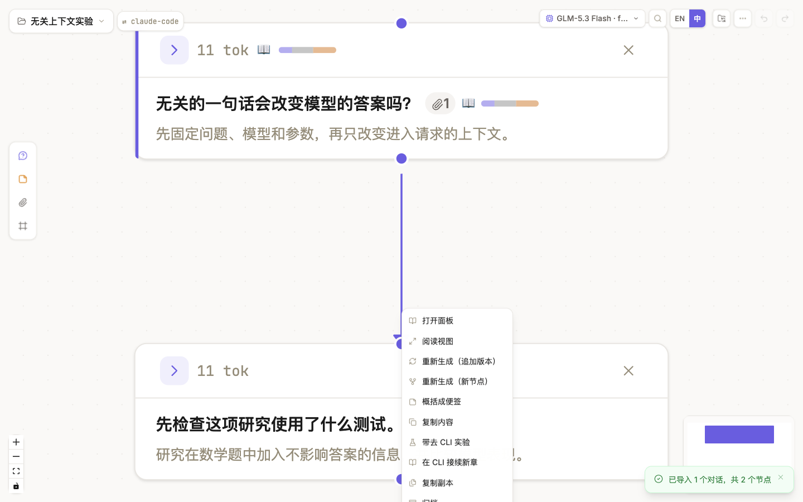
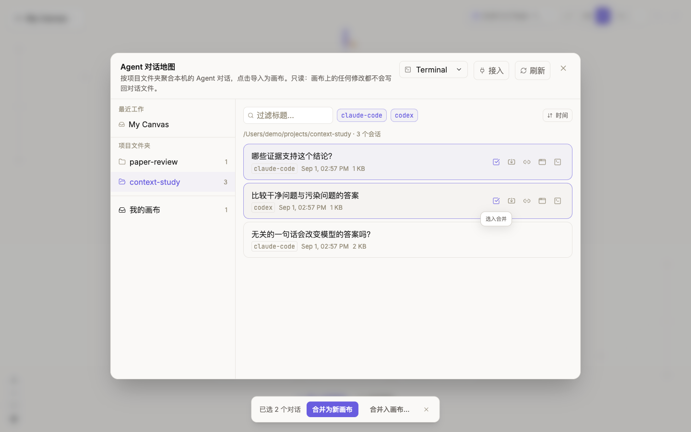

# Agent 对话地图

Agent 对话地图是 ThoughtDAG 面向本地 Agent 工作的**可视化上下文工作台**。它把原本散落在不同 CLI 和 Agent 会话里的过程，带进同一张可检查、可编辑、可组合的画布：



- 看见每轮对话、工具调用、结果和来源，而不是等自动压缩后只剩一段摘要；
- 在保留完整来源的同时，按节点、连线和附件精细整理上下文；
- 让原 Agent 继续工作并监听新增轮次，也可以在镜像中补充资料、便签和追问；
- 从一个节点把整理后的上下文带到另一个 Agent，新结果再挂回原图；
- 把多个 Agent 的工作放进同一张画布，由你决定它们是否连接、共享哪些上下文。

对话地图不是为了取代 Agent 自带的 compact，而是在它之上提供更细粒度、可追溯的整理方式。你可以把它理解为 CLI 会话之上的**可视化协同与上下文传递层**，但它还不是一个自动调度进程、权限和资源的 Agent OS。

它目前属于**桌面版功能**，原生支持扫描 Codex 与 Claude Code 的本地会话；其他工具的接入也在准备中。如果你希望支持某个 runner 或工作流，欢迎在 [GitHub Discussions](https://github.com/chenxiachan/thoughtdag/discussions) 描述使用场景，或通过 [GitHub Issues](https://github.com/chenxiachan/thoughtdag/issues) 提交可复现的格式与兼容问题。

## 原 Agent 继续工作，镜像独立整理

对话地图不会改写原 Agent 的会话。它在 ThoughtDAG 中建立一张可以独立整理、并随来源继续更新的镜像。

- 你可以在 ThoughtDAG 中删减或改写镜像节点、补充资料与便签、建立新分支并继续追问；
- 这些操作只改变 ThoughtDAG 画布及其后续编译出的上下文，不会改写原 Agent 的历史；
- 原 Agent 可以继续对话；只要这张画布仍订阅该 session，对话地图就会把新轮次增量追加到对应链尾；
- 在 ThoughtDAG 中产生的新问题和回答属于画布的新内容，不会自动写回原 Agent 会话。

因此，镜像不是一张静止的快照：你可以在其中整理上下文，而原 Agent 仍按原来的方式继续工作。

## 打开 Agent 对话地图并找到会话

首次进入可在欢迎页选择 **Agent 对话**；进入画布后，从左上角画布菜单打开 **Agent 对话地图**。



| 区域 | 作用 |
|---|---|
| **最近工作** | 返回最近打开的 ThoughtDAG 画布，包括已导入的会话镜像 |
| **项目文件夹** | 按会话记录中的工作目录分组；同一项目的不同 runner 会放在一起 |
| **搜索与 runner 筛选** | 按标题过滤，或暂时隐藏某类 runner |
| **仅看变化 / 子线程 / 排序** | 聚焦新增和变化、显示子线程，并按时间、名称、大小或 CLI 排序 |
| **会话卡片** | 显示标题、runner、时间和大小；悬停后出现导入、挂载、App 与终端入口 |
| **接入** | 管理扫描来源和一键接入命令 |

对话地图只把能够明确识别格式的文件列为会话，不会根据文件名猜测未知格式。

**子线程**是 agent 自己派出的线程，不是你亲自进行的对话：Codex 的子线程和 Claude Code 的子 agent 文件都算。默认隐藏，打开开关后可见，每一个都能作为独立镜像打开。

## 把一个会话打开为图镜像

点击会话卡片或卡片上的**导入**图标。每一轮用户问题与 Agent 回答成为一个问答节点；tool call 与 tool result 会配对成该节点的文本附件，而不会冒充新的对话轮次。



导入后保留三类来源信息：

- runner 与 session id；
- 每个节点对应的原始 turn 标识；
- tool call、tool result 与截断提示。

这些信息用于追溯和增量更新。**导入后可见，不等于已经进入下一次模型请求。** 是否进入上下文仍由连线、引用和附件开关决定，参见[控制上下文](./context-control)。

折叠状态的节点面上会列出这一轮碰过的文件（✏️ 写或改，📖 读），预览显示回答的结论段而不是开头一句；完整的工具轨迹留在节点附件里。子 agent 以任务通知形式送回的报告会折进派出它的那一轮，不会变成一条提问。回答里的链接不会让你离开应用：网址交给系统浏览器，本机目录或文件在 Finder 中打开，图片和 PDF 用系统查看器打开，agent 产出的图片直接内联显示；相对路径会按会话的工作目录解析。

## 会话卡片上的操作

将鼠标停在卡片右侧，可以看到以下入口：

| 操作 | 结果 |
|---|---|
| **导入** | 新建镜像；已有镜像时打开它，并尝试追加尚未导入的轮次 |
| **选入合并** | 把两个以上会话加入多选栏 |
| **重新镜像** | 从原会话重新建图；会丢弃这张镜像上的整理与修改，需要确认 |
| **挂载到画布** | 将会话接到指定画布主线尾部，并登记为后续可追加的 chapter |
| **在 App 中打开** | 唤起对应 App；无法直接定位时复制 session id 供搜索 |
| **在终端打开** | 使用所选终端执行受白名单约束的恢复命令，回到原会话 |

**在 App / 终端打开**只是回到来源会话，不会把 ThoughtDAG 的编辑写回 Agent。

## 配置来源与一键接入

打开 **Agent 对话地图 → 接入**：



1. 内置来源自动探测各 runner 的标准目录；
2. 用**添加目录**通过系统选择器授权其他目录；
3. 用复选框临时停用某个来源；
4. 在**一键接入**中启用或更新命令。

启用后：

- 在 Claude Code 中使用 `/thoughtdag`；
- 在 Codex 中使用 `$thoughtdag`。

前者是写入本机命令目录的 command，后者是写入本机 Codex skills 目录的 skill；**接入**页面会比较本地文件内容，显示未启用、已启用或需要更新。

一键接入的本地机制是：找到当前 runner 的 session id，打开 `thoughtdag://open?session=<id>`，再由对话地图定位来源并走同一套导入/追加逻辑。命令本身产生的“打开 ThoughtDAG”那一轮会从镜像中去掉，避免自指噪声。

这个命令不会上传会话，也不会赋予网页任意文件读取权限。扫描和深链只在桌面壳提供的受限桥接中运行；更多边界见[隐私与存储](../reference/privacy-storage)。

## 理解监听与增量追加

镜像不是每次都重建整张图。桌面壳观察受支持目录中的 JSONL 变化，经过短暂去抖后把“哪个来源文件发生变化”交给对话地图。对话地图再使用每个会话的 ledger 判断已经导入到第几轮。

```text
来源 session 新增 turn
        ↓
桌面壳发现变化并通知文件位置
        ↓
对话地图解析完整会话，跳过 ledger 之前的轮次
        ↓
只把新轮次接到该会话在画布上的尾部
```



增量追加遵守以下规则：

- 不重复导入已记录的轮次；
- 不移动现有节点；
- 用户改过的镜像内容不会被来源中的旧文本覆盖；
- App 关闭期间的变化，会在启动或切回画布时通过补扫检查；
- 一个会话登记在其他画布时，不会偷偷追加到当前画布；
- 删除某个 session 的全部镜像节点会解除订阅，避免内容重新长回来。

### 什么时候会停止监听

- 只删除一条连线、修改节点文字或删除部分镜像节点，**不会**解除监听；
- 当画布上属于某个 session 的镜像节点被全部删除时，对话地图会移除该 session 的 ledger，监听随之停止；
- 如果这是画布中的最后一个受监听 session，画布会恢复为普通的 ThoughtDAG 画布；
- 撤销删除可以恢复节点，但不会自动恢复订阅。需要回到对话地图再次打开该会话，才能重新监听；
- 来源文件暂时不可访问时，对话地图无法追加新轮次，但这不等于已经主动解除订阅。

若会话有新内容但未出现，可先回到对话地图点击**刷新**，再打开该会话卡片；仍无法追加时检查来源是否启用、session 是否仍可被识别，并参见[常见问题](../reference/troubleshooting)。

## 从节点去 CLI，再把结果挂回来

对话地图的会话卡片解决的是“**把已有 Agent 会话带进来**”。节点右键菜单解决的是相反方向：“**从当前图中的一个上下文出发，去 CLI 做新实验**”。



| 入口 | 适合什么情况 | 返回画布后的结构 |
|---|---|---|
| **带去 CLI 实验** | 验证假设、尝试替代方案，不希望改变主线 | 新 session 作为支线挂回出发节点 |
| **在 CLI 接续新章** | 已经整理好上下文，希望继续主任务 | 新 session 接在主链尾部 |

两种入口都会把所选节点的上游上下文编译为 Markdown 并复制到剪贴板，其中包含一个回程锚点。你在新的 CLI 会话中粘贴后继续工作；对话地图识别锚点后，将新会话挂回原画布。

这不是 Agent 自动调度。创建会话、粘贴上下文以及后续操作仍由用户决定。节点右键菜单的其他操作见[对话节点与侧栏](./conversations#节点右键菜单)。

## 把多个会话放到同一张画布

依次点击两个以上卡片的**选入合并**，底部会出现多选栏：



- **合并为新画布**：新建画布，把各会话并排放置；
- **合并入画布**：选择一张已有画布作为容器；
- 每个会话独立保留来源和增量 ledger；
- 会话链之间**不会自动连线**。

最后一点很重要：在 ThoughtDAG 中，连线会影响上下文。仅仅因为两个会话出现在同一画布上，并不能推断它们之间存在上下文关系；需要由你决定是否以及如何连接。

## 来源、镜像与模型上下文

| 层 | 可以修改吗 | 会影响什么 |
|---|---|---|
| 来源 session | 不由对话地图改写 | 仍由原 runner 维护 |
| ThoughtDAG 镜像 | 可以 | 节点文字、结构、引用和整理方式 |
| 下一次模型请求 | 可以检查和控制 | 只包含当前路径实际编译出的内容 |

对话地图不声称来源 Agent 原生使用了编辑后的 ThoughtDAG 图作为记忆，也不会把画布修改写回来源历史。runner 格式发生变化时，适配范围也可能需要更新。
