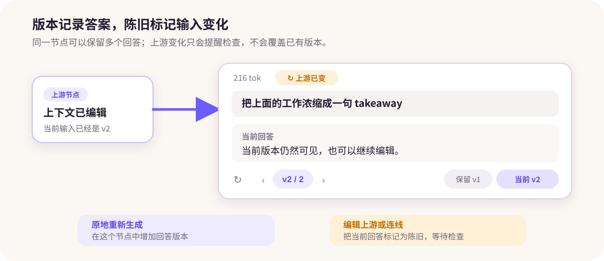
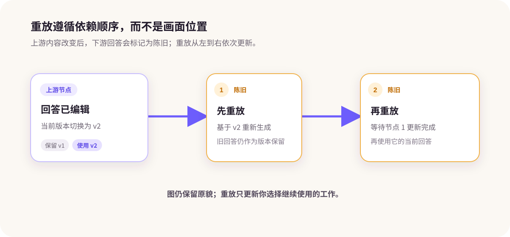

# 版本、陈旧与重放

## 比较回答版本

**原地重新生成**会在同一节点增加回答版本。你可以切换版本、删除不需要的版本，或恢复旧版本。若比较结果应该同时留在画布上，则使用[兄弟节点](/zh/guides/conversations#重新生成与比较)。

## 理解“陈旧”

生成节点会记录上游上下文指纹。编辑祖先节点、修改相关连线，或切换上游当前版本，都可能让依赖节点显示**陈旧**。

**陈旧**表示“基于旧输入生成”，不表示“答案一定错误”。先检查上下文差异，再决定是否更新。

图中的**上游已变**只提示输入已经变化。可在[上下文树与下一次请求预览](/zh/guides/context-control#检查下一次请求)中查看差异，再决定是否重放。

## 重放下游工作

1. 检查陈旧节点和估算 token；
2. 开始**重放**；
3. ThoughtDAG 按依赖顺序重新生成受影响节点；
4. 后续更新不再有价值时，可以停止。

依赖顺序可以避免下游在所需上游尚未更新时提前生成。

**重放**会沿原有结构更新已有下游节点。如果你更想用同一个问题测试另一种上下文或模型，也可以从同一上游建立新的兄弟节点，让两个答案并排保留。前者适合刷新既有工作，后者适合比较不同答案或模型。

## 使用随动评审

评审者是带批评角色和红色虚线评审关系的普通对话节点。新增工作后，它可以继续评审并保留历史版本，也可以像其他节点一样被追问或建立分支。
